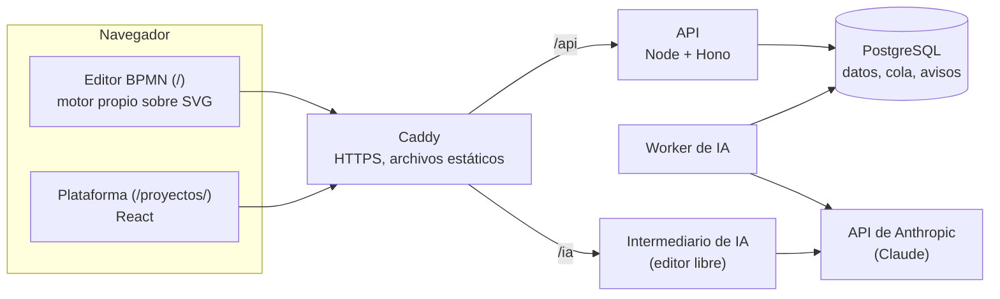

# ProcessIQ

[](https://github.com/Alejandromsa/mbc_project/actions/workflows/ci.yml)

Plataforma de **MBC Business Consulting** (Minsait) para **levantar, diagramar, diagnosticar, reingenierizar y presentar procesos de negocio** en BPMN 2.0. El consultor parte de documentos, entrevistas o event logs y termina con un diagrama con carriles, su diagnóstico y los entregables para el cliente (PPTX, Word, Ficha de Proceso, BPMN XML), trabajando en proyectos compartidos, con versiones, aprobación e IA.

- **Plataforma:** <https://mbc.asissoft.com>. Las cuentas las crea un administrador.
- **Documentación completa:** [docs/README.md](docs/README.md). El [manual de uso](docs/manual/README.md) está pensado para consultores.
- **Estado:** fases 1 y 2 terminadas; fase 3 (corte) en curso. Detalle en la [hoja de ruta](docs/arquitectura.md#13-hoja-de-ruta).

## Qué hace

| Etapa | Cómo |
|---|---|
| **Levantar** | Genera el proceso a partir de Word, PDF, PPTX, texto o transcripciones de entrevistas, con IA (Claude) o con reglas sin IA. También lo construye desde event logs CSV (minería de procesos) o importando BPMN 2.0. |
| **Diagramar** | Editor BPMN con carriles, auto-layout y tres niveles de detalle (Ejecutivo, Actividad, Detalle) que se calculan sin volver a llamar a la IA. Un linter aplica el Playbook MBB. |
| **Diagnosticar** | Pains por actividad, KPIs de una biblioteca por industria, simulación, cuellos de botella, mapa de valor y potencial de automatización. |
| **Reingenierizar** | Vistas As-Is y To-Be, propuestas con IA, backlog de iniciativas y análisis What-If. |
| **Presentar** | PPTX editable con conectores anclados y temas por cliente, informe Word, Ficha de Proceso, BPMN XML, SVG, PNG y JSON. |

La **plataforma** suma a eso:
- proyectos por cliente, con miembros y roles;
- revisiones versionadas con el flujo borrador → en revisión → aprobada;
- la IA ejecutada en el servidor, con cola, reintentos y presupuesto;
- catálogos y plantillas de proceso por organización;
- importación del trabajo hecho en el navegador;
- auditoría y una pantalla de estado del sistema.

Sin iniciar sesión, el editor funciona igual que el MVP: todo queda en el navegador.

## Arquitectura



- **Un solo lenguaje, TypeScript**, en un monorepo con pnpm y Turborepo.
- **Un modelo de dominio compartido** (`packages/dominio`) entre la web, la API y la IA.
- **Monolito modular:** una API y un worker; cada iniciativa es un módulo con fronteras comprobadas en la CI.
- **Todo en contenedores Docker.** Hoy corren en un servidor propio con staging y producción; el destino es un PaaS.

Decisiones y motivos: [docs/arquitectura.md](docs/arquitectura.md) y las [ADR](docs/adr/README.md).

## Estructura del repositorio

```text
apps/
  web/            la web (Vite): el editor (src/app/, módulos ES del MVP) y la plataforma en /proyectos/ (src/shell/, React)
  api/            API (Node + Hono + Postgres): cuentas, proyectos, revisiones, catálogos, IA en el servidor; worker y CLI
  intermediario/  intermediario de IA del editor libre: guarda la clave de Anthropic
packages/
  dominio/        modelo, catálogos, validación del Playbook MBB, esquema v1 y migración
  motor/          auto-layout por carriles, ruteo, calidad, niveles de detalle
  bpmn/           importar y exportar BPMN 2.0
  exportar/       PPTX con temas, informe Word, Ficha de Proceso
  documentos/     lectura de Word, PDF, PPTX y texto; intérprete básico
  mining/         event logs → proceso
  analitica/      simulador, cuello de botella, automatización, backlog, What-If
  ia/             prompts, cliente de Claude, costes y validación de la salida
  db/             esquema de la base (Drizzle) y migraciones SQL
pruebas/
  fidelidad/      compara la app con el MVP 3.8.9 congelado, byte a byte
  e2e/            flujos de la plataforma con la API real, Postgres y un Anthropic simulado
herramientas/     comprobación de fronteras entre paquetes
bench/            banco de calidad del layout y del PPTX (los procesos reales quedan fuera del repositorio)
infra/            Caddyfile, Dockerfiles, copias de seguridad y script de despliegue
docs/             documentación: manual, referencia técnica, trabajo en equipo, runbooks, ADR
```

## Empezar a desarrollar

Requisitos: Node 22+, pnpm 10 y Docker Desktop. La guía completa, con problemas frecuentes, está en [docs/tecnica/desarrollo.md](docs/tecnica/desarrollo.md).

```bash
pnpm install
docker compose --profile dev up -d postgres-dev          # Postgres de desarrollo (puerto 5440)
cp .env.dev.example .env.dev
pnpm --filter @processiq/api semilla                      # cuentas de prueba por rol y proyectos de ejemplo
pnpm --filter @processiq/api dev                          # API en :8790
pnpm dev                                                  # web en http://localhost:5173
```

Antes de pedir revisión:

```bash
pnpm fronteras && pnpm typecheck && pnpm test   # fronteras, tipos, unitarias e integración de la API
pnpm fidelidad                                  # la app frente al MVP (≈2,5 min), si tocas el editor o un paquete
pnpm e2e                                        # la plataforma de punta a punta
```

Si trabajas en equipo, o con Claude Code, lee primero [docs/equipo/README.md](docs/equipo/README.md): explica cómo sumar una iniciativa sin pisar el trabajo de otros.

## Despliegue

Producción (`https://mbc.asissoft.com`) y staging (`https://staging.mbc.asissoft.com`) corren en el mismo servidor. Cada versión pasa primero por staging y se promueve **la misma imagen**. Solo despliega el responsable de operación, siempre desde `main`:

```bash
git switch main && git pull
infra/desplegar.sh staging        # construye el commit y lo levanta en staging
infra/desplegar.sh produccion     # la misma imagen a producción (revertir: produccion <version>)
```

Runbooks: [servidor](docs/runbooks/servidor-local.md), [despliegue](docs/runbooks/despliegue.md), [rotación de secretos](docs/runbooks/rotacion-secretos.md) e [incidente de IA](docs/runbooks/incidente-ia.md). Cambios por versión: [CHANGELOG.md](CHANGELOG.md).

## Contribuir, seguridad y licencia

- **Contribuir:** [CONTRIBUTING.md](CONTRIBUTING.md). `main` está protegida: todo entra por PR con la CI en verde.
- **Vulnerabilidades:** nunca en un issue; sigue [SECURITY.md](SECURITY.md).
- **Licencia:** ninguna. El repositorio es público para poder leerlo, pero todos los derechos están reservados y no se puede reutilizar sin permiso ([ADR 18](docs/adr/0018-repositorio-publico.md)).
