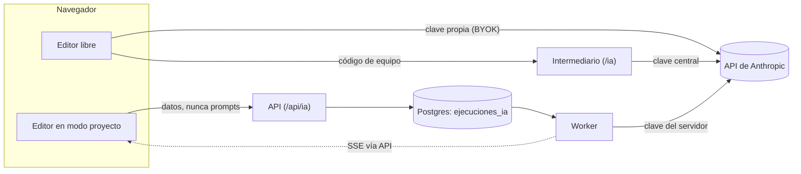
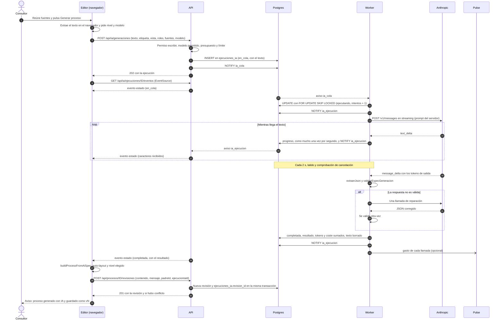
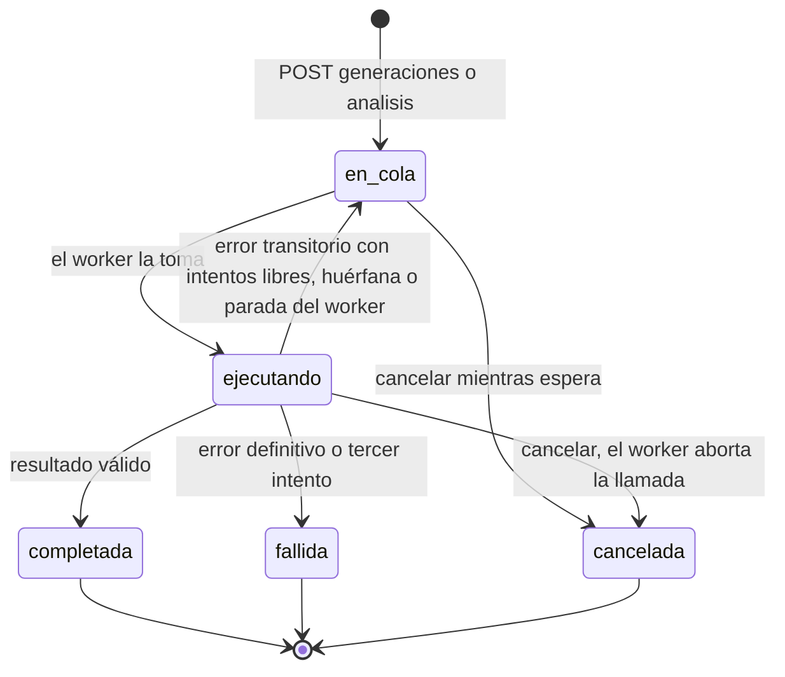

# La IA en ProcessIQ

Cómo usa ProcessIQ los modelos Claude: los dos caminos (editor libre y modo proyecto), la cola y el worker del servidor, los costes, el intermediario, cómo se prueba sin gastar y qué hacer ante un incidente.

**Actualizado:** 28-sep-2026.

---

## 1. Dos caminos

La IA hace tres cosas: **generar un proceso** a partir de documentos, **analizar sus dolores** y resolver **tareas analíticas del copiloto** (KPIs, To-Be, RACI…). Según cómo se abra el editor, lo hace por uno de dos caminos:

| | Editor libre (`/`) | Modo proyecto (`/?proceso=…`, `/?revision=…`) |
|---|---|---|
| Quién llama a Claude | El navegador | El worker de la API |
| Credencial | Código de equipo (la clave vive en el intermediario) o clave propia (BYOK, guardada en el navegador) | `ANTHROPIC_API_KEY` del servidor. El navegador nunca la ve |
| Quién arma el prompt | El navegador, con `@processiq/ia` | El servidor, con `@processiq/ia` |
| Si se cierra la pestaña | Se pierde la generación | Sigue en el servidor y se ofrece al volver |
| Reintentos | Uno, ante un fallo de red al conectar | Ese y, además, hasta 3 intentos con esperas de 15 y 60 s |
| Validación de la respuesta | `extraerJson` | `extraerJson`, esquema Zod y una reparación |
| Coste | Estimado y registrado en el navegador | Registrado por ejecución, con presupuesto mensual y límite por persona |
| Gasto a Pulse | Solo en modo equipo, desde el intermediario | Desde el worker |
| Sin IA disponible | Modo básico por palabras clave | Igual |

El punto de enganche es [ia/remota.js](../../apps/web/src/app/ia/remota.js). `aiBuildProcess`, `aiAnalyzePains` y `runAiTask` preguntan primero `iaRemota()`. Si [plataforma/ia.js](../../apps/web/src/app/plataforma/ia.js) registró la IA remota (modo proyecto), la petición va a la API. Si no, se comportan igual que el MVP.

---

## 2. Mapa del código

| Pieza | Archivo | Qué hace |
|---|---|---|
| Prompts | [packages/ia/src/prompts.ts](../../packages/ia/src/prompts.ts) | Prompts de sistema y tareas del copiloto |
| Construcción | [packages/ia/src/construccion.ts](../../packages/ia/src/construccion.ts) | Mensajes de usuario, combinación de fuentes, resumen del proceso, lectura de los dolores |
| Cliente | [packages/ia/src/cliente.ts](../../packages/ia/src/cliente.ts) | `llamarClaude` (streaming SSE) y `extraerJson` |
| Costes | [packages/ia/src/costes.ts](../../packages/ia/src/costes.ts) | Modelos, precios, `usd`, estimación previa |
| Especificación | [packages/ia/src/especificacion.ts](../../packages/ia/src/especificacion.ts) | `validarEspecGeneracion`, `promptReparacion`, `clasificarErrorIa` |
| Rutas | [apps/api/src/rutas/ia.ts](../../apps/api/src/rutas/ia.ts) | Endpoints de negocio, SSE, cancelación, consumo |
| Cola | [apps/api/src/ia/cola.ts](../../apps/api/src/ia/cola.ts) | Tomar un trabajo y reencolar huérfanas |
| Ejecución | [apps/api/src/ia/ejecutar.ts](../../apps/api/src/ia/ejecutar.ts) | Llamada, validación, reparación, reintentos, coste |
| Avisos | [apps/api/src/ia/avisos.ts](../../apps/api/src/ia/avisos.ts) | `LISTEN/NOTIFY`: canales `ia_cola` e `ia_ejecucion` |
| Worker | [apps/api/src/worker.ts](../../apps/api/src/worker.ts) | Bucle de la cola, latido, parada ordenada, gasto a Pulse |
| Configuración | [apps/api/src/config.ts](../../apps/api/src/config.ts) | Variables de entorno de la API y del worker |
| Editor | [apps/web/src/app/ia/](../../apps/web/src/app/ia/) | Ajustes, diálogos, generación, dolores, tareas, motor |
| Editor en proyecto | [apps/web/src/app/plataforma/ia.js](../../apps/web/src/app/plataforma/ia.js) | IA remota: ejecuciones y seguimiento por SSE |
| Consumo | [apps/web/src/shell/paginas/Ia.tsx](../../apps/web/src/shell/paginas/Ia.tsx) | Pantalla «Consumo de IA» |
| Intermediario | [apps/intermediario/src/index.ts](../../apps/intermediario/src/index.ts) | Proxy con código de equipo para el editor libre |

Decisión de diseño de la cola: [ADR 13](../adr/0013-cola-ia-en-postgres.md). Objetivo y contexto: [arquitectura.md §8](../arquitectura.md).

---

## 3. Prompts y parámetros

Los textos viven en [prompts.ts](../../packages/ia/src/prompts.ts) y [construccion.ts](../../packages/ia/src/construccion.ts) y se comparan byte a byte con el MVP (fidelidad). **Cambiar un prompt exige pasar la fidelidad** y, según la arquitectura, la evaluación de IA.

| Constante o función | Para qué |
|---|---|
| `PROMPT_GENERACION` | Sistema de la generación. Rol de analista BPMN; fija el JSON de salida (`meta`, `ficha`, `nodes` con `k`, `type`, `label`, `owner`, `system`, `exec`, `gateway`, `notes`, `nivel`, `padre`; `edges` con `from`, `to`, `label`) y las reglas: un inicio y al menos un fin, tipos de compuerta, paralelismo, bucles y los tres niveles con su padre |
| `promptGeneracion(texto, etiqueta, opciones)` | Mensaje de usuario: la petición, las reglas de fusión si hay varias fuentes (`REGLAS_FUSION`), quién es quién (persona → rol) y la profundidad pedida (1, 2 o 3). El contenido se recorta a `maxChars` |
| `combinarFuentes(fuentes, maxChars)` | Une varias fuentes con una cabecera cada una. Si superan el tope, reparto justo: las cortas entran enteras y el resto se divide entre las largas |
| `timeoutGeneracion(prompt)` | Límite de inactividad: 90 s + 0,5 s por cada 1 000 caracteres, con techo de 180 s |
| `PROMPT_PAINS` | Sistema del análisis de dolores. Pide un JSON con dolores **detectados** (anclados a un nodo, con evidencia) e **hipótesis del sector** (nunca se mezclan) |
| `interpretarPains(datos, nodos, siguienteId)` | Ignora nodos inexistentes y duplicados y acota severidad y frecuencia |
| `ROL_ANALISTA` + `TAREAS_IA` | Sistema de las tareas del copiloto (Markdown) y la instrucción de cada tarea |
| `resumenProcesoParaIa(proceso)` y `promptTarea` | Resumen del proceso en orden de flujo que reciben dolores y tareas |
| `PROMPT_REPARACION` y `promptReparacion(respuesta, problema)` | Solo en el servidor: pide devolver el JSON corregido sin inventar actividades |

Tareas del copiloto (`TAREAS_IA`):

| Clave | Qué pide |
|---|---|
| `suggest-kpis` | KPIs aplicables |
| `propose-tobe` | Reingeniería To-Be (también la usa el botón «Transformar a To-Be») |
| `raci` | Matriz RACI |
| `impact-effort` | Matriz impacto-esfuerzo |
| `automation` | Oportunidades de automatización |
| `backlog` | Backlog de iniciativas |
| `exec-summary` | Resumen ejecutivo |
| `sipoc` | SIPOC |
| `bottleneck` | Cuello de botella y ruta crítica |

Parámetros de cada llamada (iguales en los dos caminos, salvo la reparación, que solo existe en el servidor):

| Llamada | Sistema | Esfuerzo | `max_tokens` | Inactividad |
|---|---|---|---|---|
| Generar proceso | `PROMPT_GENERACION` | `medium` | 64 000 (`GEN_MAX_TOKENS`) | `timeoutGeneracion` |
| Reparar el JSON (servidor) | `PROMPT_REPARACION` | `low` | 64 000 | 120 s |
| Dolores | `PROMPT_PAINS` | `high` | 8 000 | 90 s |
| Tarea del copiloto | `ROL_ANALISTA` | `high` | 8 000 | 90 s |
| Probar conexión (editor libre) | — | `low` | 256 | 90 s |

Con un modelo `claude-opus-5*`, la petición lleva `fallbacks: 'default'`: si los clasificadores declinan, la API de Anthropic repite con el modelo de respaldo en la misma llamada.

---

## 4. Editor libre (como el MVP)

### 4.1 Configuración

- Se guarda en `localStorage['processiq.ai']`: `modo` (`equipo` o `propia`), `codigo`, `key`, `proxyUrl` y `model`. Sin `modo` guardado se asume clave propia (configuraciones viejas).
- `aiReady()` ([ia/motor.js](../../apps/web/src/app/ia/motor.js)): en modo equipo hace falta el código; en modo propio, la clave.
- **Primera ingesta sin configurar:** `runIngest` pide el código de equipo ([ia/dialogos.js](../../apps/web/src/app/ia/dialogos.js)). Si lo das, guarda el modo equipo y, si no había otros, el intermediario por defecto y Opus 5 como modelo. Si eliges «Modo básico» o cierras el diálogo, sigue sin IA.
- **Ajustes de IA** (botón ✨, [ia/ajustes.js](../../apps/web/src/app/ia/ajustes.js)): modo, código y dirección del intermediario o clave propia, modelo, y «Probar conexión».

### 4.2 La llamada

`callClaude()` llama a `llamarClaude()` con la configuración del navegador y el botón Cancelar de la ingesta como señal.

| | Modo equipo | Clave propia (BYOK) |
|---|---|---|
| Destino | `proxyUrl` o, por defecto, `location.origin + '/ia'`, más `/v1/messages` | `https://api.anthropic.com/v1/messages` |
| Cabeceras | `content-type`, `x-processiq-code` | `content-type`, `x-api-key`, `anthropic-version`, `anthropic-dangerous-direct-browser-access` |
| Cabecera beta del respaldo | La pone el intermediario | La pone el navegador |

- El intermediario por defecto es el del mismo origen, no `api.mbc-latam.com` (divergencia D2 en [fase1-divergencias.md](../fase1-divergencias.md)).
- **Modo básico:** sin IA lista, la generación usa el intérprete por palabras clave de `@processiq/documentos` ([ingesta/texto.js](../../apps/web/src/app/ingesta/texto.js)) y el copiloto, sus heurísticas. El copiloto avisa de que no hubo IA.

### 4.3 Coste en el navegador

- **Antes de generar:** el diálogo «Nivel de detalle y modelo» ofrece Opus 5 y Sonnet 5 con el coste estimado de cada uno (rango probable y máximo posible).
- **Estimación** (`estimarCosteGeneracion`):
  - tokens de entrada = (caracteres del texto hasta 180 000 + largo del prompt de sistema + 800) ÷ caracteres por token;
  - caracteres por token: la mediana del historial de ese modelo, o 3 sin historial;
  - tokens de salida: la relación salida/entrada mediana de ese nivel y modelo, ±30 %; sin historial, un rango por nivel (1: 5–15 mil; 2: 10–30 mil; 3: 20–50 mil), acotado entre 500 y 64 000;
  - máximo posible: entrada + 64 000 tokens de salida.
- **Después:** el uso real se guarda en `processiq.ia.costes` (últimas 20 ejecuciones) y el copiloto muestra el coste. Si la ejecución falla después de consumir, el error lo dice.

---

## 5. Modo proyecto: IA en el servidor

### 5.1 Tipos de ejecución

Cada petición es una fila de `ejecuciones_ia`.

| `tipo` | `tarea` | Quién la pide en el editor | Modelo | `resultado` |
|---|---|---|---|---|
| `generacion` | — | «Generar proceso» de la ingesta (también una descripción escrita en el copiloto) | El elegido, si está permitido | La especificación del proceso, validada |
| `pains` | — | «Analizar dolores» | `MODELO_IA_ANALISIS` | `{ datos }`: el JSON de dolores |
| `tarea` | Una clave de `TAREAS_IA` | Acciones del copiloto y «Transformar a To-Be» | `MODELO_IA_ANALISIS` | `{ markdown }` |

Estados: `en_cola`, `ejecutando`, `completada`, `fallida` y `cancelada` (sección 6.1).

### 5.2 Qué envía el cliente y qué decide el servidor

**El cliente nunca envía prompts.** Envía datos:

| Petición | Campos |
|---|---|
| `POST /api/ia/generaciones` | `procesoId`, `texto` (las fuentes ya combinadas; 1 a 1 000 000 caracteres), `etiqueta` (hasta 200), `vista` (1, 2 o 3), `roles` (persona → rol, de las transcripciones), `variasFuentes`, `fuentes` (nombre, tipo y caracteres de cada una; hasta 50), `modelo` (opcional) |
| `POST /api/ia/analisis` | `procesoId`, `tipo` (`pains` o una clave de `TAREAS_IA`), `contenido` (el proceso del editor, normalizado a v1) |

El servidor decide:

| Decisión | Cómo |
|---|---|
| Prompt | El de `@processiq/ia` para cada tipo (sección 3). En los análisis, el resumen lo calcula el servidor a partir de `contenido`, validado con `migrarProyecto` |
| Modelo de la generación | El pedido si está en `MODELOS_IA_PERMITIDOS`. Si no lo está, el primero permitido, y la respuesta lo dice en `modeloSustituido: { pedido, usado }`: el editor muestra el aviso en la barra y en el progreso. Sin pedir, el primero permitido |
| Modelo de los análisis | Siempre `MODELO_IA_ANALISIS` |
| Esfuerzo, `max_tokens`, inactividad | Los de la tabla de la sección 3 |
| Tope de texto | Recorta las fuentes a 180 000 caracteres (`MAX_CHARS_FUENTES`, el mismo `MAX_AI_CHARS` del editor) |
| Si se puede gastar | Comprueba al encolar: clave configurada (409 `IA_NO_CONFIGURADA`), presupuesto mensual de la organización (409 `PRESUPUESTO`) y límite mensual de la persona (409 `LIMITE_USUARIO`). El worker lo vuelve a comprobar antes de cada llamada ([§8.2](#82-presupuesto-y-límite-por-persona)) |
| Quién puede | Capacidad `escribir` sobre el proceso (propietario o editor; el administrador cuenta como propietario). Proyecto archivado: 409. Sin acceso: 404 |

### 5.3 Endpoints

Todos bajo `/api/ia` y con sesión ([rutas/ia.ts](../../apps/api/src/rutas/ia.ts)).

| Método y ruta | Capacidad | Qué hace |
|---|---|---|
| `GET /estado` | Sesión | Si hay clave, modelos permitidos con su precio, modelo de análisis, presupuesto y gasto del mes (organización y tú) |
| `POST /generaciones` | `escribir` | Encola una generación. Responde 202 con la ejecución |
| `POST /analisis` | `escribir` | Encola dolores o una tarea. Responde 202 |
| `GET /ejecuciones/:id` | `leer` | La ejecución, con su resultado |
| `GET /ejecuciones/:id/eventos` | `leer` | Progreso en vivo (SSE, sección 6.7) |
| `POST /ejecuciones/:id/cancelar` | `escribir` | Cancela (sección 6.5) |
| `POST /ejecuciones/:id/descartar` | `escribir` | Marca una generación terminada como descartada: deja de ofrecerse |
| `GET /procesos/:id` | `leer` | Últimas 20 ejecuciones del proceso y las generaciones pendientes |
| `GET /consumo` | Administrador | Gasto del mes por persona y las últimas 50 ejecuciones |

- Una ejecución nunca devuelve el texto de las fuentes ni la organización (`publica()`). El resultado solo va en `GET /ejecuciones/:id`, en las pendientes y en el último evento del SSE.
- Auditoría: `ia.generacion` (modelo, caracteres y nombres de las fuentes), `ia.analisis` e `ia.cancelacion`. Guardar la revisión generada registra `revision.alta` con `ejecucionIaId`.

### 5.4 Secuencia de una generación

### 5.5 El editor durante la ejecución

En [plataforma/ia.js](../../apps/web/src/app/plataforma/ia.js):

- **`generar()`** envía la petición y sigue la ejecución con `seguir(id)`:
  - abre un `EventSource` sobre `/api/ia/ejecuciones/:id/eventos` y traduce cada estado a un texto de progreso («En cola…», «Reintentando en el servidor… (motivo)», «Recibiendo el proceso de la IA… N caracteres»);
  - `completada` resuelve; `fallida` rechaza con el error; `cancelada` rechaza con `CANCELLED`;
  - el botón Cancelar de la ingesta cierra el `EventSource`, pide `POST …/cancelar` y rechaza con `CANCELLED`;
  - si el servidor cierra la conexión (por ejemplo, sesión caducada), avisa de que la IA sigue trabajando y de que el resultado estará al volver a abrir el proceso.
- Si el modelo elegido en el diálogo no está permitido en el servidor, envía el primero permitido.
- Con el resultado, [ia/generacion.js](../../apps/web/src/app/ia/generacion.js):
  - registra el coste en `processiq.ia.costes`, para calibrar la estimación del navegador;
  - dibuja con `buildProcessFromAiSpec` (el mismo código que el MVP);
  - llama a `alGenerar`, que programa el guardado como revisión con el mensaje «Proceso generado con IA desde…» y el `ejecucionIaId`. La ingesta aplica antes el nivel elegido (es síncrona), así que se guarda la vista de ese nivel.
- **`analizar(tipo)`** envía el proceso actual y devuelve `resultado.markdown` (tareas) o `resultado.datos` (dolores), que el editor interpreta igual que en el MVP.
- **Si la IA no está disponible** (sin clave, presupuesto o límite agotados, o rol sin `escribir`): `lista()` es falso, la ingesta avisa y sigue en modo básico, y el copiloto usa sus heurísticas. «Ajustes de IA» solo informa: estado, modelos, modelo de análisis y gasto del mes de la organización y tuyo.

### 5.6 Generaciones pendientes

Si la pestaña se cerró durante la generación:

1. Al abrir el proceso, el editor pide `GET /api/ia/procesos/:id`. Son **pendientes** las generaciones `completada` sin `revision_id` y no descartadas.
2. Si hay una (y puedes escribir), pregunta «Dibujarlo y guardarlo» o «Descartarlo».
3. «Dibujarlo» aplica la especificación, el nivel pedido (`parametros.vista`) y guarda una revisión con `ejecucionIaId`. «Descartarlo» llama a `POST …/descartar`.

Al guardar con `ejecucionIaId`, la API enlaza la ejecución (`revision_id`) en la misma transacción que crea la revisión. Solo acepta una generación `completada` del mismo proceso; si no, responde 400 `EJECUCION_INVALIDA` y no guarda nada.

---

## 6. Cola y worker

El worker es el mismo código e imagen que la API ([worker.ts](../../apps/api/src/worker.ts)); en Docker es el servicio `worker`. Las migraciones las aplica la API; el worker arranca después.

### 6.1 Estados de una ejecución

### 6.2 Tomar un trabajo

`tomarSiguiente()` ([cola.ts](../../apps/api/src/ia/cola.ts)) hace un solo `UPDATE … WHERE id = (SELECT … FOR UPDATE SKIP LOCKED LIMIT 1)`:

- elige la fila `en_cola` más antigua con `disponible_en <= now()` y sin `cancelar`;
- la pasa a `ejecutando`, suma un intento, pone el progreso a 0 y fija `iniciado_en` (solo la primera vez) y `actualizado_en`.

`SKIP LOCKED` garantiza que dos workers (o dos bucles) nunca toman la misma fila. Índice: `ejecuciones_ia_cola_idx` sobre `(estado, disponible_en)`.

### 6.3 Latido y huérfanas

- Mientras ejecuta, una **vigilancia** cada 2 s actualiza `actualizado_en` (latido de la ejecución) y lee `cancelar`.
- `reencolarHuerfanas()` devuelve a la cola las ejecuciones `ejecutando` con más de **120 s** sin latido (worker caído o reiniciado). **No cuentan el intento.** Se ejecuta al arrancar el worker y cada 60 s.
- Aparte, el worker deja su propio latido en la tabla `latidos` cada `LATIDO_SEGUNDOS` (30 s por defecto), con su concurrencia, lo que tiene en curso y si tiene clave. La pantalla «Sistema» avisa si pasan más de 120 s sin latido.

### 6.4 Concurrencia, espera y parada

- `IA_CONCURRENCIA` bucles en paralelo (2 por defecto; 1 en staging). El pool de la base admite hasta `concurrencia + 2` conexiones.
- Cada bucle: toma una ejecución; si no hay, espera hasta 10 s o hasta un aviso `ia_cola`. Un aviso despierta a **todos** los bucles que esperan (`despertador()` en [avisos.ts](../../apps/api/src/ia/avisos.ts)). Al terminar una, despierta a los demás.
- **Parada** (`SIGINT` o `SIGTERM`): deja de tomar trabajo, aborta lo que está en curso y lo devuelve a la cola sin contar el intento (se suman los tokens de las llamadas que ya terminaron). Espera hasta 15 s a que acaben los bucles.

### 6.5 Reintentos

`MAX_INTENTOS = 3`. Tras un fallo, `clasificarErrorIa()` ([especificacion.ts](../../packages/ia/src/especificacion.ts)) decide. Primero mira la clase que `llamarClaude` marca en el propio error (`claseIa`, con `marcarErrorIa`, sin cambiar el mensaje): los HTTP 429 y 5xx son transitorios y el resto definitivos; a mitad del stream decide el `error.type` de Anthropic. Solo si el error no trae marca, decide por el texto:

| Clase | Errores | Qué pasa |
|---|---|---|
| `transitorio` | «Error 5xx» o 529, `overloaded`, 429, «No se pudo conectar», «Se cortó la conexión», «dejó de responder», «tardó más de» | Si quedan intentos, vuelve a `en_cola` con `disponible_en` = ahora + **15 s** (tras el primero) o **60 s** (tras el segundo). El error queda como «… (reintento n de 3)» |
| `definitivo` | Clave inválida (401), rechazo del modelo, respuesta que supera `max_tokens`, JSON que no se pudo reparar, cualquier otro | `fallida`, con el mensaje |
| `cancelado` | Cancelación | `cancelada` |

- Además, `llamarClaude` reintenta **una vez**, tras 1,2 s, un fallo de red al conectar.
- El worker sondea la cola cada 10 s como mucho, así que un reintento arranca poco después de su `disponible_en`.
- Si falla la llamada de reparación con un error transitorio, se repite la generación entera en el siguiente intento.

### 6.6 Cancelación

- **En cola:** `POST …/cancelar` la pasa a `cancelada` al momento y borra el texto.
- **Ejecutando:** marca `cancelar = true`. La vigilancia del worker lo ve en 2 s como mucho, aborta la llamada y la ejecución queda `cancelada`.
- En los dos casos avisa por `ia_ejecucion` y lo registra en la auditoría.

### 6.7 Validación y reparación

Solo en las generaciones ([ejecutar.ts](../../apps/api/src/ia/ejecutar.ts)):

1. `extraerJson()` toma el primer objeto JSON (tolera bloques de código y prosa alrededor).
2. `validarEspecGeneracion()` comprueba con Zod la forma mínima que necesita el editor: `nodes` con al menos un elemento y `k` en cada uno; `edges` opcional con `from` y `to`; `meta` y `ficha` opcionales. Admite campos de más. Devuelve hasta 10 errores.
3. Si falla y la respuesta tiene como mucho 200 000 caracteres (`MAX_CHARS_REPARACION`), hace **una** llamada de reparación con la respuesta y el problema.
4. Si la reparación tampoco valida, o la respuesta era más grande, la ejecución falla.

Los dolores solo pasan por `extraerJson`; las tareas devuelven Markdown sin validar.

### 6.8 Avisos (`LISTEN/NOTIFY`) y SSE

| Canal | Quién avisa | Quién escucha | Para qué |
|---|---|---|---|
| `ia_cola` | La API al encolar | El worker | Despertarlo sin esperar al sondeo |
| `ia_ejecucion` | Worker (cada cambio y el progreso) y API (cancelar) | La API | Empujar el SSE |

- `Escucha` ([avisos.ts](../../apps/api/src/ia/avisos.ts)) abre **una** conexión dedicada por servicio de Node (una en la API, otra en el worker; no una por cliente) y reparte los avisos. Si se cae, se reconecta a los 2 s.
- El SSE (`GET /ejecuciones/:id/eventos`):
  - lee la fila y, si cambió, envía un evento `estado` con el **estado completo** (el resultado solo en el estado final);
  - si no cambió, envía un comentario de latido;
  - espera al siguiente aviso de esa ejecución o, como respaldo, 5 s;
  - termina en un estado final o cuando el cliente se va.
- Como cada evento lleva el estado completo, **reconectar es seguro**: `EventSource` se reconecta solo ante cortes de red y recibe el estado actual.

### 6.9 Tokens, coste y purga del texto

- Tokens y coste se **suman** en la fila con cada llamada que informa su uso, reparación e intentos fallidos incluidos. Las llamadas abortadas o cortadas a mitad no lo informan (sección 13).
- Al terminar (`completada`, `fallida` o `cancelada`), `texto` pasa a `null`: **el texto de las fuentes no se conserva**. Mientras está en cola o ejecutando se guarda, porque hace falta para reintentar.
- Se quedan `parametros` (etiqueta, nivel, roles, fuentes con nombre, tipo y tamaño, caracteres) y `resultado`.
- Cada evento del worker va al log en JSON (`arranque`, `inicio`, `fin`, `error`, `gasto_ia`, `reencoladas`). Sus errores inesperados van también a la tabla `errores` (pantalla «Sistema»).

---

## 7. Cliente de Claude (`llamarClaude`)

[cliente.ts](../../packages/ia/src/cliente.ts) es el mismo en los tres usos. Lo que depende del entorno llega como parámetro (`Entorno`: intermediario por defecto, señal de cancelación, `fetch`, espera, URL de la API).

| Modo (`cfg.modo`) | Destino | Autenticación | Lo usa |
|---|---|---|---|
| `equipo` | Intermediario + `/v1/messages` | `x-processiq-code` | Editor libre con código de equipo |
| `servidor` | `ANTHROPIC_BASE_URL` o `https://api.anthropic.com` | `x-api-key` del servidor, sin la cabecera de acceso directo del navegador | Worker |
| Otro (clave propia) | `https://api.anthropic.com` | `x-api-key` + `anthropic-dangerous-direct-browser-access` | Editor libre con BYOK |

Cómo lee la respuesta:

- Siempre en **streaming** (`stream: true`). El límite es de **inactividad**: se rearma con cada trozo que llega.
- Solo acumula los deltas de texto (el razonamiento se ignora). Un bloque `fallback` descarta lo recibido: el modelo de respaldo repite la respuesta entera.
- Tokens: la entrada sale de `message_start` y `message_delta` (incluye la caché de prompts si la hubiera); la salida, de `message_delta`. Llama a `onUsage` antes de lanzar los errores del final de la respuesta, porque una respuesta cortada también se cobra.
- **Uso de una respuesta cortada a mitad** (cancelación, inactividad, corte de red, apagado del worker): si quien llama pasa `onUsoParcial`, recibe la entrada de `message_start` y la salida de `message_delta` si llegó. Solo lo pasa el worker, que lo suma al coste de la ejecución y lo informa a Pulse (en el log, `parcial: true`); el editor libre no lo pasa y se comporta como el MVP. En la práctica la salida de una respuesta cortada casi nunca se conoce: Anthropic la informa en el `message_delta` final.

Errores que traduce:

| Situación | Mensaje (resumen) |
|---|---|
| 401 | Código de equipo incorrecto; clave propia inválida; o, en el servidor, clave del servidor inválida o revocada |
| 403 en modo equipo | El intermediario rechazó el origen (no está en `ALLOWED_ORIGINS`) |
| 429 | Límite de uso alcanzado |
| Sin conexión tras dos intentos | No se pudo conectar |
| Inactividad | La IA tardó o dejó de responder y se canceló |
| Corte a mitad | Se cortó la conexión mientras la IA respondía |
| `stop_reason: refusal` | El modelo rechazó la solicitud |
| `stop_reason: max_tokens` | El proceso es más largo de lo que cabe en una respuesta: generar en nivel Actividad o Ejecutivo, o dividir el documento |
| Evento `error` en el SSE | Error a mitad de la respuesta |

---

## 8. Costes

### 8.1 Precios

Precios de lista por millón de tokens, en US$ (`PRECIOS_IA`, tabla oficial del 24-jun-2026):

| Modelo | Entrada | Salida |
|---|---|---|
| `claude-opus-5` | 5 | 25 |
| `claude-sonnet-5` | 2 | 10 |
| `claude-haiku-4-5` | 1 | 5 |

- `usd(entrada, salida, modelo)` = (entrada × precio de entrada + salida × precio de salida) ÷ 1 000 000. Un modelo desconocido se cobra como Opus 5.
- El respaldo automático de Opus 5 usa modelos de la misma tarifa.
- Si cambian los precios, se cambia `PRECIOS_IA`: lo usan el editor, la API (validación de modelos) y el worker.

### 8.2 Presupuesto y límite por persona

- **Gasto del mes:** suma de `coste_usd` de las ejecuciones de la organización creadas desde el día 1 del mes, hora de Lima (`America/Lima`). El de la persona es la misma suma filtrada por su usuario.
- **Topes** (US$, `.env`): `PRESUPUESTO_IA_MENSUAL_USD` (100 por defecto) para la organización y `LIMITE_IA_USUARIO_MENSUAL_USD` (25 por defecto) para cada persona.
- Se comprueban **al encolar**. Si se alcanzó alguno, la API responde 409 y el editor sigue en modo básico.
- Red final: el tope de gasto de la consola de Anthropic.

### 8.3 Pantalla «Consumo de IA»

`/proyectos/admin/ia`, solo administradores ([Ia.tsx](../../apps/web/src/shell/paginas/Ia.tsx)). Se refresca cada 15 s.

- Gasto del mes frente al presupuesto, con una barra (resaltada desde el 90 %) y el tope por persona.
- Por persona: ejecuciones y gasto del mes, con la marca «en el tope».
- Últimas 50 ejecuciones: fecha, persona, qué hizo, modelo, estado (con intentos y error), tokens de entrada y salida, y coste.
- Aviso si falta `ANTHROPIC_API_KEY`.

La pantalla «Sistema» añade la cola: en cola, ejecutando, fallidas y completadas en 24 h, y avisos si el worker no da señales, si hay ejecuciones esperando más de 5 min o si falta la clave.

### 8.4 Pulse

| Origen | Cuándo | Cuerpo |
|---|---|---|
| Worker | En cada llamada a Claude (`onUsage`) | `tool`, `provider`, `model`, `inputTokens`, `outputTokens`, `origen: 'servidor'` |
| Intermediario | Al terminar cada respuesta (lee una copia del stream) | `tool`, `provider`, `model`, `inputTokens`, `outputTokens` |

- `POST` a `PULSE_URL` con `authorization: Bearer <PULSE_TOKEN>` si hay token. Es opcional: sin `PULSE_URL`, solo queda la línea `gasto_ia` en el log.
- Nunca afecta a la ejecución ni a la respuesta: los fallos se ignoran.
- El editor con clave propia no informa a Pulse.

---

## 9. El intermediario

Proxy Node (Hono) con el **mismo contrato que el Worker de Cloudflare del MVP**, para que el editor libre no cambie ([index.ts](../../apps/intermediario/src/index.ts)). Caddy lo publica en `/ia/*` del mismo origen y quita el prefijo.

| Ruta pública | Ruta en el contenedor | Qué hace |
|---|---|---|
| `POST /ia/v1/messages` | `POST /v1/messages` | Cabecera `x-processiq-code` + cuerpo JSON de la API de Anthropic. Devuelve la respuesta de Anthropic tal cual, SSE incluido |
| `GET /ia/health` | `GET /health` | `{ ok, servicio, configurado, formatoClave }`: dice si la clave tiene formato válido, sin revelarla. No pide código |
| `OPTIONS /ia/*` | `OPTIONS *` | CORS: 204 para orígenes permitidos, 403 para el resto |

Comprobaciones de `POST /v1/messages`, en orden:

| # | Comprobación | Si falla |
|---|---|---|
| 1 | `Origin` en `ALLOWED_ORIGINS` | 403 |
| 2 | Clave y código configurados | 500 |
| 3 | Código de equipo correcto (comparación en tiempo constante) | 401 |
| 4 | Cuerpo de 2 MB como mucho (cabecera y tamaño real) | 413 |
| 5 | JSON válido | 400 |
| 6 | Modelo en `claude-opus-5`, `claude-sonnet-5` o `claude-haiku-4-5` | 400 |

Después:

- acota `max_tokens` entre 1 y 64 000 (1 024 si no viene);
- solo admite `fallbacks: 'default'` (cualquier otro valor se quita) y, si viene, añade la cabecera beta del respaldo;
- llama a Anthropic con la clave central; si el navegador corta, la llamada se aborta;
- si Anthropic responde 401, devuelve **502**: falla la clave central, no el código del usuario.

Los errores propios tienen la forma de los de Anthropic (`type: 'error'`, `error.type: 'processiq_proxy'`).

Límite conocido: con el código de equipo se puede enviar **cualquier** prompt con la clave de la empresa. Por eso el tope de gasto en la consola de Anthropic y la rotación del código ([runbooks/rotacion-secretos.md](../runbooks/rotacion-secretos.md)).

---

## 10. Configuración

Nombres de las variables. Los valores van en `.env` del servidor, nunca en el repositorio.

| Variable | Servicio | Por defecto | Para qué |
|---|---|---|---|
| `ANTHROPIC_API_KEY` | API, worker, intermediario | — | Clave de Anthropic. La API solo mira si existe (y no encola sin ella) |
| `MODELOS_IA_PERMITIDOS` | API | `claude-opus-5,claude-sonnet-5` | Modelos para generar. Uno desconocido impide arrancar |
| `MODELO_IA_ANALISIS` | API | `claude-sonnet-5` | Modelo de dolores y tareas |
| `PRESUPUESTO_IA_MENSUAL_USD` | API | 100 | Tope de la organización por mes |
| `LIMITE_IA_USUARIO_MENSUAL_USD` | API | 25 | Tope por persona y mes |
| `IA_CONCURRENCIA` | Worker | 2 | Ejecuciones a la vez |
| `LATIDO_SEGUNDOS` | Worker | 30 | Cada cuánto deja su latido |
| `ANTHROPIC_BASE_URL` | Worker | API real | Solo pruebas (Anthropic falso) |
| `PULSE_URL`, `PULSE_TOKEN` | Worker, intermediario | — | Registro de gasto (opcional) |
| `ACCESS_CODE` | Intermediario | — | Código de equipo |
| `ALLOWED_ORIGINS` | Intermediario | `https://${DOMINIO}` (en `docker-compose.yml`) | Orígenes permitidos, separados por coma |

Staging usa topes más bajos y una sola ejecución a la vez ([ADR 16](../adr/0016-staging-mismo-servidor.md), `.env.staging.example`).

---

## 11. Cómo se prueba sin gastar

| Nivel | Archivo | Cómo evita la red | Qué cubre |
|---|---|---|---|
| Unitarias del paquete | [packages/ia/src/ia.test.ts](../../packages/ia/src/ia.test.ts) | `fetch` falso | Modos de `llamarClaude`, respaldo, reintento de red, errores, `extraerJson`, costes y estimación, prompts, validación y clasificación de errores |
| Intermediario | [apps/intermediario/src/index.test.ts](../../apps/intermediario/src/index.test.ts) | `fetch` falso | `health`, orígenes, código, modelos, JSON, tope de `max_tokens`, `fallbacks`, 401 → 502 |
| Fidelidad | [pruebas/fidelidad/interacciones.spec.mjs](../../pruebas/fidelidad/interacciones.spec.mjs) | Playwright intercepta la URL del intermediario | Editor libre: generación, niveles, tareas y dolores, con las **peticiones** comparadas byte a byte con el MVP |
| Integración de la API | [apps/api/src/ia.test.ts](../../apps/api/src/ia.test.ts) | `fetch` falso que imita el SSE de Anthropic; esperas instantáneas; vigilancia cada 20 ms | Contra Postgres real: generar, reintentar, reparar, errores definitivos, cancelar, permisos y presupuesto, análisis, SSE, consumo y huérfanas |
| E2E | [pruebas/e2e/ia.spec.mjs](../../pruebas/e2e/ia.spec.mjs) con [anthropic-falso.mjs](../../pruebas/e2e/src/anthropic-falso.mjs) | Servidor HTTP local que responde `/v1/messages` en SSE, en trozos y con pausas | Con la web construida, la API, Postgres y el **worker real** (apuntado al falso con `ANTHROPIC_BASE_URL`): generación guardada como revisión, generación pendiente, copiloto y dolores, consumo, y que quien solo lee no usa la IA |

- El Anthropic falso elige la respuesta según la petición: un proceso de 3 elementos para la generación, Markdown para una tarea y un JSON de dolores para el análisis.
- Para gastar de verdad en local: `pnpm --filter @processiq/api worker` con `ANTHROPIC_API_KEY` en `.env.dev`.

---

## 12. Ante un incidente

Resumen de [runbooks/incidente-ia.md](../runbooks/incidente-ia.md). Mira primero **«Sistema»** (worker y cola) e **«IA»** (últimas ejecuciones, con su error).

| Síntoma | Causa probable | Qué hacer |
|---|---|---|
| Ejecuciones «En cola» que no avanzan; «El worker no da señales» | Worker parado | Revisar y levantar el servicio `worker`. Lo que estaba a medias vuelve solo a la cola |
| Todas fallan con clave inválida (401) | Clave revocada o mal copiada | Rotar la clave |
| 429, 529 u `overloaded` | Límite de la cuenta o saturación | El worker reintenta solo. Si persiste: esperar, bajar `IA_CONCURRENCIA` o revisar los límites en la consola |
| «Se alcanzó el presupuesto mensual» | `PRESUPUESTO_IA_MENSUAL_USD` | Decisión de negocio: subirlo y reiniciar la API, o esperar al mes siguiente |
| Una persona no puede usar la IA | `LIMITE_IA_USUARIO_MENSUAL_USD` | Igual; en «IA» se ve cuánto gastó |
| Gasto anómalo | Uso excesivo o un bucle | Ver en «IA» quién y qué. Parar el worker corta todo al momento (lo encolado espera). Bajar el presupuesto antes de volver a arrancarlo |
| Proceso generado incompleto o vacío | Documento muy largo o respuesta cortada | Regenerar en nivel Actividad o Ejecutivo, o dividir el documento |

- **Cortar la IA por completo:** parar `worker` (IA de los proyectos) e `intermediario` (IA del editor libre). La plataforma y el editor siguen en modo básico.
- **Después:** anotar qué pasó, cuánto duró, el coste afectado y qué se cambió.

---

## 13. Diferencias con la arquitectura y puntos por confirmar

- **Rutas distintas de las de [arquitectura.md §8](../arquitectura.md).** La tabla «Endpoints de negocio» nombra `POST /api/ia/analisis/pains` y `POST /api/ia/analisis/{tipo}`, y un SSE en `/api/ia/generaciones/{id}/eventos` con `Last-Event-ID`. El código usa `POST /api/ia/analisis` con `tipo` en el cuerpo y `/api/ia/ejecuciones/:id/eventos`, que no usa `Last-Event-ID` porque cada evento lleva el estado completo.
- **No implementado todavía** (lo prevé la arquitectura): salida estructurada, caché de prompts y `sourceRefs`. Tampoco hay versión de prompt en `ejecuciones_ia`.
- **Salida de las respuestas cortadas.** Desde el 28-sep-2026 se suma la entrada de una llamada cortada ([§7](#7-cliente-de-claude-llamarclaude)), pero su salida casi nunca se conoce: el consumo registrado puede quedar algo por debajo del real. Para acercarlo habría que estimar la salida a partir del texto recibido.
- **Datos personales en `parametros`.** Al terminar una ejecución (completada, fallida o cancelada) se borran el texto y `parametros.roles` (nombres de los participantes). Quedan los nombres de los archivos de las fuentes. Por confirmar con la política de datos pendiente con Legal.
- **Modelo elegido y permitido.** En modo proyecto, el diálogo ofrece Opus 5 y Sonnet 5 con la estimación del navegador, aunque el servidor permita otros. Si pide uno no permitido, el servidor usa el primero permitido y el editor lo avisa (`modeloSustituido`).
- **Comentario desactualizado.** La cabecera del intermediario dice que es temporal y que en la fase 2 lo sustituyen los endpoints de negocio. La fase 2 está hecha y el intermediario sigue sirviendo al editor libre.
