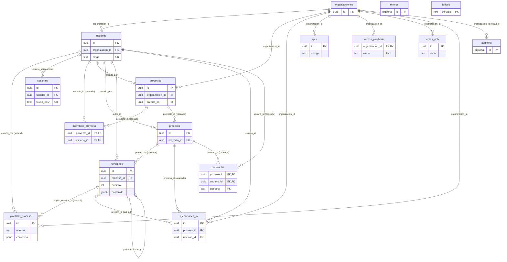

# Modelo de datos

Qué guarda ProcessIQ en Postgres, cómo se relacionan las tablas, cómo evoluciona cada fila y qué forma tiene el JSON de un proceso.

Actualizado: 28-sep-2026.

---

## 1. Visión general

- **Dos niveles.** Las tablas relacionales guardan quién, dónde y cuándo (organizaciones, usuarios, proyectos, revisiones, ejecuciones de IA…). El proceso en sí (nodos, aristas, ficha, pains, KPIs) va como un único documento JSON en `revisiones.contenido` ([ADR 10](../arquitectura.md#14-decisiones-de-arquitectura-resumen-de-adr): grafo en JSONB por revisión).
- **Dónde está el código:**
  - Tablas y tipos: [esquema.ts](../../packages/db/src/esquema.ts) (Drizzle ORM).
  - Conexión y migraciones: [cliente.ts](../../packages/db/src/cliente.ts).
  - SQL versionado: [migraciones/](../../packages/db/migraciones/).
  - Esquema del JSON y migración desde el MVP: [esquema.ts de dominio](../../packages/dominio/src/esquema.ts) y [modelo.ts](../../packages/dominio/src/modelo.ts).
- **Quién toca la base:** solo `apps/api` (servidor HTTP, worker de IA, CLI y semilla). El navegador nunca habla con Postgres.
- **Convenciones de columnas:**
  - Ids `uuid` con `gen_random_uuid()`, salvo `auditoria` y `errores` (`bigserial`), `latidos` (clave de texto) y las tablas con clave compuesta.
  - Fechas `timestamp with time zone` con `now()` por defecto.
  - Textos opcionales de la interfaz como `text not null default ''` (nunca `null`).
- **Nombres reservados:** todas las tablas, tipos enumerados y canales `LISTEN/NOTIFY` de este documento son del núcleo (`nucleo`) en [docs/iniciativas/README.md](../iniciativas/README.md). Una iniciativa no añade columnas a estas tablas: crea las suyas, con su prefijo.

---

## 2. Diagrama de relaciones



`auditoria`, `errores` y `latidos` no tienen clave foránea hacia `usuarios`: su `usuario_id` es una referencia lógica que sobrevive aunque el usuario desaparezca. `auditoria` sí la tiene hacia `organizaciones`.

### Borrados en cascada

| Clave foránea | `onDelete` | Efecto |
|---|---|---|
| `sesiones.usuario_id` → `usuarios` | `cascade` | Borrar un usuario cierra sus sesiones. |
| `miembros_proyecto.usuario_id` → `usuarios` | `cascade` | Borrar un usuario lo quita de los proyectos. |
| `miembros_proyecto.proyecto_id` → `proyectos` | `cascade` | Borrar un proyecto borra sus miembros. |
| `procesos.proyecto_id` → `proyectos` | `cascade` | Borrar un proyecto borra sus procesos… |
| `revisiones.proceso_id` → `procesos` | `cascade` | …y con ellos sus revisiones… |
| `ejecuciones_ia.proceso_id` → `procesos` | `cascade` | …y sus ejecuciones de IA. |
| `ejecuciones_ia.revision_id` → `revisiones` | `set null` | Borrar la revisión deja la ejecución sin enlace. |
| `presencias.proceso_id` → `procesos`, `presencias.usuario_id` → `usuarios` | `cascade` | Borrar un proceso o un usuario borra su presencia. |
| `plantillas_proceso.creado_por` → `usuarios`, `plantillas_proceso.origen_revision_id` → `revisiones` | `set null` | La plantilla sobrevive a su autor y a la revisión de la que salió. |
| Todas las que apuntan a `organizaciones` | `no action` | No se puede borrar una organización con datos. |
| `proyectos.creado_por`, `procesos.creado_por`, `revisiones.autor_id`, `ejecuciones_ia.usuario_id` → `usuarios` | `no action` | No se puede borrar un usuario que creó algo: se desactiva (`activo = false`). |

> La API no borra organizaciones, usuarios, proyectos, procesos ni revisiones: solo desactiva usuarios y archiva proyectos. Borra filas de `sesiones` (también las caducadas, cada hora desde el worker), `miembros_proyecto`, `verbos_playbook`, `temas_pptx`, `plantillas_proceso`, `errores` (purga) y `presencias` (al cerrar la pestaña y al caducar). La semilla de desarrollo (`pnpm --filter @processiq/api semilla`) sí borra los proyectos de las cuentas de prueba, y ahí actúan las cascadas.

---

## 3. Tipos enumerados

| Tipo | Valores | Columna |
|---|---|---|
| `rol_organizacion` | `admin`, `consultor`, `lector` | `usuarios.rol` |
| `rol_proyecto` | `propietario`, `editor`, `revisor`, `lector` | `miembros_proyecto.rol` |
| `estado_revision` | `borrador`, `en_revision`, `aprobada` | `revisiones.estado` |
| `tipo_ejecucion_ia` | `generacion`, `pains`, `tarea` | `ejecuciones_ia.tipo` |
| `estado_ejecucion_ia` | `en_cola`, `ejecutando`, `completada`, `fallida`, `cancelada` | `ejecuciones_ia.estado` |
| `tipo_verbo` | `permitido`, `prohibido` | `verbos_playbook.tipo` |
| `origen_error` | `api`, `web`, `editor`, `worker` | `errores.origen` |

Qué permite cada rol (de [permisos.ts](../../apps/api/src/permisos.ts)):

| Capacidad | propietario | editor | revisor | lector |
|---|:-:|:-:|:-:|:-:|
| leer | ✓ | ✓ | ✓ | ✓ |
| escribir (crear procesos, guardar revisiones, enviar a revisión, usar la IA) | ✓ | ✓ | | |
| aprobar (aprobar o devolver una revisión) | ✓ | | ✓ | |
| administrar (datos del proyecto, miembros, archivar) | ✓ | | | |

- Un `admin` de la organización actúa como `propietario` en todos los proyectos de su organización.
- Un `lector` de la organización no crea proyectos.
- Sin acceso al proyecto, la API responde 404 (no delata que existe).

---

## 4. Tablas

### Identidad

#### `organizaciones`

Una por país o práctica de MBC. Hoy hay una sola: la crea `asegurarOrganizacion` (nombre `MBC`) al arrancar la API si no existe ninguna.

| Columna | Tipo | Nulo | Por defecto | Significado |
|---|---|:-:|---|---|
| `id` | uuid | no | `gen_random_uuid()` | Clave primaria. |
| `nombre` | text | no | — | Nombre visible. |
| `creado_en` | timestamptz | no | `now()` | Alta. La «organización por defecto» es la más antigua. |

#### `usuarios`

Cuentas locales con contraseña ([ADR 12](../adr/0012-cuentas-locales.md)); Entra ID llegará después.

| Columna | Tipo | Nulo | Por defecto | Significado |
|---|---|:-:|---|---|
| `id` | uuid | no | `gen_random_uuid()` | Clave primaria. |
| `organizacion_id` | uuid | no | — | FK → `organizaciones` (`no action`). |
| `email` | text | no | — | Único en toda la base. Siempre en minúsculas (lo garantiza la API). |
| `nombre` | text | no | — | Nombre visible. |
| `hash_clave` | text | no | — | `scrypt$N$r$p$sal$hash` (base64url). Con Entra ID quedará vacío. |
| `rol` | `rol_organizacion` | no | `consultor` | Rol en la organización. |
| `activo` | boolean | no | `true` | `false` = no puede entrar; desactivarlo borra sus sesiones. |
| `debe_cambiar_clave` | boolean | no | `true` | Contraseña temporal (alta o restablecimiento): solo se permite cambiarla. |
| `creado_en` | timestamptz | no | `now()` | Alta. |
| `ultimo_acceso` | timestamptz | sí | — | Último inicio de sesión correcto. |

Restricción única: `usuarios_email_unique (email)`.

#### `sesiones`

Una fila por sesión abierta (cookie `piq_sesion`).

| Columna | Tipo | Nulo | Por defecto | Significado |
|---|---|:-:|---|---|
| `id` | uuid | no | `gen_random_uuid()` | Clave primaria. |
| `usuario_id` | uuid | no | — | FK → `usuarios` (`cascade`). |
| `token_hash` | text | no | — | SHA-256 del token de la cookie: una fuga de la base no expone sesiones. |
| `creada_en` | timestamptz | no | `now()` | Inicio de sesión. |
| `expira_en` | timestamptz | no | — | `creada_en` + `HORAS_SESION` (12 h por defecto). |
| `ip` | text | sí | — | IP del cliente al entrar. |
| `agente` | text | sí | — | `User-Agent` al entrar. |

- Restricción única `sesiones_token_hash_unique (token_hash)`; índice `sesiones_usuario_idx (usuario_id)`.
- Se borran al cerrar sesión, al desactivar al usuario, al restablecerle la contraseña (todas) y al cambiarla él mismo (todas menos la actual).
- Una sesión caducada deja de valer (la API filtra `expira_en > now()`) y el worker borra cada hora las filas caducadas (`purgarSesionesCaducadas`).

### Trabajo

#### `proyectos`

Unidad de trabajo con un cliente. Un proyecto archivado es de solo lectura.

| Columna | Tipo | Nulo | Por defecto | Significado |
|---|---|:-:|---|---|
| `id` | uuid | no | `gen_random_uuid()` | Clave primaria. |
| `organizacion_id` | uuid | no | — | FK → `organizaciones` (`no action`). Toda consulta filtra por ella. |
| `nombre` | text | no | — | Nombre del proyecto. |
| `cliente` | text | no | `''` | Cliente, en texto libre (no hay tabla de clientes). |
| `descripcion` | text | no | `''` | Descripción libre. |
| `creado_por` | uuid | no | — | FK → `usuarios` (`no action`). |
| `creado_en` | timestamptz | no | `now()` | Alta. |
| `archivado` | boolean | no | `false` | `true` = no se escribe ni se aprueba (409 `ARCHIVADO`) hasta reactivarlo. |

Sin índices propios (aparte de la clave primaria).

#### `miembros_proyecto`

Quién participa en cada proyecto y con qué rol. Quien crea el proyecto entra como `propietario`, y la API impide quedarse sin ninguno.

| Columna | Tipo | Nulo | Por defecto | Significado |
|---|---|:-:|---|---|
| `proyecto_id` | uuid | no | — | FK → `proyectos` (`cascade`). |
| `usuario_id` | uuid | no | — | FK → `usuarios` (`cascade`). |
| `rol` | `rol_proyecto` | no | — | Rol en el proyecto. |

Clave primaria compuesta `(proyecto_id, usuario_id)`: un rol por persona y proyecto.

#### `procesos`

Un proceso de negocio dentro de un proyecto. Su contenido está en sus revisiones.

| Columna | Tipo | Nulo | Por defecto | Significado |
|---|---|:-:|---|---|
| `id` | uuid | no | `gen_random_uuid()` | Clave primaria. |
| `proyecto_id` | uuid | no | — | FK → `proyectos` (`cascade`). |
| `nombre` | text | no | — | Nombre (no tiene que ser único). |
| `creado_por` | uuid | no | — | FK → `usuarios` (`no action`). |
| `creado_en` | timestamptz | no | `now()` | Alta. |
| `actualizado_en` | timestamptz | no | `now()` | Se actualiza al renombrar y al guardar cada revisión. |

Índice `procesos_proyecto_idx (proyecto_id)`.

#### `revisiones`

Una revisión es el proceso completo en un momento dado (JSON v1, [§8](#8-contenido-json-v1-de-una-revisión)). Ciclo de vida en [§6.1](#61-revisiones).

| Columna | Tipo | Nulo | Por defecto | Significado |
|---|---|:-:|---|---|
| `id` | uuid | no | `gen_random_uuid()` | Clave primaria. |
| `proceso_id` | uuid | no | — | FK → `procesos` (`cascade`). |
| `numero` | integer | no | — | Correlativo dentro del proceso (1, 2, 3…). |
| `padre_id` | uuid | sí | — | Revisión sobre la que se trabajó. **Sin FK**: la API comprueba que sea del mismo proceso. `null` = se partió de un proceso sin revisiones. |
| `autor_id` | uuid | no | — | FK → `usuarios` (`no action`). |
| `mensaje` | text | no | `''` | Mensaje del autor (hasta 500 caracteres). La primera, si nace con el proceso, lleva «Versión inicial». |
| `estado` | `estado_revision` | no | `borrador` | Estado de aprobación. |
| `schema_version` | integer | no | — | Versión del JSON (`1` hoy). |
| `contenido` | jsonb | no | — | El proceso en formato v1, ya validado y normalizado. |
| `creada_en` | timestamptz | no | `now()` | Momento del guardado. |

- Restricción única `revisiones_proceso_numero_uq (proceso_id, numero)`.
- Índice `revisiones_proceso_idx (proceso_id)`.
- No hay índices sobre el JSONB: se añadirán cuando una consulta entre procesos lo pida.

### IA

#### `ejecuciones_ia`

Una llamada de IA que hace el servidor. **La fila es también el trabajo de la cola** ([ADR 13](../adr/0013-cola-ia-en-postgres.md)). Ciclo de vida en [§6.2](#62-ejecuciones-de-ia).

| Columna | Tipo | Nulo | Por defecto | Significado |
|---|---|:-:|---|---|
| `id` | uuid | no | `gen_random_uuid()` | Clave primaria. |
| `organizacion_id` | uuid | no | — | FK → `organizaciones` (`no action`). Para el presupuesto mensual. |
| `proceso_id` | uuid | no | — | FK → `procesos` (`cascade`). |
| `usuario_id` | uuid | no | — | FK → `usuarios` (`no action`). Quien la pidió (límite por persona). |
| `tipo` | `tipo_ejecucion_ia` | no | — | `generacion` (proceso desde fuentes), `pains` o `tarea` (copiloto). |
| `tarea` | text | sí | — | Solo en `tarea`: clave de `TAREAS_IA` (`suggest-kpis`, `propose-tobe`, `raci`, `impact-effort`, `automation`, `backlog`, `exec-summary`, `sipoc`, `bottleneck`). |
| `modelo` | text | no | — | Modelo de Claude usado (dentro de los permitidos). |
| `estado` | `estado_ejecucion_ia` | no | `en_cola` | Estado del trabajo. |
| `parametros` | jsonb | no | `'{}'` | Generación: `{ etiqueta, vista, roles, variasFuentes, fuentes: [{ nombre, tipo, caracteres }], caracteres }`. Análisis: `{ nodos }`. |
| `texto` | text | sí | — | Entrada de la IA: texto de las fuentes (generación) o resumen del proceso (análisis). **Se borra al terminar.** |
| `progreso` | integer | no | `0` | Caracteres recibidos de la IA. Vuelve a 0 en cada intento. |
| `resultado` | jsonb | sí | — | Generación: la especificación del proceso validada. Tarea: `{ markdown }`. Pains: `{ datos }`. |
| `error` | text | sí | — | Último error. Mientras espera reintento lleva «(reintento n de 3)». |
| `intentos` | integer | no | `0` | Intentos consumidos (sube al tomarla de la cola). |
| `disponible_en` | timestamptz | no | `now()` | No se toma de la cola antes de esta hora (espera entre reintentos). |
| `cancelar` | boolean | no | `false` | Pedido de cancelación; el worker lo vigila. |
| `tokens_entrada` | integer | no | `0` | Suma de todas las llamadas (intentos fallidos y reparación incluidos). |
| `tokens_salida` | integer | no | `0` | Ídem. |
| `coste_usd` | double precision | no | `0` | Coste acumulado en US$, con los precios de lista de `@processiq/ia`. |
| `revision_id` | uuid | sí | — | FK → `revisiones` (`set null`). Revisión que se guardó con esta generación. |
| `descartada` | boolean | no | `false` | El usuario no quiso aplicar la generación: deja de ofrecerse. |
| `creado_en` | timestamptz | no | `now()` | Encolado. Base del consumo mensual. |
| `iniciado_en` | timestamptz | sí | — | Primera vez que un worker la tomó. |
| `terminado_en` | timestamptz | sí | — | Llegada a un estado final. |
| `actualizado_en` | timestamptz | no | `now()` | Latido del worker mientras ejecuta. |

Índices:

- `ejecuciones_ia_cola_idx (estado, disponible_en)`: tomar de la cola.
- `ejecuciones_ia_proceso_idx (proceso_id)`: ejecuciones y pendientes de un proceso.
- `ejecuciones_ia_consumo_idx (organizacion_id, creado_en)`: gasto del mes.

### Catálogos

Administrables por organización (fase 2.4a). Se siembran con los del MVP, que viven en `@processiq/dominio`. Detalle en [§6.7](#67-catálogos).

#### `kpis`

| Columna | Tipo | Nulo | Por defecto | Significado |
|---|---|:-:|---|---|
| `id` | uuid | no | `gen_random_uuid()` | Clave primaria (solo para la API de administración). |
| `organizacion_id` | uuid | no | — | FK → `organizaciones` (`no action`). |
| `codigo` | text | no | — | **Id estable del KPI**: es la clave con la que los procesos guardan sus valores (`kpiValues`). Nunca cambia. |
| `industria` | text | no | — | Industria (Banca, Seguros…). |
| `macroproceso` | text | no | `''` | Macroproceso (O2C, Siniestros…). |
| `nombre` | text | no | — | Nombre del indicador. |
| `unidad` | text | no | `''` | Unidad (%, días…). |
| `benchmark` | text | no | `''` | Referencia de mercado, en texto. |
| `descripcion` | text | no | `''` | Qué mide. |
| `activo` | boolean | no | `true` | Desactivado = no se ofrece, pero los procesos que ya lo usan lo conservan. |
| `creado_en` | timestamptz | no | `now()` | Alta. |
| `actualizado_en` | timestamptz | no | `now()` | Último cambio. |

Restricción única `kpis_org_codigo_uq (organizacion_id, codigo)`.

#### `verbos_playbook`

Verbos del Playbook MBB que usa el linter para la primera palabra de cada tarea.

| Columna | Tipo | Nulo | Por defecto | Significado |
|---|---|:-:|---|---|
| `organizacion_id` | uuid | no | — | FK → `organizaciones` (`no action`). |
| `verbo` | text | no | — | Una palabra en infinitivo, minúsculas (`^[a-záéíóúüñ]{2,30}$`). |
| `tipo` | `tipo_verbo` | no | — | `permitido` o `prohibido`. |
| `motivo` | text | no | `''` | Texto que ve el consultor. Obligatorio si es `prohibido`. |
| `actualizado_en` | timestamptz | no | `now()` | Último cambio. |

Clave primaria compuesta `(organizacion_id, verbo)`.

#### `temas_pptx`

Temas de cliente para el export PPTX, **además** de los del código (`mbc` y `bbva`).

| Columna | Tipo | Nulo | Por defecto | Significado |
|---|---|:-:|---|---|
| `id` | uuid | no | `gen_random_uuid()` | Clave primaria. |
| `organizacion_id` | uuid | no | — | FK → `organizaciones` (`no action`). |
| `clave` | text | no | — | Identificador del tema (`^[a-z0-9-]{2,30}$`). `mbc` y `bbva` están reservadas. |
| `nombre` | text | no | — | Nombre visible (copia de `definicion.nombre`). |
| `definicion` | jsonb | no | — | Misma forma que una entrada de `TEMAS_PPTX` ([§6.7](#67-catálogos)). |
| `activo` | boolean | no | `true` | Solo los activos llegan al editor. |
| `creado_en` | timestamptz | no | `now()` | Alta. |
| `actualizado_en` | timestamptz | no | `now()` | Último cambio. |

Restricción única `temas_pptx_org_clave_uq (organizacion_id, clave)`.

#### `plantillas_proceso`

Procesos completos de los que se parte al crear otro en un proyecto. Se crean desde una revisión y sin lo que es de un cliente concreto ([§6.7](#67-catálogos)).

| Columna | Tipo | Nulo | Por defecto | Significado |
|---|---|:-:|---|---|
| `id` | uuid | no | `gen_random_uuid()` | Clave primaria. |
| `organizacion_id` | uuid | no | — | FK → `organizaciones` (`no action`). |
| `nombre` | text | no | — | Nombre visible; único en la organización. |
| `descripcion` | text | no | `''` | Para elegirla. |
| `industria` | text | no | `''` | Si no se indica, la de `meta.industry` del proceso. |
| `contenido` | jsonb | no | — | Contenido v1 ([§8](#8-contenido-json-v1-de-una-revisión)) ya limpio. |
| `schema_version` | integer | no | — | Versión del esquema de `contenido`. |
| `nodos` | integer | no | `0` | Elementos del diagrama, para mostrarlo sin leer el contenido. |
| `activo` | boolean | no | `true` | Solo las activas se ofrecen al crear un proceso. |
| `creado_por` | uuid | sí | — | FK → `usuarios` (`set null`). |
| `origen_revision_id` | uuid | sí | — | FK → `revisiones` (`set null`): de dónde salió. |
| `creado_en` | timestamptz | no | `now()` | Alta. |
| `actualizado_en` | timestamptz | no | `now()` | Último cambio. |

Restricción única `plantillas_proceso_org_nombre_uq (organizacion_id, nombre)`.

### Control

#### `auditoria`

Quién hizo qué, sobre qué y cuándo. **Solo se inserta** (funciones `registrar()` y `registrarEvento()` de [auditoria.ts](../../apps/api/src/auditoria.ts)). Cada administrador ve solo las filas de su organización.

| Columna | Tipo | Nulo | Por defecto | Significado |
|---|---|:-:|---|---|
| `id` | bigserial | no | secuencia | Clave primaria. |
| `usuario_id` | uuid | sí | — | Quién (sin FK). `null` si no había sesión y en la línea de comandos. |
| `organizacion_id` | uuid | sí | — | FK a `organizaciones`. La del autor o, sin autor, la de la cuenta afectada (entidad `usuario`). `null` si no hay ninguna (correo inexistente). Las filas anteriores a la migración 0005 se rellenaron así. |
| `accion` | text | no | — | Qué pasó ([§6.5](#65-auditoría)). |
| `entidad` | text | no | — | Tipo de objeto (`proyecto`, `proceso`, `revision`, `usuario`, `kpi`, `verbo`, `tema_pptx`). |
| `entidad_id` | text | sí | — | Id del objeto (texto: puede no ser uuid). |
| `detalle` | jsonb | no | `'{}'` | Datos del cambio. |
| `ip` | text | sí | — | IP del cliente. |
| `creado_en` | timestamptz | no | `now()` | Momento. |

Índices `auditoria_entidad_idx (entidad, entidad_id)` y `auditoria_organizacion_idx (organizacion_id, id)`.

#### `errores`

Errores inesperados de API, web, editor y worker ([ADR 15](../adr/0015-observabilidad-propia.md)).

| Columna | Tipo | Nulo | Por defecto | Significado |
|---|---|:-:|---|---|
| `id` | bigserial | no | secuencia | Clave primaria. |
| `origen` | `origen_error` | no | — | Quién lo informa. |
| `mensaje` | text | no | — | Mensaje (recortado a 2 000 caracteres). |
| `pila` | text | sí | — | Traza (recortada a 8 000). |
| `ruta` | text | sí | — | Ruta de la API («POST /api/…»), URL de la página o lugar del worker (recortada a 500). |
| `huella` | text | no | — | Agrupa repeticiones ([§6.3](#63-errores)). |
| `usuario_id` | uuid | sí | — | Quién estaba conectado, si se sabe (sin FK). |
| `agente` | text | sí | — | `User-Agent` (recortado a 300). |
| `detalle` | jsonb | no | `'{}'` | Datos extra (p. ej. `ejecucionId`). |
| `creado_en` | timestamptz | no | `now()` | Momento. |

Índices `errores_creado_idx (creado_en)` y `errores_huella_idx (huella)`.

#### `latidos`

Último latido de cada servicio sin HTTP.

| Columna | Tipo | Nulo | Por defecto | Significado |
|---|---|:-:|---|---|
| `servicio` | text | no | — | Clave primaria. Hoy solo existe `worker`. |
| `detalle` | jsonb | no | `'{}'` | Worker: `{ concurrencia, enCurso, iaConfigurada }`. |
| `en` | timestamptz | no | `now()` | Hora del último latido. |

#### Tabla de drizzle

Drizzle crea el esquema `drizzle` con la tabla `__drizzle_migrations (id, hash, created_at)`. Guarda una fila por migración aplicada, con la marca de tiempo del journal en `created_at`. No se toca a mano ([§7](#7-migraciones)).

### Invitados (iniciativa `invitados`)

Enlaces de solo lectura a una revisión y los comentarios de quien los abre ([ficha](../iniciativas/invitados.md), [ADR 20](../adr/0020-rutas-publicas-con-token.md)). Los escribe solo el módulo `apps/api/src/modulos/invitados`.

#### `invitados_enlaces`

| Columna | Tipo | Nulo | Por defecto | Significado |
|---|---|:-:|---|---|
| `id` | uuid | no | `gen_random_uuid()` | Clave primaria. |
| `organizacion_id`, `proyecto_id`, `proceso_id`, `revision_id` | uuid | no | — | FK (`cascade`) a la revisión compartida y a lo que la contiene. |
| `token_hash` | text | no | — | SHA-256 del token del enlace, único. El token solo se muestra al crearlo. |
| `destinatario` | text | no | — | A quién se envió (texto libre). |
| `admite_comentarios` | boolean | no | `true` | Si el invitado puede comentar. |
| `caduca_en` | timestamptz | no | — | Alta + los días elegidos (14 por defecto, 90 como máximo). |
| `revocado_en`, `revocado_por` | timestamptz, uuid | sí | — | Revocado si tiene fecha; `revocado_por` FK → `usuarios` (`set null`). |
| `creado_por` | uuid | no | — | FK → `usuarios` (`no action`). |
| `creado_en` | timestamptz | no | `now()` | Alta. |
| `ultimo_acceso` | timestamptz | sí | — | Última vez que alguien lo abrió. |

Índices `invitados_enlaces_proceso_idx (proceso_id)` y `invitados_enlaces_revision_idx (revision_id)`.

#### `invitados_comentarios`

| Columna | Tipo | Nulo | Por defecto | Significado |
|---|---|:-:|---|---|
| `id` | uuid | no | `gen_random_uuid()` | Clave primaria. |
| `enlace_id` | uuid | no | — | FK → `invitados_enlaces` (`cascade`). |
| `revision_id` | uuid | no | — | FK → `revisiones` (`cascade`): la del enlace. |
| `elemento_id` | text | sí | — | Id del nodo comentado; `null` = la revisión en general. |
| `elemento_etiqueta` | text | sí | — | Etiqueta del nodo al comentar («(To-Be)» si es de esa vista). |
| `nombre` | text | no | — | El nombre que escribió el invitado (no se piden correos). |
| `texto` | text | no | — | El comentario (hasta 4 000 caracteres). |
| `creado_en` | timestamptz | no | `now()` | Alta. |
| `resuelto_en`, `resuelto_por` | timestamptz, uuid | sí | — | Resuelto si tiene fecha; `resuelto_por` FK → `usuarios` (`set null`). |

Índices `invitados_comentarios_enlace_idx (enlace_id)` y `invitados_comentarios_revision_idx (revision_id)`.

### Colaboración (núcleo, iniciativa `colaboracion`)

Quién tiene abierto cada proceso ([ficha](../iniciativas/colaboracion.md), [ADR 21](../adr/0021-presencia-y-eventos-por-sse.md)). La escribe solo `apps/api/src/colaboracion`. Es efímera: sin histórico ni auditoría.

#### `presencias`

Una fila por pestaña abierta en un proceso (el editor o la página del proceso del shell).

| Columna | Tipo | Nulo | Por defecto | Significado |
|---|---|:-:|---|---|
| `proceso_id` | uuid | no | — | FK → `procesos` (`cascade`). Parte de la clave primaria. |
| `usuario_id` | uuid | no | — | FK → `usuarios` (`cascade`). Parte de la clave primaria. |
| `pestana` | text | no | — | Identificador aleatorio que genera la web por pestaña (8–64 caracteres). Parte de la clave primaria. |
| `lugar` | text | no | — | `editor` o `shell` (lo valida la API). |
| `estado` | text | no | — | `viendo` o `editando` (hay cambios sin guardar). La API solo guarda `editando` si la persona puede escribir en el proyecto y no está archivado. |
| `desde` | timestamptz | no | `now()` | Cuándo se abrió la pestaña. |
| `ultimo_latido` | timestamptz | no | `now()` | Último latido. Caduca a los 60 s. |

Clave primaria `(proceso_id, usuario_id, pestana)`; índice `presencias_ultimo_latido_idx (ultimo_latido)` para borrar las caducadas.

---

## 5. Canales `LISTEN/NOTIFY`

| Canal | Carga | Quién avisa | Quién escucha |
|---|---|---|---|
| `ia_cola` | id de la ejecución | La API al encolar | El worker: despierta y mira la cola. |
| `ia_ejecucion` | id de la ejecución | El worker en cada cambio (estado, progreso) y la API al cancelar | La API, para el SSE `/api/ia/ejecuciones/:id/eventos`. |
| `procesos_evento` | id del proceso | La API: al guardar una revisión (dentro de la transacción) y cuando cambia la presencia (entra, cambia de estado, se va o caduca) | La API, para el SSE `/api/procesos/:id/eventos` ([ADR 21](../adr/0021-presencia-y-eventos-por-sse.md)). |

Los avisos solo despiertan. El estado se lee siempre de la tabla, y cada evento SSE envía el estado completo (la fila, o la presencia y la última revisión), así que reconectar es seguro. La API escucha los dos canales en una sola conexión (`Escucha`, [ia/avisos.ts](../../apps/api/src/ia/avisos.ts)). Los que esperan tienen además un sondeo de respaldo (10 s en el worker, 5 s en el SSE).

---

## 6. Ciclo de vida

### 6.1 Revisiones

Código: [rutas/procesos.ts](../../apps/api/src/rutas/procesos.ts).

**Cómo nace una revisión:**

1. **Con el proceso:** `POST /api/proyectos/:id/procesos` con `contenido`. En la misma transacción crea el proceso y la revisión 1, con `padre_id = null` y el mensaje «Versión inicial» si no se da otro. Sin `contenido`, el proceso nace sin revisiones. Es la vía de la importación del shell (`/proyectos/importar` y «importar JSON» en un proyecto), que envía el JSON del editor libre (v0) tal cual.
2. **Al guardar:** `POST /api/procesos/:id/revisiones` con `{ contenido, mensaje, padreId, ejecucionIaId }`.

En ambos casos el contenido pasa por `migrarProyecto` ([§8.13](#813-schemaversion-y-migración-desde-el-mvp-v0)). Si no es válido, responde 400 `PROCESO_INVALIDO` con la lista de errores. Se guarda el resultado normalizado (v1), no lo que envió el cliente.

**Numeración y conflicto** (todo en una transacción):

1. `select id from procesos where id = … for update`: bloquea el proceso, así que dos guardados simultáneos no pueden tomar el mismo número.
2. Lee la última revisión (mayor `numero`).
3. Si llega `padreId`, comprueba que sea de este proceso (si no, 400 `PADRE_INVALIDO`).
4. `conflicto = (id de la última ?? null) !== padreId`. **Se guarda igual**: no se pierde trabajo. La respuesta lleva `conflicto: true` y `ultimaAnterior`, y el editor avisa.
5. Inserta con `numero = última + 1` y actualiza `procesos.actualizado_en`.
6. Si llega `ejecucionIaId`, enlaza esa ejecución (`revision_id`). Tiene que ser de este proceso, de tipo `generacion` y estar `completada`; si no, 400 `EJECUCION_INVALIDA` y no se guarda nada.

La restricción única `(proceso_id, numero)` es la red de seguridad si algo saltara el bloqueo.

**Estados:**

```text
borrador ──(escribir)──▶ en_revision ──(aprobar)──▶ aprobada
    ▲                        │
    └──────(aprobar)─────────┘   devolver
```

| Transición | Capacidad | Quién |
|---|---|---|
| `borrador` → `en_revision` | escribir | propietario, editor |
| `en_revision` → `aprobada` | aprobar | propietario, revisor |
| `en_revision` → `borrador` (devolver) | aprobar | propietario, revisor |

- Cualquier otra transición: 409 `TRANSICION`.
- El cambio se hace con `update … where id = … and estado = <estado leído>`. Si otra persona cambió el estado entretanto, 409 `CONCURRENCIA`.
- Proyecto archivado: 409 `ARCHIVADO`.

**Inmutabilidad:**

- El **contenido** de una revisión nunca cambia: la API no tiene ninguna ruta que lo actualice. Editar es guardar una revisión nueva.
- Una revisión **`aprobada`** tampoco cambia de estado: 409 `INMUTABLE` («guarda una nueva»).

Auditoría: `revision.alta` (con `numero`, `conflicto` y `ejecucionIaId` si lo hay) y `revision.estado` (`{ de, a }`).

### 6.2 Ejecuciones de IA

Código: [rutas/ia.ts](../../apps/api/src/rutas/ia.ts), [ia/cola.ts](../../apps/api/src/ia/cola.ts), [ia/ejecutar.ts](../../apps/api/src/ia/ejecutar.ts) y [worker.ts](../../apps/api/src/worker.ts).

```text
            ┌──────────── reintento (15 s, 60 s) / huérfana / worker apagándose ───────────┐
            ▼                                                                               │
POST ──▶ en_cola ──(worker, SKIP LOCKED)──▶ ejecutando ──┬──▶ completada                    │
            │                                             ├──▶ fallida                       │
            │ cancelar                                    ├──▶ cancelada                     │
            ▼                                             └───────────────────────────────────┘
        cancelada
```

**Encolar** (`POST /api/ia/generaciones` o `POST /api/ia/analisis`):

- Exige capacidad «escribir» sobre el proceso.
- Comprueba que la IA del servidor esté configurada (409 `IA_NO_CONFIGURADA`), el **presupuesto mensual de la organización** (409 `PRESUPUESTO`) y el **límite mensual por persona** (409 `LIMITE_USUARIO`). Ambos se calculan sumando `coste_usd` desde el inicio del mes en hora de Lima. Por defecto son US$ 100 y US$ 25 (`PRESUPUESTO_IA_MENSUAL_USD`, `LIMITE_IA_USUARIO_MENSUAL_USD`).
- Generación: el cliente puede pedir un modelo de `MODELOS_IA_PERMITIDOS` (400 `MODELO` si no está); si no pide ninguno, se usa el primero de la lista. `texto` = texto de las fuentes (máximo 1 000 000 caracteres; el prompt solo usa los 180 000 primeros).
- Análisis: el contenido del proceso se valida con `migrarProyecto`. `texto` = resumen del proceso (`resumenProcesoParaIa`). El modelo es el de análisis (`MODELO_IA_ANALISIS`).
- Inserta la fila en `en_cola` y avisa por `ia_cola`. Responde 202 con la ejecución.

**Tomar** (`tomarSiguiente`): un solo `update` pasa a `ejecutando` la fila `en_cola` más antigua con `disponible_en <= now()` y `not cancelar`, elegida con `for update skip locked`. En el mismo paso: `intentos + 1`, `progreso = 0` y `iniciado_en` (solo la primera vez). Dos workers nunca toman la misma.

**Ejecutar:**

- Cada 2 s el worker actualiza `actualizado_en` (latido) y mira `cancelar`.
- El progreso (`progreso`) se escribe como mucho una vez por segundo.
- Los tokens y el coste se **suman** en cada salida, incluidos los intentos fallidos y la reparación del JSON.
- Generación: valida la especificación. Si falla y la respuesta mide menos de 200 000 caracteres, pide una sola reparación.

**Cómo termina:**

| Situación | Nuevo estado | Cambios |
|---|---|---|
| Éxito | `completada` | `resultado`, `error = null`, **`texto = null`**, `terminado_en` |
| Error pasajero (`clasificarErrorIa` = transitorio) y `intentos < 3` | `en_cola` | `progreso = 0`, `error` con «(reintento n de 3)», `disponible_en = now + 15 s` (tras el 1.º) o `+ 60 s` (tras el 2.º) |
| Error definitivo o tercer intento fallido | `fallida` | `error`, **`texto = null`**, `terminado_en` |
| Cancelada mientras ejecutaba | `cancelada` | `error = null`, **`texto = null`**, `terminado_en` |
| El worker se apaga (SIGTERM) a mitad | `en_cola` | `intentos - 1` (no cuenta), `progreso = 0`, `disponible_en = now` |

**Cancelar** (`POST /api/ia/ejecuciones/:id/cancelar`, capacidad «escribir»):

- En cola: pasa a `cancelada` al momento, con `cancelar = true`, `texto = null` y `terminado_en`.
- Ejecutando: solo marca `cancelar = true`. El worker lo ve en su siguiente vigilancia (≤ 2 s), aborta la llamada y la deja `cancelada`.
- En un estado final no hace nada.

**Huérfanas:** una fila `ejecutando` sin latido durante más de 120 s (worker caído) vuelve a `en_cola` sin contar el intento. Se revisa al arrancar el worker y cada 60 s.

**Privacidad:**

- `texto` (fuentes del cliente) solo vive mientras hace falta. Se conserva durante los reintentos y se borra en cualquier estado final.
- Quedan el nombre, el tipo y el tamaño de cada fuente en `parametros.fuentes`, y sus nombres en la auditoría (`ia.generacion`).
- La API nunca devuelve `texto` ni `organizacion_id` (función `publica`). `resultado` solo se devuelve en estados finales.

**Después:** una generación `completada`, sin `revision_id` y no `descartada` es «pendiente»: el editor ofrece dibujarla al abrir el proceso. Al guardarla como revisión (con `ejecucionIaId`) queda enlazada. `POST …/descartar` pone `descartada = true`.

### 6.3 Errores

Código: [observabilidad.ts](../../apps/api/src/observabilidad.ts) y [rutas/sistema.ts](../../apps/api/src/rutas/sistema.ts).

- **Quién escribe:**
  - la API, en cada 500 (los 4xx no se registran); la respuesta lleva la referencia `X-Request-Id`;
  - el worker, en sus errores inesperados;
  - la web (el shell siempre, el editor solo en modo proyecto), por `POST /api/errores`, que es pública y tiene límite por IP.
- `registrarError` nunca lanza: si falla, deja una línea en el log y sigue.
- **Huella:** SHA-1 (16 caracteres hex) de `origen | mensaje normalizado | primer marco de la pila`.
  - En el mensaje, los uuid pasan a `<id>` y los números a `<n>`; se toman los primeros 300 caracteres.
  - Al marco se le quitan línea, columna y parámetros de la URL.
  - Así, el mismo error se agrupa aunque cambien ids o la línea exacta.
- **Pantalla «Sistema»:** agrupa por huella los errores de los últimos 7 días (30 grupos) y cuenta los de 24 h y 1 h.
- **Purga:** el worker borra cada hora los errores de más de 30 días (`purgarErrores`).

### 6.4 Latidos

- El worker hace *upsert* en `latidos` (`servicio = 'worker'`) al arrancar y cada 30 s (`LATIDO_SEGUNDOS`).
- «Sistema» avisa si nunca hubo latido o si el último tiene más de 120 s.
- No confundir con el latido por ejecución (`ejecuciones_ia.actualizado_en`, cada 2 s).

### 6.5 Auditoría

Toda escritura relevante de la API llama a `registrar(c, accion, entidad, entidadId, detalle)`. Acciones que existen hoy:

| Entidad | Acciones |
|---|---|
| `usuario` | `sesion.inicio`, `sesion.fallida`, `sesion.cierre`, `usuario.alta`, `usuario.cambio`, `usuario.cambio_clave`, `usuario.restablecer_clave`; desde `cli.js`, `cli.usuario.alta` y `cli.usuario.restablecer_clave` (sin autor, `detalle.origen = 'cli'`) |
| `proyecto` | `proyecto.alta`, `proyecto.cambio`, `proyecto.miembro`, `proyecto.baja_miembro` |
| `proceso` | `proceso.alta`, `proceso.cambio`, `ia.generacion`, `ia.analisis`, `ia.cancelacion` |
| `revision` | `revision.alta`, `revision.estado` |
| `kpi` | `catalogo.kpi.alta`, `catalogo.kpi.cambio` |
| `verbo` | `catalogo.verbo`, `catalogo.verbo.baja` |
| `tema_pptx` | `catalogo.tema.alta`, `catalogo.tema.cambio`, `catalogo.tema.baja` |

Nadie actualiza ni borra filas de `auditoria`, y no hay purga.

### 6.6 Sesiones

Ver la tabla [`sesiones`](#sesiones): se crea al entrar, expira a las `HORAS_SESION` horas y se borra al salir o por cambios de la cuenta. El worker borra cada hora las caducadas (`purgarSesionesCaducadas`).

### 6.7 Catálogos

Código: [catalogos.ts](../../apps/api/src/catalogos.ts) y [rutas/catalogos.ts](../../apps/api/src/rutas/catalogos.ts). La escritura es solo para administradores.

**Siembra** (`asegurarCatalogos`):

- Se ejecuta al crear la organización y en cada arranque de la API.
- Es idempotente: solo inserta si la organización no tiene **ningún** KPI (o ningún verbo), con `on conflict do nothing`.
- Copia `KPI_LIBRARY`, `VERBS_ALLOWED` y `VERBS_FORBIDDEN` de `@processiq/dominio`.
- Consecuencia: si un administrador desactiva todos los KPIs, siguen ahí (desactivados). Pero si se borraran todas las filas, el siguiente arranque volvería a sembrar los del MVP.

**KPIs, `codigo` estable:**

- Los sembrados conservan el id del MVP (`bnk-01`, `seg-03`…). Los nuevos reciben `org-` + 8 caracteres hexadecimales al azar.
- `codigo` no se puede editar (el esquema del `PATCH` no lo admite) y los KPIs no se borran: solo se desactivan.
- Motivo: los procesos guardan sus valores en `kpiValues` con ese código como clave ([§8.10](#810-kpis-kpivalues)).

**Verbos:**

- Un verbo `prohibido` exige `motivo`.
- Se pueden borrar (`DELETE /api/catalogos/verbos/:verbo`).

**Temas PPTX:**

- `mbc` y `bbva` viven en el código (`TEMAS_PPTX` de `@processiq/exportar`) y no pueden redefinirse desde la base: 409 `CLAVE_RESERVADA`. Una clave repetida da 409 `DUPLICADO`.
- `definicion` se valida con un esquema estricto (`DefinicionTemaEsquema`):
  - textos: `nombre`, `autor`, `pie`, `font`, `fontTitulo`;
  - colores hexadecimales de 6 dígitos sin `#`: `dk1`, `lt2`, `acento`, `gris`, `antetitulo`, `sep`, `chipRol`, `teal`, `rosa`, `verde`, `arena`, `circulo`, `portadaFondo`, `portadaTexto`, `portadaSub`;
  - imágenes PNG o JPEG en data URI (≤ 2 000 000 caracteres): `logo`, `logoInv` y `foto` (opcional);
  - `logoW` (≤ 6), `logoH` (≤ 3), `portada` (`mbc` | `bbva`) y `cierre` (booleano).
- Se pueden desactivar o borrar.

**Plantillas de proceso:**

- Las crea un administrador desde una revisión de un proyecto al que llega. `contenidoDePlantilla` guarda una copia del contenido v1 sin `meta.client`, sin las personas de `ficha.gobernanza`, sin `ficha.cambios`, sin `kpiValues` y con `simResults` a `null`. El texto libre no se limpia.
- Al crear un proceso con `plantillaId`, la v1 es una copia del contenido con `meta.name` = el nombre del proceso y `meta.client` = el cliente del proyecto. El mensaje es «Creado desde la plantilla «X»».
- Ocultar una plantilla (`activo = false`) la deja de ofrecer; borrarla no toca los procesos creados con ella.

**Uso:** `GET /api/catalogos` devuelve solo lo activo, con la forma de `@processiq/dominio`. En modo proyecto, el editor reemplaza en sitio los catálogos por defecto ([ADR 14](../adr/0014-catalogos-en-sitio.md)).

### 6.8 Presencia

- **Alta y latido:** cada pestaña hace `PUT /api/procesos/:id/presencia` al abrirse, cada 20 s y cuando cambia su estado (*upsert*). Mientras su SSE siga abierto, la API renueva también `ultimo_latido` cada 20 s.
- **Caducidad:** una fila sin latido en 60 s ya no se muestra; el siguiente latido de cualquiera borra todas las caducadas (y avisa a sus procesos).
- **Baja:** al cerrar la pestaña, `DELETE …/presencia` con `keepalive`; si no llega, caduca sola. Borrar el proceso o la cuenta también la borra (cascada).
- **Avisos:** `NOTIFY procesos_evento` cuando entra una pestaña, cambia su estado o se va; y, dentro de la transacción, al guardar una revisión.

---

## 7. Migraciones

| Archivo | Fecha (`when`) | Qué introduce |
|---|---|---|
| [0000_inicial.sql](../../packages/db/migraciones/0000_inicial.sql) | 25-sep-2026 | Tipos `estado_revision`, `rol_organizacion`, `rol_proyecto`. Tablas `organizaciones`, `usuarios`, `sesiones`, `proyectos`, `miembros_proyecto`, `procesos`, `revisiones`, `auditoria`, con sus FK e índices. |
| [0001_ejecuciones_ia.sql](../../packages/db/migraciones/0001_ejecuciones_ia.sql) | 25-sep-2026 | Tipos `estado_ejecucion_ia`, `tipo_ejecucion_ia`. Tabla `ejecuciones_ia` con sus FK e índices de cola, proceso y consumo. |
| [0002_catalogos.sql](../../packages/db/migraciones/0002_catalogos.sql) | 26-sep-2026 | Tipo `tipo_verbo`. Tablas `kpis`, `temas_pptx`, `verbos_playbook`. |
| [0003_observabilidad.sql](../../packages/db/migraciones/0003_observabilidad.sql) | 26-sep-2026 | Tipo `origen_error`. Tablas `errores` y `latidos`. |
| [0004_plantillas_proceso.sql](../../packages/db/migraciones/0004_plantillas_proceso.sql) | 28-sep-2026 | Tabla `plantillas_proceso`. |
| [0005_auditoria_organizacion.sql](../../packages/db/migraciones/0005_auditoria_organizacion.sql) | 28-sep-2026 | Columna `auditoria.organizacion_id` (FK nulable), su índice y el relleno de las filas existentes (dos `UPDATE` añadidos a mano). |
| [0006_conocimiento_busqueda.sql](../../packages/db/migraciones/0006_conocimiento_busqueda.sql) | 29-sep-2026 | Extensiones `pg_trgm` y `unaccent`, función `conocimiento_normalizar` (añadidas a mano, [ADR 19](../adr/0019-busqueda-pg-trgm-unaccent.md)). Tablas `conocimiento_indice` y `conocimiento_marco`. |
| [0007_invitados_enlaces.sql](../../packages/db/migraciones/0007_invitados_enlaces.sql) | 29-sep-2026 | Tablas `invitados_enlaces` e `invitados_comentarios` ([ADR 20](../adr/0020-rutas-publicas-con-token.md)). |
| [0008_colaboracion_presencias.sql](../../packages/db/migraciones/0008_colaboracion_presencias.sql) | 28-sep-2026 | Tabla `presencias` (colaboración, [ADR 21](../adr/0021-presencia-y-eventos-por-sse.md)) con sus FK en cascada e índice por último latido. |

Todas solo añaden: ninguna borra ni renombra. Cada migración tiene su instantánea en `migraciones/meta/NNNN_snapshot.json` y una entrada en [meta/_journal.json](../../packages/db/migraciones/meta/_journal.json) (`idx`, `when` en milisegundos, `tag`).

### Cómo se aplican

- `aplicarMigraciones(db, carpeta)` ([cliente.ts](../../packages/db/src/cliente.ts)) llama al `migrate` de drizzle.
- **La API las aplica al arrancar**, antes de sembrar catálogos y de aceptar peticiones. También la CLI y la semilla antes de actuar. **El worker no**: arranca después.
- En la imagen Docker, `scripts/construir.mjs` copia `packages/db/migraciones` a `dist/migraciones`, y la variable `CARPETA_MIGRACIONES` apunta allí.
- Drizzle lee la fila más reciente de `drizzle.__drizzle_migrations` y **aplica solo las migraciones cuyo `when` es posterior a ese `created_at`**. Aplica todas las pendientes en una sola transacción.
- **Trampa:** una migración con marca de tiempo anterior a la última aplicada se salta **sin avisar**. Pasa si dos ramas generan migraciones en paralelo y se fusiona primero la más nueva. Las pruebas no lo ven, porque parten de una base vacía. Por eso, si `main` recibe otra migración antes de fusionar la tuya, **se regenera la tuya** ([convenciones.md](../equipo/convenciones.md#migraciones-de-la-base)).

### Reglas

1. Se cambia [esquema.ts](../../packages/db/src/esquema.ts) y se genera la migración con `pnpm --filter @processiq/db generar --name <nombre>`. Se revisa el SQL antes de confirmar.
2. **Nunca se edita una migración ya publicada** (fusionada en `main`).
3. **Compatibilidad hacia atrás:** se añaden tablas y columnas. Borrar o renombrar se hace en un despliegue posterior, cuando ningún código lo usa. Así se puede revertir con `infra/desplegar.sh produccion <anterior>` sin tocar la base ([despliegue.md](../runbooks/despliegue.md#reversión)).
4. Si una migración no es compatible: copia manual de la base **antes de promover**, y anotar que revertir exige restaurarla.
5. Iniciativas:
   - su sección al final de `esquema.ts` (`// ===== <clave> =====`), con nombres con su prefijo y reservados en [docs/iniciativas/README.md](../iniciativas/README.md);
   - las filas de un proyecto o de una organización llevan su FK con `onDelete: 'cascade'`;
   - nada de columnas nuevas en tablas del núcleo.

---

## 8. Contenido JSON v1 de una revisión

### 8.1 Dónde vive y quién lo valida

- Se guarda en `revisiones.contenido` (jsonb), con `schema_version = 1`.
- Es el contrato entre editor, API, IA y exports. Lo define `ProyectoV1Esquema` (Zod) y lo produce `migrarProyecto`, ambos en [dominio/src/esquema.ts](../../packages/dominio/src/esquema.ts). Los tipos TypeScript están en [modelo.ts](../../packages/dominio/src/modelo.ts).
- Quién llama a `migrarProyecto`:
  - la API, al crear un proceso con contenido, al guardar una revisión y al encolar un análisis de IA;
  - el editor, antes de guardar (envía ya el v1 normalizado) y para calcular la huella de «cambios sin guardar».
- **Los nombres de los campos son los del MVP 3.8.9, en inglés** (`nodes`, `owner`, `executionType`…). Son el contrato con los datos que ya existen en los navegadores y en los JSON exportados: no se renombran.

### 8.2 Primer nivel

El esquema es **abierto** (`loose`): acepta y conserva claves que no conoce. Solo valida las marcadas.

| Clave | Tipo | Obligatoria | Validación | Significado |
|---|---|:-:|---|---|
| `schemaVersion` | `1` | sí | literal `1` | Versión del formato. |
| `meta` | objeto | sí | 5 textos | Datos del proceso ([§8.3](#83-meta)). |
| `ficha` | objeto | sí | 8 textos + 5 listas | Ficha de Proceso ([§8.8](#88-ficha-de-proceso)). |
| `nodes` | lista | sí | cada nodo ([§8.4](#84-nodos)) + ids únicos | Nodos de la vista activa. |
| `edges` | lista | sí | cada arista ([§8.5](#85-aristas)) + `from`/`to` existentes | Aristas de la vista activa. |
| `kpiValues` | objeto | no | registro de objetos | Valores de KPI capturados ([§8.10](#810-kpis-kpivalues)). |
| `activeView` | `'asis'` \| `'tobe'` | no | ninguna | Vista activa ([§8.7](#87-vistas-as-is-y-to-be)). |
| `views` | objeto | no | tolerante: se normaliza, no se rechaza ([§8.7](#87-vistas-as-is-y-to-be)) | Las dos vistas. |
| `lanes` | objeto | no | ninguna | Caché del layout de carriles ([§8.6](#86-carriles)). |
| `raci` | objeto | no | ninguna | Matriz RACI ([§8.11](#811-análisis-guardados)). |
| `sipoc` | objeto | no | ninguna | Tabla SIPOC. |
| `simResults` | objeto | no | ninguna | Último resultado del simulador. |

Reglas cruzadas (`superRefine`):

- dos nodos con el mismo `id`: error `nodes.i.id: id de nodo repetido`;
- una arista cuyo `from` o `to` no existe entre los nodos: error `edges.i.from|to`.

Los errores salen como `ruta: mensaje`.

### 8.3 `meta`

| Campo | Tipo | Significado |
|---|---|---|
| `name` | string | Nombre del proceso. |
| `industry` | string | Industria (valores sugeridos en `INDUSTRIES`: Banca, Seguros, Retail…). |
| `macroprocess` | string | Macroproceso (sugeridos en `MACROPROCESSES`: O2C, P2P, Siniestros…). También da nombre al carril único del nivel Ejecutivo. |
| `client` | string | Cliente. |
| `owner` | string | Dueño del proceso. |
| `nivelVista` | `1` \| `2` \| `3` | Opcional. Lo añade el editor: nivel de detalle que se veía al guardar. |

### 8.4 Nodos

Obligatorios y validados:

| Campo | Tipo | Validación |
|---|---|---|
| `id` | string | no vacío, único |
| `type` | `TipoNodo` | uno de los 8 tipos (tabla siguiente) |
| `x`, `y` | number | finitos (coordenadas del lienzo, en px) |
| `w`, `h` | number | positivos |
| `label` | string | puede ser `''` |
| `pains` | lista de pains | opcional; si está, cada pain se valida ([§8.9](#89-pains)) |

Tipos de nodo y tamaño por defecto (`FORMAS_POR_DEFECTO`):

| `type` | Qué es | `w` × `h` |
|---|---|---|
| `start` | Evento de inicio | 54 × 54 |
| `intermediate` | Evento intermedio | 54 × 54 |
| `end` | Evento de fin | 54 × 54 |
| `task` | Actividad | 158 × 76 |
| `system` | Actividad soportada por sistema (forma propia) | 158 × 76 |
| `decision` | Compuerta | 110 × 80 |
| `document` | Documento | 110 × 70 |
| `data` | Dato / almacén | 110 × 60 |

Opcionales (no los valida Zod; tipos en `Nodo` de [modelo.ts](../../packages/dominio/src/modelo.ts)):

| Campo | Tipo | Significado |
|---|---|---|
| `owner` | string | Responsable. **Define el carril.** |
| `executionType` | `manual` \| `system` \| `automatic` \| `ai` \| `email` \| `send` \| `phone` \| `document` \| `rpa` \| `''` | Tipo de ejecución (Playbook MBB §10). Vacío en eventos y compuertas. |
| `activityCode` | string | Código estilo MBC (`USR-01`); el prefijo sale del tipo de ejecución. |
| `system` | string | Sistema que soporta la actividad. |
| `time` | string | Minutos por ejecución (texto, como en el MVP). |
| `volume` | string | Volumen mensual (texto). |
| `va` | `VA` \| `BVA` \| `NVA` \| `''` | Clasificación Lean. |
| `sla`, `docsIn`, `docsOut`, `rules`, `notes` | string | SLA, documentos de entrada y salida, reglas de negocio, notas. |
| `gatewayType` | `exclusive` \| `parallel` \| `inclusive` | Tipo de compuerta. |
| `eventType` | `none` \| `message` \| `timer` \| `error` \| `signal` | Subtipo de evento. |
| `throw` | boolean | Evento intermedio que lanza (relleno) en vez de esperar. |
| `terminate` | boolean | Fin de terminación. |
| `marker` | `subprocess` \| `loop` \| `multiinstance` \| `multiinstance-seq` \| `''` | Marcador de actividad BPMN. |
| `boundary` | `{ type: 'timer'\|'error'\|'message', interrupting: boolean }` \| `null` | Evento de borde. |
| `nivel` | `1` \| `2` \| `3` | Nivel de detalle al que pertenece (lo pone la IA o la heurística). |
| `padre` | string | Id del nodo de nivel superior del que forma parte. |
| `role` | string | Campo antiguo; el carril sale de `owner`. |

Tipos de ejecución (catálogo `EXECUTION_TYPES`):

| `executionType` | Etiqueta | Tarea BPMN | Prefijo |
|---|---|---|---|
| `manual` | Manual | Manual Task | MAN |
| `system` | User Task (sistema) | User Task | USR |
| `automatic` | Service Task (auto) | Service Task | SRV |
| `ai` | Script/IA Task | Script Task | IA |
| `email` | Receive Task (correo) | Receive Task | RCV |
| `send` | Send Task (enviar) | Send Task | SND |
| `phone` | Vía teléfono | Receive Task | TEL |
| `document` | Documental | Manual Task | DOC |
| `rpa` | RPA / Bot | Service Task | BOT |

**Claves internas (prefijo `_`):**

- `CLAVES_EFIMERAS` = `_d`, `_dSerie`, `_band`, `_inferredOwner`, `_sello`. Son cachés de pintado (ruta SVG de la arista, banda, responsable inferido, sello del modelo de niveles). `migrarProyecto` las quita de `nodes`, `edges` y de cada vista, venga de v0 o ya sea v1, y el editor también antes de guardar.
- `_autoGen: true` **no** es efímera: marca el fin «Caso no procede» que crea el motor (`asegurarRamasDeDecision`) y se guarda.
- `_hijos` y `_detalle` (ids y etiquetas de los nodos agrupados) marcan las cajas de grupo de los niveles Ejecutivo y Actividad. Tampoco son efímeras.

> **Niveles de detalle y guardado.** Al cambiar a nivel 1 o 2, el editor reemplaza `nodes` y `edges` por la proyección colapsada. El modelo completo solo vive en memoria (`state._modeloCompleto`): no está en `localStorage` ni en el contenido. Si se guarda una revisión en nivel 1 o 2, lo que queda guardado es la proyección, con sus cajas de grupo, y al abrirla el editor la toma como modelo completo. Es el comportamiento heredado del MVP. Por confirmar si se quiere cambiar.

### 8.5 Aristas

| Campo | Tipo | Obligatorio | Significado |
|---|---|:-:|---|
| `id` | string | sí (no vacío) | Id de la arista. |
| `from` | string | sí | Id del nodo de origen (debe existir). |
| `to` | string | sí | Id del nodo de destino (debe existir). |
| `label` | string | sí | Texto de la flecha (`Sí`, `No`…); puede ser `''`. |

Las cachés `_d` (path SVG) y `_dSerie` se quitan como en los nodos.

### 8.6 Carriles

- **No hay una lista de carriles editable.** El carril de cada nodo es su `owner`. Si falta, el motor (`inferirResponsables`) toma el del predecesor o sucesor más cercano con responsable; si no hay, el más frecuente del proceso; y si ningún nodo tiene responsable, «Por asignar».
- `lanes` es **la salida del auto-layout** (`Carriles` en [motor/src/layout.ts](../../packages/motor/src/layout.ts)): `list` (orden de los carriles), `laneOf` (carril de cada nodo), `ranks`, `laneHs`/`laneTops` (alto y posición de cada carril), `colX`, `rankW`, `bands`, `wrap`, `wrapAt`, `totalRanks`, `inferredCount` y constantes de geometría (`headerW`, `colW`, `laneH`, `padX`, `padY`, `innerPadL`, `bandH`).
- La usan el lienzo, el ruteo, el export BPMN y el PPTX.
- Si una revisión llega sin `lanes`, el editor ejecuta el auto-layout al abrirla.

### 8.7 Vistas As-Is y To-Be

- `activeView`: `'asis'` o `'tobe'`.
- `views`: `{ asis: { nodes, edges } | null, tobe: { nodes, edges } | null }`. Guarda las dos versiones del diagrama. `nodes` y `edges` de primer nivel son una copia de la vista activa.
- El editor y `migrarProyecto` quitan las `CLAVES_EFIMERAS` también dentro de `views`.
- **Validación tolerante.** Hasta el 29-sep-2026 las vistas no se revisaban, así que puede haber revisiones guardadas con cualquier cosa dentro. Por eso `migrarProyecto` las **normaliza en vez de rechazarlas** (`normalizarVistas`), con las mismas reglas que la migración desde v0 aplica al primer nivel:
  - `views` que no es un objeto: se quita (el editor la trata como `{ asis: null, tobe: null }`);
  - `asis` o `tobe` que no es un objeto: `null`; `nodes` o `edges` que no son una lista: `[]`; las entradas que no son objetos se quitan;
  - nodos: `x`/`y` no finitos pasan a `0`, `w`/`h` no válidos toman el tamaño de su tipo, y la etiqueta ausente pasa a `''` (si no es texto, se convierte en texto); aristas: la etiqueta igual;
  - las demás claves de `views` se conservan tal cual, y también el orden de las claves de cada nodo (la huella de los borradores no cambia).
- Después, `ProyectoV1Esquema` exige esa forma (coordenadas finitas, tamaños positivos y etiquetas de texto) sin transformarla. En las vistas **no** se exigen ids únicos, tipos conocidos, pains válidos ni aristas con extremos existentes: eso sigue siendo solo del primer nivel, la vista activa.

### 8.8 Ficha de Proceso

Formato corporativo de 12 bloques (estándar PR-DU-COM-*), que genera `@processiq/exportar`. Todos los campos son obligatorios en v1; `normalizarFicha` completa los que falten.

| Bloque del documento | Campo(s) de `ficha` | Qué más usa |
|---|---|---|
| Cabecera de gobernanza | `gobernanza: [{ rol, cargo, nombre, fecha }]` (rol: Dueño, Editor, Revisor, Aprobador) | — |
| Código y versión | `code`, `version` | `meta.name`, `meta.client` |
| 1. Objetivo | `objetivo` | — |
| 2. Alcance | `alcanceAreas`, `alcanceDesde`, `alcanceHasta`, `alcanceIncluye` | Si están vacíos: responsables y nodos de inicio y fin. |
| 3. Indicadores | — | `kpiValues`. Si está vacío, hasta 6 KPIs del catálogo de la industria de `meta` (o transversales), sin valor. |
| 4. Responsabilidades | — | Carriles y actividades. |
| 6. Procedimiento | — | Diagrama. |
| 7. Detalle de actividades | — | Nodos en orden de flujo, con su ruteo. |
| 8. Sistemas | `sistemas: [{ nombre, uso }]` | Unión con el `system` de cada nodo. |
| 9. Términos clave | `terminos: [{ termino, definicion }]` | — |
| 10. Anexos | `anexos: [{ codigo, nombre }]` | — |
| 11. Control de cambios | `cambios: [{ version, fecha, descripcion }]` | — |

`descripcion` añade una sección «5. Descripción» solo si tiene texto. Los objetos de las listas no se validan por dentro (objetos abiertos).

### 8.9 Pains

Van dentro de cada nodo (`node.pains`).

| Campo | Tipo | Validación | Significado |
|---|---|---|---|
| `id` | string | obligatorio | Id del pain (`p` + número). |
| `category` | string | obligatorio | Id de categoría (tabla siguiente). |
| `description` | string | obligatorio | Descripción. |
| `severity` | number | 1 a 5 | Severidad. |
| `frequency` | number | 1 a 5 | Frecuencia. |

Los que añade la IA traen además `evidence`, `impact` y `source: 'ia'` (`PainIa` de `@processiq/ia`). El esquema es abierto, así que se conservan.

| `category` | Etiqueta |
|---|---|
| `handoff` | Handoff / Traspaso |
| `rework` | Reproceso |
| `wait` | Espera / Cuello |
| `control` | Control duplicado |
| `system` | Sistema / Tecnología |
| `regulatory` | Regulatorio / Compliance |
| `manual` | Actividad manual |
| `data` | Calidad de datos |

### 8.10 KPIs (`kpiValues`)

- Objeto cuya **clave es el `codigo` del KPI** (`seg-03`, `org-1a2b3c4d`…) y cuyo valor es `ValorKpi`:
  `{ name, unit, benchmark, value, gap, source }`, todos texto.
- `name`, `unit` y `benchmark` se **copian** del catálogo al capturar el valor. Si luego se edita el KPI en el catálogo, el proceso conserva lo que tenía.
- Zod solo comprueba que cada valor sea un objeto.

### 8.11 Análisis guardados

| Clave | Forma |
|---|---|
| `raci` | `{ [idNodo]: { [rol]: 'R' \| 'A' \| 'R/A' \| 'C' \| 'I' \| '' } }` |
| `sipoc` | `{ suppliers, inputs, process, outputs, customers }`, textos |
| `simResults` | `{ fteCurrent, fteToBe, monthlyCost, monthlySavings, annualSavings, leadTimeChain, activitiesWithData }` (`ResultadoSimulacion` de `@processiq/analitica`; el orden de las claves se conserva) |

### 8.12 Fuentes y `sourceRefs`

- **No forman parte del contenido v1.**
- **Fuentes:** en el editor viven solo en memoria (`{ id, tipo, nombre, texto, chars }`). No se guardan en `localStorage` ni en la revisión. En el servidor solo pasan por `ejecuciones_ia`: el texto en `texto` (se borra al terminar) y el nombre, el tipo y el tamaño en `parametros.fuentes`.
- **`sourceRefs`** (de qué fuente y fragmento sale cada nodo) está en la arquitectura ([§6 y §7](../arquitectura.md#6-modelo-de-dominio)), con las tablas `fuentes` y `fragmentos`. **No está implementado:** no hay campo en el esquema, ni tabla, ni código que lo use. Guardar fuentes está bloqueado por la política de datos pendiente con Legal.

### 8.13 `schemaVersion` y migración desde el MVP (v0)

**v0** es el formato del MVP 3.8.9: el export JSON (`{ meta, ficha, nodes, edges, exportedAt }`) y lo que guarda `localStorage` (`processiq.v1`, que además lleva `views`, `lanes`, `raci`…). No tiene número de versión. El «Exportar → JSON» del editor de ahora también es v0, pero completo: lleva además `activeView`, `views`, `raci`, `sipoc`, `simResults`, `kpiValues` y `lanes` (divergencia D7 en [fase1-divergencias.md](../fase1-divergencias.md)).

`migrarProyecto(entrada)`:

1. Si la entrada no es un objeto: error.
2. Sin `schemaVersion` → versión 0. No entero o negativo → error. Mayor que `VERSION_ESQUEMA` (1) → error «versión más nueva».
3. Copia la entrada (`JSON.parse(JSON.stringify(…))`); no la modifica.
4. Encadena `MIGRACIONES[v]` desde la versión de origen hasta la actual.
5. Valida con `ProyectoV1Esquema`. Devuelve `{ ok: true, proyecto, versionOrigen }` o `{ ok: false, errores, versionOrigen }`.

Qué hace la migración v0 → v1:

- `meta`: conserva lo que haya y completa los 5 campos con `''`.
- `ficha`: `normalizarFicha` (completa las claves que falten).
- Nodos:
  - `x`/`y` no finitos pasan a `0`;
  - `w`/`h` no válidos toman el tamaño por defecto de su tipo (tipo desconocido: el de `task`);
  - `label` ausente pasa a `''`;
  - se quitan las `CLAVES_EFIMERAS`.
- Aristas: `label` ausente pasa a `''`; se quitan las efímeras.
- Copia `kpiValues`, `raci`, `sipoc`, `simResults`, `views`, `activeView` y `lanes` si no son `null`.
- **Descarta todo lo demás** del primer nivel (`exportedAt`, `nextId`, `savedAt`…). El editor recalcula `nextId` al abrir.

Después, venga de la versión que venga (también si ya era v1), `normalizarV1` quita las `CLAVES_EFIMERAS` de `nodes`, `edges` y de cada vista, y normaliza `views` ([§8.7](#87-vistas-as-is-y-to-be)).

Cosas a tener en cuenta:

- **Idempotente:** un v1 válido sale con el mismo contenido (lo prueba [esquema.test.ts](../../packages/dominio/src/esquema.test.ts)).
- Con una entrada que ya es v1 no se ejecuta ninguna migración: se conservan las claves desconocidas y no se completa nada del primer nivel (`meta` y `ficha` tienen que venir enteras). Sí se quitan las efímeras y se normalizan las vistas, como desde v0.
- Ningún contenido que se aceptaba antes de esos dos cambios (29-sep-2026) se rechaza ahora: los fixtures del MVP, los v1 que guardaba la versión anterior y lo que envía el editor salen idénticos; solo cambian las vistas con cachés o con forma rara.
- **Zod reordena las claves:** primero las del esquema y después las demás (en los nodos, `pains` pasa a ir tras `label`). No compares por texto la entrada con la salida.
- **Añadir la versión 2:**
  1. Añadir `MIGRACIONES[1]` (de v1 a v2).
  2. Subir `VERSION_ESQUEMA`.
  3. Crear el esquema nuevo.
  4. Probar la cadena desde v0.
  5. La columna `revisiones.schema_version` guardará el nuevo número.

  Las revisiones antiguas siguen en v1 en la base: quien las lea debe pasarlas por `migrarProyecto`.

### 8.14 Ejemplo mínimo válido

Proceso inventado. Pasa `migrarProyecto` (`ok: true`, `versionOrigen: 1`) y `validarProceso` no da ningún hallazgo del Playbook.

```json
{
  "schemaVersion": 1,
  "meta": {
    "name": "Atención de reembolsos",
    "industry": "Seguros",
    "macroprocess": "Siniestros",
    "client": "Aseguradora de ejemplo",
    "owner": "Jefatura de Operaciones"
  },
  "ficha": {
    "code": "PR-EJ-01",
    "version": "1",
    "objetivo": "Pagar los reembolsos procedentes en menos de 7 días.",
    "alcanceAreas": "",
    "alcanceDesde": "Solicitud recibida",
    "alcanceHasta": "Reembolso pagado",
    "alcanceIncluye": "",
    "descripcion": "",
    "gobernanza": [
      { "rol": "Dueño", "cargo": "Jefe de Operaciones", "nombre": "Por definir", "fecha": "2026-09-28" }
    ],
    "sistemas": [{ "nombre": "Sistema core", "uso": "Registro y pago" }],
    "terminos": [],
    "anexos": [],
    "cambios": [{ "version": "1", "fecha": "2026-09-28", "descripcion": "Versión inicial" }]
  },
  "nodes": [
    { "id": "n1", "type": "start", "x": 200, "y": 88, "w": 54, "h": 54, "label": "Solicitud recibida",
      "eventType": "message", "owner": "Atención al cliente" },
    { "id": "n2", "type": "task", "x": 312, "y": 77, "w": 158, "h": 76, "label": "Registrar solicitud",
      "executionType": "system", "activityCode": "USR-01", "owner": "Atención al cliente", "system": "Sistema core",
      "time": "10", "volume": "400", "va": "BVA", "sla": "", "docsIn": "", "docsOut": "", "rules": "", "notes": "",
      "pains": [
        { "id": "p9", "category": "manual", "description": "Se vuelve a digitar lo que el cliente ya llenó",
          "severity": 3, "frequency": 4 }
      ] },
    { "id": "n3", "type": "decision", "x": 548, "y": 245, "w": 110, "h": 80, "label": "¿Documentación completa?",
      "gatewayType": "exclusive", "owner": "Operaciones" },
    { "id": "n4", "type": "task", "x": 736, "y": 247, "w": 158, "h": 76, "label": "Pagar reembolso",
      "executionType": "system", "activityCode": "USR-02", "owner": "Operaciones", "system": "Sistema core",
      "time": "2", "volume": "350", "va": "VA", "pains": [] },
    { "id": "n5", "type": "end", "x": 972, "y": 258, "w": 54, "h": 54, "label": "Reembolso pagado", "owner": "Operaciones" },
    { "id": "n6", "type": "end", "x": 736, "y": 398, "w": 54, "h": 54, "label": "Solicitud devuelta", "owner": "Operaciones" }
  ],
  "edges": [
    { "id": "e7", "from": "n1", "to": "n2", "label": "" },
    { "id": "e8", "from": "n2", "to": "n3", "label": "" },
    { "id": "e9", "from": "n3", "to": "n4", "label": "Sí" },
    { "id": "e10", "from": "n3", "to": "n6", "label": "No" },
    { "id": "e11", "from": "n4", "to": "n5", "label": "" }
  ],
  "activeView": "asis",
  "kpiValues": {
    "seg-03": { "name": "Lead time de siniestro", "unit": "días", "benchmark": "< 7 días (P50 mercado)",
                "value": "12", "gap": "+5", "source": "Muestreo de 30 casos" }
  }
}
```

Lo mínimo absoluto que acepta `migrarProyecto` es `{ "nodes": [], "edges": [] }`: se trata como v0 y sale un v1 con `meta` y `ficha` vacías.

---

## 9. Previsto en la arquitectura y aún no implementado

[arquitectura.md §7](../arquitectura.md#7-datos-y-persistencia) lista más tablas de las que existen. Situación real:

| Prevista | Hoy |
|---|---|
| `miembros_organizacion` | El rol de organización es la columna `usuarios.rol`: una persona pertenece a una sola organización. |
| `clientes` | Texto libre en `proyectos.cliente`. |
| `fuentes`, `fragmentos` (`sourceRefs`) | No existen ([§8.12](#812-fuentes-y-sourcerefs)); bloqueadas por la política de datos. |
| `exportaciones` | No existen: los exports se generan en el navegador y no se guardan. |
| `plantillas` | Existe como `plantillas_proceso` (28-sep-2026). |
| `jobs` (pg-boss) | Sustituida por `ejecuciones_ia` como cola ([ADR 13](../adr/0013-cola-ia-en-postgres.md)). |
