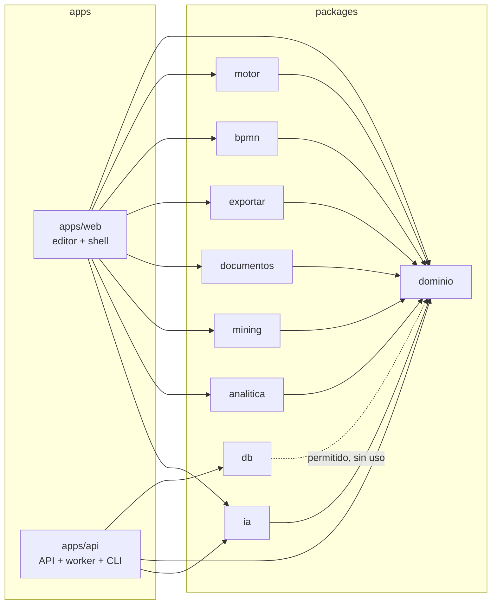

# Paquetes del monorepo

Para qué sirve cada paquete de `packages/`, qué exporta, de qué depende, quién lo usa, qué pruebas tiene y dónde están sus trampas.

Actualizado: 28-sep-2026.

---

## 1. Mapa de dependencias



En texto:

```text
dominio            (no depende de nadie)
 ├── motor, bpmn, exportar, documentos, mining, analitica, ia   → solo dominio
 └── db                                                         → puede usar dominio; hoy no lo hace
apps/web  → dominio, motor, bpmn, exportar, documentos, mining, analitica, ia   (nunca db)
apps/api  → db, dominio, ia
```

Entre paquetes hermanos no hay dependencias: `documentos` no importa `bpmn`, ni `exportar` importa `motor`. Cuando uno necesita algo de otro, la app se lo inyecta como parámetro. Por ejemplo, `extraerTexto` recibe `importarBpmn` en su entorno.

---

## 2. Resumen

| Paquete | Para qué | Navegador | Servidor | Pruebas |
|---|---|:-:|:-:|---|
| [dominio](#51-processiqdominio) | Modelo del proceso, catálogos, Ficha, validación del Playbook, esquema v1 y migración | ✓ | ✓ | 21 |
| [motor](#52-processiqmotor) | Auto-layout por carriles, ruteo, calidad, niveles de detalle, operaciones del grafo | ✓ | — | 17 |
| [bpmn](#53-processiqbpmn) | Import y export BPMN 2.0 | ✓ | — | 9 |
| [exportar](#54-processiqexportar) | PPTX (temas mbc y bbva), informe Word, Ficha de Proceso | ✓ | — | 7 |
| [documentos](#55-processiqdocumentos) | Extracción de Word/PDF/PPTX/texto, intérprete básico, participantes | ✓ | — | 7 |
| [mining](#56-processiqmining) | Event logs CSV → proceso y variantes | ✓ | — | 8 |
| [analitica](#57-processiqanalitica) | Simulador, cuello de botella, automatización, mapa de valor, backlog, What-If | ✓ | — | 11 |
| [ia](#58-processiqia) | Prompts, cliente de Claude en streaming, costes, construcción y lectura de respuestas | ✓ | ✓ | 22 |
| [db](#59-processiqdb) | Esquema Drizzle, migraciones SQL y conexión a Postgres | — | ✓ | 0 (las cubre `apps/api`) |

Total: 102 pruebas unitarias en 10 archivos (recuento de los `it(…)`, confirmado con la última salida de `vitest` de cada paquete).

---

## 3. Reglas comunes

- **Sin build.** Cada `package.json` exporta su fuente (`"exports": { ".": "./src/index.ts" }`). Vite, Vitest, tsx y esbuild la consumen directamente.
- **Todo lo público pasa por `src/index.ts`.** Si añades una función, expórtala en el índice en el mismo paso ([lección 5b](../lecciones-aprendidas.md)).
- **Configuración de TypeScript** ([tsconfig.base.json](../../tsconfig.base.json)): `strict`, `noUncheckedIndexedAccess`, `lib: ES2022` y `types: []`. Excepciones:
  - `dominio` y `db` cargan los tipos de Node (`dominio` los necesita para que sus pruebas lean los fixtures);
  - `ia` añade `lib: DOM` (`fetch`, `AbortSignal`, `TextDecoder`).
- **Cada paquete compila la fuente de sus dependencias con su propia configuración.** Un global de Node o del navegador en `dominio` pasa su propio typecheck, pero rompe el de todos los demás ([lección 5c](../lecciones-aprendidas.md)). Tras tocar un paquete compartido, `pnpm typecheck` en la raíz.
- **Portado del MVP 3.8.9 sin cambiar el comportamiento.** La mayoría de los archivos lo dicen en su cabecera. `pnpm fidelidad` compara byte a byte con el MVP congelado: JSON, SVG, BPMN, Word, Ficha, PPTX, prompts y mensajes. Una diferencia intencional se registra en [fase1-divergencias.md](../fase1-divergencias.md).
- **Los nombres de campo del modelo están en inglés** (`nodes`, `owner`, `executionType`…) porque son el contrato con los datos del MVP. Los nombres nuevos de tipos y funciones van en español.
- **Comandos:**

  ```bash
  pnpm --filter @processiq/<paquete> test
  pnpm --filter @processiq/<paquete> typecheck
  pnpm typecheck && pnpm test      # todos (turbo)
  pnpm fronteras
  ```

---

## 4. Fronteras: `herramientas/fronteras.mjs`

[fronteras.mjs](../../herramientas/fronteras.mjs) se ejecuta con `pnpm fronteras` y en la CI, antes del typecheck. Sale con código 1 si hay violaciones.

Reglas (`PERMITIDOS`):

| Paquete | Puede depender de |
|---|---|
| `@processiq/dominio` | nadie |
| `@processiq/db` | `@processiq/dominio` |
| `@processiq/bpmn`, `motor`, `exportar`, `mining`, `analitica`, `ia`, `documentos` | `@processiq/dominio` |

Qué revisa, en cada carpeta de `packages/`:

1. Que el paquete tenga reglas. Un paquete nuevo sin entrada en `PERMITIDOS` es una violación: se añade allí.
2. Las dependencias `@processiq/*` declaradas en `dependencies` y `devDependencies`.
3. Los imports reales de `src/` (`.ts`, `.js`, `.mjs`): `import … from '…'`, `export … from '…'` e `import('…')`.
   - Un `@processiq/*` no permitido es violación. Como las apps son `@processiq/web` y `@processiq/api`, esto también impide importar de `apps/*` por nombre.
   - Una ruta relativa que sale de la carpeta del paquete es violación (así se impide importar de `apps/*` o de otro paquete por ruta).

Qué **no** revisa:

- Los imports sin `from` (`import './efectos.js'`): la expresión regular exige `from`.
- Las apps: `apps/*` pueden importar cualquier paquete.
- Que `dominio` no use DOM ni Node. Eso lo detecta el typecheck de los paquetes que dependen de él ([§3](#3-reglas-comunes)).
- Las dependencias externas (npm).

---

## 5. Paquetes

### 5.1 `@processiq/dominio`

**Para qué.** El modelo del proceso y las reglas que valen igual en el navegador y en el servidor: tipos, formas por defecto, Ficha, recorrido del grafo, validación del Playbook MBB, catálogos del MVP y el esquema versionado del JSON (v1) con su migración desde el MVP. Solo ECMAScript estándar. Única dependencia externa: `zod`.

**Exporta** ([index.ts](../../packages/dominio/src/index.ts)):

| Símbolo | Qué es |
|---|---|
| Tipos de [modelo.ts](../../packages/dominio/src/modelo.ts): `Nodo`, `Arista`, `MetaProceso`, `Ficha`, `Pain`, `ValorKpi`, `TipoNodo`, `TipoEjecucion`, `TipoGateway`, `TipoEvento`, `MarcadorActividad`, `ValorLean`, `NivelDetalle`, `EventoBorde`, `FilaGobernanza`, `SistemaProceso`, `Termino`, `Anexo`, `CambioVersion` | El modelo del proceso. Detalle campo a campo en [modelo-de-datos.md §8](modelo-de-datos.md#8-contenido-json-v1-de-una-revisión). |
| `FORMAS_POR_DEFECTO`, `FormaPorDefecto` | Ancho, alto y etiqueta inicial de cada tipo de nodo. |
| `fichaVacia()` | Ficha nueva con listas nuevas (sin referencias compartidas). |
| `normalizarFicha(f)` | Completa una ficha parcial con las claves que falten. |
| `centroNodo(n)` | Centro geométrico de un nodo. |
| `contarTraspasos(nodes, edges)` | Aristas entre responsables distintos (handoffs). |
| `ordenDeFlujo(nodes, edges)` | Orden BFS estable desde los inicios; las islas, al final. Lo usan la Ficha, el Word y los textos para la IA. |
| `crearNodo(id, type, x, y, label)` | Nodo nuevo con los campos editables vacíos, en el orden de claves del MVP. |
| `validarProceso(nodes, edges, catalogo?)`, `Hallazgo`, `Severidad`, `CatalogoVerbos`, `PESO_SEVERIDAD` | Linter del Playbook MBB: 16 reglas (inicio y fin, verbos, etiquetas largas, responsable, tipo de ejecución, compuertas, nodos huérfanos, tamaño, roles). |
| `KPI_LIBRARY`, `Kpi` | 71 KPIs por industria y macroproceso. |
| `VERBS_ALLOWED`, `VERBS_FORBIDDEN` | 91 verbos permitidos; 13 prohibidos con su motivo. |
| `EXECUTION_TYPES`, `DefinicionTipoEjecucion` | 9 tipos de ejecución: tarea BPMN, prefijo de código, colores e iconos. |
| `PAIN_CATEGORIES`, `CategoriaPain` | 8 categorías de pain. |
| `INDUSTRIES`, `MACROPROCESSES` | 9 industrias y 27 macroprocesos sugeridos. |
| `VERSION_ESQUEMA` | Versión actual del JSON (`1`). |
| `ProyectoV1Esquema`, `ProyectoV1` | Esquema Zod y tipo del proyecto v1. |
| `migrarProyecto(entrada)`, `ResultadoMigracion` | Lleva cualquier versión conocida a v1 y la valida. No modifica la entrada. |
| `CLAVES_EFIMERAS`, `sinEfimeras(o)` | Cachés de pintado que no se guardan (`_d`, `_dSerie`, `_band`, `_inferredOwner`, `_sello`) y la función que las quita. |

**Quién lo usa:**

- Navegador: estado del editor ([estado.js](../../apps/web/src/app/estado.js)), `window.*` para el código legado, linter, operaciones del proceso, catálogos e integración con la plataforma (`migrarProyecto` para la huella y el guardado). Además, todos los demás paquetes.
- Servidor: la API valida cada contenido con `migrarProyecto` (procesos, revisiones, análisis de IA) y siembra los catálogos con `KPI_LIBRARY` y `VERBS_*`.

**Pruebas** (21):

| Archivo | Qué cubre |
|---|---|
| [dominio.test.ts](../../packages/dominio/src/dominio.test.ts) (8) | Ficha vacía y normalizada; catálogos coherentes (ids únicos, industrias válidas, prefijos, ningún verbo permitido y prohibido a la vez, formas con tamaño). |
| [esquema.test.ts](../../packages/dominio/src/esquema.test.ts) (8) | Migración de los dos exports reales del MVP (fixtures públicos de ejemplos); no muta la entrada; idempotencia; relleno de datos antiguos; conserva los análisis de `localStorage`; rechaza aristas rotas, ids repetidos, tipos desconocidos, no-objetos y versiones futuras. |
| [validacion.test.ts](../../packages/dominio/src/validacion.test.ts) (5) | Proceso vacío y bien formado sin hallazgos; detección de cada regla; el hallazgo apunta al nodo. |

**Trampas:**

- **Catálogos reemplazados en sitio** ([ADR 14](../adr/0014-catalogos-en-sitio.md)). En un proceso de proyecto, [plataforma/catalogos.js](../../apps/web/src/app/plataforma/catalogos.js) vacía y rellena `KPI_LIBRARY`, `VERBS_ALLOWED` y `VERBS_FORBIDDEN` con los de la organización, sin reasignarlos.
  - Los tipos dicen `readonly`, pero en el navegador **cambian en tiempo de ejecución**.
  - Nunca los copies ni los captures en otra constante al cargar el módulo: perderías el reemplazo.
  - Afecta también a quien los lee por referencia en otros paquetes: `validarProceso` (catálogo por defecto), `interpretarTexto` de `documentos` (`VERBS_ALLOWED`) y el PPTX, el Word y la Ficha de `exportar` (`KPI_LIBRARY`).
  - En el servidor no se reemplazan: la API los usa solo para sembrar.
- **Nada de DOM ni de Node en `src/`** (ni `structuredClone`). El `tsconfig` del paquete carga los tipos de Node para las pruebas, así que su propio typecheck no lo detecta.
- **El orden de las claves importa.** `crearNodo` conserva el del MVP porque se ve en el JSON exportado y la fidelidad lo compara. Y `migrarProyecto` **reordena** las claves (primero las del esquema): no compares su salida con la entrada como texto.
- **El esquema v1 es abierto y valida poco:** `views`, `lanes`, `raci`, `sipoc` y `simResults` pasan sin validar, y una entrada que ya es v1 conserva las claves efímeras. Detalle en [modelo-de-datos.md §8.13](modelo-de-datos.md#813-schemaversion-y-migración-desde-el-mvp-v0).

### 5.2 `@processiq/motor`

**Para qué.** El motor del diagrama:

- auto-layout por carriles (un carril por responsable, flujo de izquierda a derecha);
- ruteo ortogonal de flechas;
- medida de calidad (flechas que pisan cajas y cruces);
- niveles de detalle Ejecutivo / Actividad / Detalle;
- operaciones sobre el grafo (ramas de decisión, códigos de actividad, responsables inferidos, compuertas de convergencia).

Portado del MVP sin cambios de cálculo. No toca el DOM.

**Exporta** ([index.ts](../../packages/motor/src/index.ts)):

| Símbolo | Qué es |
|---|---|
| `calcularLayout(nodes, edges, { ownerMap, wrap })`, `Carriles` | Coloca los nodos (modifica `x`, `y`, `_band`) y devuelve los carriles (`state._lanes`): back-edges por DFS, rank por camino más largo, carriles ordenados por baricentro, columnas compactas. |
| `normalizarGeometria(nodes)` | Red de seguridad: repara `w`/`h`/`x`/`y` no finitos (un NaN deja el lienzo en blanco). |
| `rutaArista(a, b, edge, ctx)` | Path SVG de una arista: la heurística y, si el `A*` está activo y la heurística pisa una caja, el `A*` solo si mejora. |
| `rutaHeuristica`, `rutaAStar` | Las dos estrategias por separado. |
| `corredoresDeRetorno(nodes, edges)` | Altura del corredor bajo la banda para cada retorno (reproceso). |
| `ContextoRuteo`, `CarrilesRuteo`, `RADIO_CODO`, `LOOP_GAP`, `LOOP_LANE_H` | Contexto del ruteo (nodos, carriles, corredores, canales del `A*`) y constantes. |
| `medirCalidad(nodes, edges, rutaDe)`, `CalidadDiagrama` | Flechas que pisan cajas, cruces, ancho, alto y una puntuación (menor es mejor). |
| `caminoRedondeado`, `segmentosDePath`, `segmentoPisaCaja`, `segmentosSeCruzan`, `Punto`, `Caja`, `Segmento` | Geometría de rutas. |
| `asegurarRamasDeDecision(nodes, edges, siguienteId)` | Compuerta exclusiva con una sola salida: rama «No» a un fin nuevo «Caso no procede» (`_autoGen`); rotula Sí/No. |
| `asignarCodigosActividad(…)` | Códigos estilo MBC (`USR-27`) por prefijo y rank, respetando los existentes. |
| `inferirResponsables(nodes, edges)` | Responsable de cada nodo (el suyo, el del vecino más cercano o el más frecuente); marca `_inferredOwner`. |
| `insertarCompuertasConvergencia(…)` | Compuerta exclusiva de cierre donde convergen ramas de una decisión. |
| `proyectarNivel(full, nivel, ctx)`, `ModeloProceso`, `ContextoNivel` | Proyecta el modelo completo al nivel 1, 2 o 3 (copias; no modifica el modelo). |
| `NIVELES`, `EJEC_MAX_CAJAS` | Definición de los 3 niveles; techo de 10 cajas en el Ejecutivo. |
| `esHito`, `gruposPorCadena`, `ranksLocales`, `etapasEjecutivas`, `colapsarGatewaysDegenerados` | Piezas de la proyección: hitos, cadenas de tareas del mismo carril, ranks, etapas ejecutivas y compuertas que ya no deciden. |

**Quién lo usa:** solo el navegador: `layout/auto-layout.js`, `layout/niveles.js`, `lienzo/ruteo.js`, `lienzo/calidad.js` y `proceso/operaciones.js`. El servidor no dibuja: la especificación que genera la IA la dibuja el editor ([arquitectura §8](../arquitectura.md#8-ia-en-producción)).

**Pruebas** — [motor.test.ts](../../packages/motor/src/motor.test.ts) (17):

- operaciones: rama «No», compuertas paralelas, responsables inferidos, códigos, compuerta de cierre;
- layout: ranks sin inflar por reprocesos, cajas apiladas sin solaparse, `normalizarGeometria`;
- ruteo y calidad: recta, codo, corredores de retorno, cruces, flechas sobre cajas;
- niveles: nivel 3 exacto, agrupación del 2, jerarquía de la IA, carril único del 1.

**Trampas:**

- **Modifica lo que recibe.** `calcularLayout` y las operaciones mutan los arrays y los nodos. Las que crean elementos devuelven el siguiente id libre: úsalo.
- **Las cachés son del llamador.** Rutas memorizadas por arista, corredores y canales ocupados viven en `apps/web/src/app/lienzo/ruteo.js`.
- **El ruteo `A*` está apagado a propósito** (`ctx.canales = null`; se activa con `ProcessIQ.astar(true)`). La solución a las flechas que se pisan es bajar la densidad con los niveles, no mejorar el ruteo ([docs/mvp/HANDOFF.md](../mvp/HANDOFF.md), pendiente 3).
- **Un nodo sin `w`/`h` finitos deja el lienzo en blanco.** Da geometría de tarea a los nodos sintéticos.
- **Cambios de layout o ruteo:** mide con el banco de calidad (`bench/`) antes y después, y pasa `pnpm fidelidad`.

### 5.3 `@processiq/bpmn`

**Para qué.** Exportar el proceso a BPMN 2.0 XML (compatible con Bizagi, Camunda, Signavio y ARIS) e importarlo desde BPMN. Sin librerías.

**Exporta** ([index.ts](../../packages/bpmn/src/index.ts)):

| Símbolo | Qué es |
|---|---|
| `generarBpmnXml(proceso, idProceso)`, `ProcesoBpmn`, `CarrilesBpmn` | XML con proceso, `laneSet` (si hay carriles), elementos, flujos, eventos de borde, pains y metadatos como documentación, y diagrama (DI). |
| `leerBpmn(xml, opciones)`, `OpcionesLectura`, `ResultadoLectura`, `LectorXml` | Lee un BPMN y devuelve `nodos`, `aristas`, nombre del proceso, siguiente id y conteo. No aplica nada al proceso abierto: eso lo hace la app. |

**Quién lo usa:** navegador (`bpmn/exportar.js`, `bpmn/importar.js`). La ingesta de un `.bpmn` llega por `documentos`, que recibe el importador como parámetro.

**Pruebas** — [bpmn.test.ts](../../packages/bpmn/src/bpmn.test.ts) (9): XML bien formado; mapeo de cada tipo de nodo; escape de textos; pains y metadatos; evento de borde, carriles y DI; sin `laneSet` si no hay carriles; ida y vuelta (tipos, compuertas, eventos y flujos); numeración de ids desde `siguienteId`; subprocesos y `callActivity`; XML sin elementos.

**Trampas:**

- **`leerBpmn` necesita un `DOMParser`.** En el navegador usa el global. En Node hay que pasar `opciones.leerXml`: las pruebas usan `@xmldom/xmldom`, que es solo `devDependency`.
- El export conserva tipos de ejecución antiguos (`receive`, `ia`, `script`, `user`) que ya no están en el catálogo, por los datos existentes. No los quites.
- **El import es plano.** Recorre todos los elementos del XML, también los que están dentro de un `subProcess`. Esos elementos llegan como nodos del mismo diagrama, además de la caja del subproceso (tarea con marcador `subprocess`).
- **No lee carriles (`laneSet`) ni posiciones (DI).** Los nodos llegan en `(0, 0)` y sin `owner`; la app aplica después el auto-layout.
- Un `boundaryEvent` llega como evento intermedio suelto, no enganchado a su actividad.

### 5.4 `@processiq/exportar`

**Para qué.** Los entregables:

- PPTX editable con temas de cliente, con conectores anclados de verdad (`cxnSp`);
- informe Word;
- Ficha de Proceso corporativa (HTML compatible con Word).

Descargar el archivo es cosa de la app.

**Exporta** ([index.ts](../../packages/exportar/src/index.ts)):

| Símbolo | Qué es |
|---|---|
| `construirPptx(state, tema, entorno)` | Arma la presentación con pptxgenjs (`entorno.PptxGenJS`). Devuelve `{ pres, nombresPorNodo }`. Construye su propia rejilla a partir de ranks y carriles, independiente de las `x/y` del lienzo. |
| `posprocesarPptx(pres, nombresPorNodo, cargarJSZip)` | Escribe el `.pptx` y convierte las líneas `Flujo\|…` en conectores anclados. Devuelve `{ blob, conectores }`. Si JSZip falla, devuelve el archivo sin anclar. |
| `anclarConectoresEnXml(xml, nombresPorNodo)` | El post-proceso sobre el XML de una lámina (lo usan las pruebas). |
| `TEMAS_PPTX` | Temas `mbc` y `bbva`: paleta, tipografías, logotipos en data URI, carátula y cierre. |
| `renderMiniDiagram`, `computeDeltas`, `painImplication`, `painRecommendation` | Mini-diagrama de la lámina As-Is frente a To-Be, diferencias entre vistas y textos de implicación y recomendación de un pain. |
| `derivarFicha(state)` | Deriva del grafo las actividades numeradas con su ruteo, sistemas, responsables y alcance. |
| `construirInformeWord(state)` | Informe completo en HTML para Word. |
| `cuerpoFicha(state, opts)`, `estilosFicha(forWord)`, `documentoFicha(state, svgDiagrama)` | Cuerpo, estilos y documento de la Ficha de Proceso (12 bloques). |

**Quién lo usa:**

- Navegador: `exportar/pptx.js`, `exportar/word.js`, `exportar/ficha.js` y `plataforma/catalogos.js` del editor.
- El shell importa `TEMAS_PPTX` bajo demanda en «Catálogos», para duplicar MBC o BBVA como base de un tema nuevo.
- El servidor no lo usa.

**Pruebas** — [exportar.test.ts](../../packages/exportar/src/exportar.test.ts) (7):

- Ficha: numeración en orden de flujo y ruteo desde compuertas; el diagrama solo se pide si se incrusta.
- Word: HTML completo.
- PPTX: temas `mbc` y `bbva`; conversión de líneas en conectores anclados; línea a un nodo inexistente sin tocar; deltas e implicación.

La salida real (láminas XML de los 14 ejemplos en los dos temas, Word y Ficha) la comparan las pruebas de fidelidad.

**Trampas:**

- **`pptx.ts`, `word.ts` y `ficha.ts` están tipados** desde el 28-sep-2026, sin cambiar el JS que emiten. Los tipos del `state` que leen están en `tipos.ts`, y los de pptxgenjs y JSZip son interfaces mínimas locales.
- **Reciben el `state` del editor, no el contenido v1.** Leen `state._lanes`, `_raci`, `_sipoc`, `_simResults`, `_kpiValues` y `_views`, con guion bajo, además de `meta`, `ficha`, `nodes`, `edges` y `activeView`. Para usarlos con una revisión guardada hay que convertir `lanes` → `_lanes`, etc.
- **`TEMAS_PPTX` y `KPI_LIBRARY` se reemplazan en sitio** en modo proyecto ([ADR 14](../adr/0014-catalogos-en-sitio.md)): se añaden los temas de la organización como claves nuevas. No copies el objeto al cargar.
- **Tema nuevo del sistema** = entrada en `TEMAS_PPTX` + botón `data-export="pptx" data-tema="…"` en el menú. `mbc` y `bbva` están reservados: la base no puede redefinirlos.
- **Constantes con nombre histórico** (`M_PRUNO`…) toman su valor del tema. Divergencia F1: en el MVP, `renderMiniDiagram` usaba constantes que solo existen dentro de `construirPptx` y el export con To-Be fallaba siempre. Ahora recibe `estilo` ([fase1-divergencias.md](../fase1-divergencias.md)).
- **En una pestaña oculta, `pres.write()` no termina** (el navegador estrangula los timers). Playwright headless no tiene ese problema.

### 5.5 `@processiq/documentos`

**Para qué.**

- Sacar texto de los documentos del cliente **en el navegador**: los originales no salen del equipo ([ADR 9](../arquitectura.md#14-decisiones-de-arquitectura-resumen-de-adr)).
- Interpretar texto sin IA (modo básico).
- Detectar participantes en transcripciones.

**Exporta** ([index.ts](../../packages/documentos/src/index.ts)):

| Símbolo | Qué es |
|---|---|
| `extraerTexto(archivo, entorno)` | Word (`.docx` con mammoth; `.doc` de forma aproximada), PDF, PowerPoint (`.pptx`), texto (`.txt`, `.md`, `.csv`), o importación directa de `.bpmn`/`.xml`. Rechaza `.ppt` y archivos de más de 40 MB. Informa el avance, cede el hilo y respeta la cancelación. |
| `textoDePdf`, `textoDePptx` | Lectores de PDF (pdf.js, página a página, con mensajes para PDF escaneado, protegido o dañado) y de PPTX (los `<a:t>` de cada lámina, en orden). |
| `MAX_ARCHIVO_MB` (40), `MAX_PAGINAS_PDF` (120) | Topes de tamaño y de páginas. |
| `ArchivoEntrada`, `EntornoExtraccion`, `TextoExtraido` | Tipos de la extracción (en [extraccion-tipos.ts](../../packages/documentos/src/extraccion-tipos.ts)). |
| `interpretarTexto(texto)`, `ActividadDetectada` | Frases → actividades y decisiones (heurística; prefiere narraciones en primera persona). |
| `construirProcesoBasico(detectadas, opciones)`, `ProcesoBasico`, `MAX_NODOS_BASICO` (60) | Inicio, actividades en rejilla y «Caso completado», conectados en línea; recorta a 60 actividades. |
| `detectarParticipantes(texto)`, `Participante` | Personas con 2 o más intervenciones en una transcripción («Nombre: texto»), con su cargo si aparece (máximo 12). |

**Quién lo usa:** solo el navegador (`ingesta/flujo.js`, `ingesta/texto.js`, `ingesta/participantes.js`). Al servidor solo llega el texto extraído, cuando se pide una generación con IA.

**Pruebas** — [documentos.test.ts](../../packages/documentos/src/documentos.test.ts) (7): actividades y decisiones de una narración; infinitivo, sistemas y canales; sin verbos no hay actividades; la frase original queda como nota; proceso básico lineal; recorte a 60; participantes con cargo.

La lectura real de `.docx`, `.pdf`, `.pptx` y `.txt` la cubren las pruebas de fidelidad (no hay pruebas unitarias de `extraerTexto`).

**Trampas:**

- **`extraccion.ts` está tipado** (28-sep-2026), con interfaces locales de lo que usa de pdf.js y JSZip. Su interfaz pública sigue en `extraccion-tipos.ts`.
- **Las librerías llegan por el entorno**: `entorno.mammoth()`, `pdfjs()` y `jszip()` las cargan bajo demanda, con las versiones exactas que la web copia a `/vendor/`. El paquete no las importa.
- **`importarBpmn` también llega por el entorno**, porque `documentos` no puede depender de `bpmn` (fronteras).
- `interpretarTexto` usa `VERBS_ALLOWED` por referencia: en modo proyecto ve los verbos de la organización (efecto del [ADR 14](../adr/0014-catalogos-en-sitio.md)).

### 5.6 `@processiq/mining`

**Para qué.** Descubrir el proceso a partir de un event log CSV (alpha-miner simplificado) y listar sus variantes.

**Exporta** ([index.ts](../../packages/mining/src/index.ts)):

| Símbolo | Qué es |
|---|---|
| `parseCsv(texto)`, `parseCsvLine(linea, sep)`, `TablaCsv` | CSV o TSV (RFC 4180): comillas, comillas escapadas y separadores entre comillas. Usa tabulador solo si no hay comas. |
| `adivinarMapeo(cabeceras)`, `MapeoColumnas` | Propone por su nombre las columnas de caso (`case`), actividad (`act`), fecha (`ts`) y recurso o rol (`res`, opcional). |
| `descubrirProceso(tabla, mapeo, opciones)`, `ProcesoDescubierto`, `Variante` | Inicio, una tarea por actividad y Fin; aristas con frecuencias, filtrando el ruido; variantes con su porcentaje. |
| `EVENT_LOG_MUESTRA` | Log de ejemplo que ofrece la interfaz. |

**Quién lo usa:** navegador (`mining/event-log.js`).

**Pruebas** — [mining.test.ts](../../packages/mining/src/mining.test.ts) (8): comillas, tabulador, líneas vacías y celdas faltantes, mapeo propuesto; con la muestra: casos, actividades y variantes, ids en el orden del MVP, frecuencias y filtro de ruido, error con un log sin transiciones.

**Trampas:**

- Un log sin transiciones (casos de una sola actividad) **lanza error**, como el MVP. A diferencia del MVP, el cálculo termina antes de tocar el proceso abierto, así que ya no lo deja a medio construir (divergencia D1).
- Los ids y las posiciones reproducen los del MVP: la fidelidad los compara.

### 5.7 `@processiq/analitica`

**Para qué.** El diagnóstico cuantitativo: simulador de carga (FTE, lead time, coste, ahorro), cuello de botella y ruta crítica, oportunidades de automatización, mapa de valor Lean, matriz impacto-esfuerzo, backlog priorizado y comparador What-If.

**Exporta** ([index.ts](../../packages/analitica/src/index.ts)):

| Símbolo | Qué es |
|---|---|
| `simularCarga(nodes, { costoFte, horasMes, reduccion })`, `ResultadoSimulacion`, `SimulacionDetallada`, `ParametrosCosto` | Simulador del panel: FTE actual y To-Be, coste mensual, ahorro, lead time (suma lineal). El resultado se guarda en el proyecto (`simResults`). |
| `simularEscenario(nodes, reduccionPct, p)`, `Escenario` | Simulación compacta para el What-If. |
| `cuelloDeBotella(nodes, edges)`, `CuelloDeBotella`, `CargaActividad` | Actividad con más carga (tiempo × volumen) y ruta crítica por tiempo desde un Inicio; `null` sin datos. |
| `oportunidadesAutomatizacion(nodes, p)`, `OportunidadAutomatizacion` | Tareas automatizables por etiqueta y tipo de ejecución, por ahorro anual. |
| `mapaDeValor(nodes)`, `MapaDeValor` | Reparto de la carga entre VA, BVA, NVA y sin clasificar. |
| `painsDelProceso(nodes)`, `PainConActividad` | Todos los pains con su actividad. |
| `posicionImpactoEsfuerzo(pain)`, `ESFUERZO_POR_CATEGORIA` | Posición 0..1 en la matriz: impacto = sev × frec / 25; esfuerzo según la categoría. |
| `generarBacklog(nodes, kpiValues, p)`, `Iniciativa` | Consolida pains, automatización de tareas manuales y gaps de KPI, priorizados por impacto y esfuerzo. |
| `backlogCsv(items)` | CSV del backlog con BOM (Excel respeta los acentos). |
| `compararWhatIf(nodes, palancas, reduccionExtra, p)`, `PALANCAS_WHATIF`, `Palanca`, `ComparacionWhatIf` | As-Is frente a un To-Be construido con las palancas elegidas. |

**Quién lo usa:** navegador (`analitica/simulador.js`, `analitica/avanzada.js`, `analitica/impacto-esfuerzo.js`).

**Pruebas** — [analitica.test.ts](../../packages/analitica/src/analitica.test.ts) (11): FTE, coste y ahorro; orden de las claves del resultado; reducción del escenario; cuello de botella y ruta crítica; sin datos no hay cuello; automatización; mapa de valor; matriz; backlog consolidado; CSV con BOM y comillas; el What-If no modifica los nodos.

**Trampas:**

- **Mismo orden de operaciones y de claves que el MVP.** Los redondeos se ven en el panel, el PPTX y el informe, y `ResultadoSimulacion` se guarda en el proyecto: no reordenes sus campos.
- `time` y `volume` son **texto** en el modelo y se leen con `parseFloat`. Si faltan, el simulador cuenta 0; el mapa de valor, en cambio, da peso 1 a una actividad sin datos.

### 5.8 `@processiq/ia`

**Para qué.** Todo lo de la IA que comparten el editor y el servidor:

- prompts versionados;
- cliente de la API de mensajes de Anthropic en streaming (SSE);
- precios y estimación de coste;
- construcción de los mensajes;
- validación y reparación de la especificación generada;
- lectura de los pains.

**Exporta** ([index.ts](../../packages/ia/src/index.ts)):

| Símbolo | Qué es |
|---|---|
| `PROMPT_GENERACION` | Sistema de la generación: devuelve el JSON BPMN (`meta`, `ficha`, `nodes`, `edges`). |
| `ROL_ANALISTA`, `TAREAS_IA`, `TareaIa` | Rol y tareas del copiloto: `suggest-kpis`, `propose-tobe`, `raci`, `impact-effort`, `automation`, `backlog`, `exec-summary`, `sipoc`, `bottleneck`. |
| `PROMPT_PAINS` | Sistema del análisis de dolores (JSON con detectados y sectoriales). |
| `REGLAS_FUSION` | Reglas cuando se combinan varias fuentes del mismo proceso. |
| `llamarClaude(texto, opts, cfg, entorno)`, `ConfigIa`, `OpcionesLlamada`, `UsoIa`, `Entorno` | Llamada en streaming, con timeout por inactividad (90 s por defecto), un reintento ante fallo de red y respaldo automático (`fallbacks`) en Opus. Modos: `equipo` (intermediario con código), `servidor` (clave del servidor) o clave propia desde el navegador. |
| `extraerJson(texto)` | Saca el objeto JSON de una respuesta con prosa o bloques de código. |
| `MODELOS_IA`, `PRECIOS_IA`, `precioModelo`, `usd`, `fmtUsd`, `PrecioModelo` | Modelos ofrecidos y precios de lista por millón de tokens; coste en US$ y su formato. |
| `GEN_MAX_TOKENS` (64 000) | Tope de tokens de respuesta de la generación. |
| `estimarCosteGeneracion(…)`, `EstimacionCoste`, `CosteEjecucion`, `CAR_POR_TOKEN_INICIAL`, `SALIDA_INICIAL`, `mediana` | Coste antes de generar (rango probable y máximo), calibrado con el historial de ejecuciones reales. |
| `promptGeneracion(texto, etiqueta, opciones)`, `OpcionesGeneracion` | Mensaje de usuario de la generación: roles (quién es quién), profundidad por nivel, reglas de fusión y contenido recortado a `maxChars`. |
| `timeoutGeneracion(prompt)` | 90 s + 0,5 s por cada 1 000 caracteres, con techo de 3 min. |
| `resumenProcesoParaIa(proceso)`, `ProcesoParaIa` | Descripción textual del proceso en orden de flujo (entrada del copiloto y de los pains). |
| `promptTarea(instruccion, resumen)` | Mensaje de usuario de una tarea del copiloto. |
| `combinarFuentes(fuentes, maxChars)`, `Fuente` | Une varias fuentes con reparto justo: las cortas entran enteras y el resto del presupuesto se reparte entre las largas. |
| `interpretarPains(datos, nodes, siguienteId)`, `PainIa`, `HipotesisSector`, `PainsInterpretados` | Respuesta de pains → pains por nodo: ignora nodos inexistentes y duplicados, acota severidad y frecuencia a 1..5. |
| `EspecGeneracionEsquema`, `validarEspecGeneracion`, `EspecGeneracion` | Forma mínima que necesita el editor para dibujar (al menos un nodo con `k`). |
| `PROMPT_REPARACION`, `promptReparacion`, `MAX_CHARS_REPARACION` (200 000) | Una reparación del JSON por generación, solo si la respuesta no es enorme. |
| `clasificarErrorIa(error)` | `cancelado`, `transitorio` (red, 429, 5xx/529, inactividad) o `definitivo`. |

**Quién lo usa:**

- Navegador:
  - `ia/motor.js`, `ia/generacion.js`, `ia/pains.js`, `ia/tareas.js` e `ingesta/fuentes.js`, que en el editor libre llaman a Claude como el MVP;
  - `plataforma/ia.js`, que en modo proyecto envía los datos al servidor en lugar de llamar a Claude;
  - la pantalla de consumo del shell (`TAREAS_IA`, `fmtUsd`, `precioModelo`).
- Servidor:
  - `config.ts` valida los modelos contra `PRECIOS_IA`;
  - `rutas/ia.ts` arma el resumen del proceso y ofrece modelos y precios;
  - `ia/ejecutar.ts` (worker) arma los prompts, llama con `modo: 'servidor'`, valida, repara, clasifica errores y suma el coste.

**Pruebas** — [ia.test.ts](../../packages/ia/src/ia.test.ts) (22), con un `fetch` falso que imita el SSE de Anthropic (sin red ni gasto):

- `llamarClaude`: modo equipo con respaldo en Opus; clave propia; bloque de respaldo; reintento ante fallo de red; mensajes de 401, 403, 429, `max_tokens` y rechazo; exige código o clave.
- `extraerJson`.
- Costes: `usd` y estimación inicial; calibración con historial.
- Construcción de prompts: generación, timeout, reparto de fuentes, resumen, pains.
- Modo servidor: URL configurada, sin la cabecera del navegador; mensajes sin clave.
- Especificación: validación y clasificación de errores.

Además, la integración del worker con Postgres está en `apps/api/src/ia.test.ts`.

**Trampas:**

- **Los prompts y mensajes se comparan byte a byte** con el MVP (la fidelidad incluye las peticiones a Claude). Se copian con un script, nunca a mano ([lección 14](../lecciones-aprendidas.md)). Cambiar un prompt exige además la evaluación de IA ([arquitectura §8](../arquitectura.md#8-ia-en-producción)).
- **`clasificarErrorIa` reconoce los errores por el texto** de los mensajes de `llamarClaude` («No se pudo conectar», «Se cortó la conexión», «dejó de responder», «Límite de uso alcanzado (429)»…). Si cambias uno de esos mensajes, cambias en silencio qué se reintenta en el servidor.
- **Mismo código, dos tipos de entorno.** El paquete compila con `lib: DOM`, pero la API lo compila con los tipos de Node, donde `Response.json()` devuelve `unknown`. Tipa explícitamente lo que dependa del entorno (`const j: any = await res.json()`) y pasa el typecheck de la API ([lección 22](../lecciones-aprendidas.md)).
- **Valores que se leen al fallar, no al empezar.** `entorno.cancelado()` es una función a propósito: la cancelación se consulta en el momento del error ([lección 15](../lecciones-aprendidas.md)).
- La cabecera beta del respaldo (`anthropic-beta`) solo se envía cuando la llamada va directa a Anthropic (clave propia o servidor). En modo equipo, la añade el intermediario.
- Los precios de `PRECIOS_IA` son los de lista a una fecha fija (comentario en [costes.ts](../../packages/ia/src/costes.ts)). El presupuesto y los límites del servidor se calculan con ellos.

### 5.9 `@processiq/db`

**Para qué.** El esquema de Postgres (Drizzle ORM), las migraciones SQL versionadas y la conexión. Solo lo usa la API. Detalle de tablas y migraciones en [modelo-de-datos.md](modelo-de-datos.md).

**Exporta** ([index.ts](../../packages/db/src/index.ts)):

| Símbolo | Qué es |
|---|---|
| Tablas: `organizaciones`, `usuarios`, `sesiones`, `proyectos`, `miembrosProyecto`, `procesos`, `revisiones`, `auditoria`, `ejecucionesIa`, `kpis`, `verbosPlaybook`, `temasPptx`, `errores`, `latidos` | Definiciones Drizzle (nombres en camelCase; en SQL, en snake_case). |
| Enumerados: `rolOrganizacion`, `rolProyecto`, `estadoRevision`, `tipoEjecucionIa`, `estadoEjecucionIa`, `tipoVerbo`, `origenError` | Tipos `pgEnum`. |
| `conectar(url, { max? })`, `Conexion`, `BaseDeDatos` | Pool de `pg` (10 conexiones por defecto) + instancia Drizzle con el esquema; `cerrar()`. |
| `aplicarMigraciones(db, carpeta?)` | Aplica las migraciones pendientes (idempotente). |
| `carpetaMigraciones()` | Ruta de `migraciones/` dentro del paquete; la imagen Docker pasa otra con `CARPETA_MIGRACIONES`. |

**Scripts:** `generar` (`drizzle-kit generate`, con [drizzle.config.ts](../../packages/db/drizzle.config.ts)) y `typecheck`. No tiene `test`.

**Quién lo usa:** solo el servidor: la API (rutas, auditoría, observabilidad, catálogos), el worker, la CLI y la semilla. La web nunca.

**Pruebas:** ninguna en el paquete. Lo prueban las integraciones de `apps/api/src/*.test.ts` contra un Postgres real (`TEST_DATABASE_URL`):

- `proyectos.test.ts`: numeración de revisiones, conflicto, ciclo de estados e inmutabilidad, archivado, auditoría;
- `ia.test.ts`: cola, reintentos, cancelación, huérfanas, consumo;
- `catalogos.test.ts` y `sistema.test.ts`: siembra idempotente, huella y purga de errores, latidos;
- `sesion.test.ts` y `semilla.test.ts`.

**Trampas:**

- **Migraciones:** nunca editar una publicada; regenerar la propia si `main` trae otra (drizzle salta sin avisar una migración con marca de tiempo anterior a la última aplicada); compatibles hacia atrás. Reglas completas en [modelo-de-datos.md §7](modelo-de-datos.md#7-migraciones) y [convenciones.md](../equipo/convenciones.md#migraciones-de-la-base).
- **Tablas de iniciativas:** van en su sección al final de `esquema.ts`, con prefijo y nombre reservado. Nada de columnas nuevas en tablas del núcleo.
- **Las fronteras permiten `db → dominio`, pero hoy `db` no lo usa** ni lo declara en su `package.json`. Si lo necesitas, decláralo.
- El worker **no** aplica migraciones: arranca después de la API.
