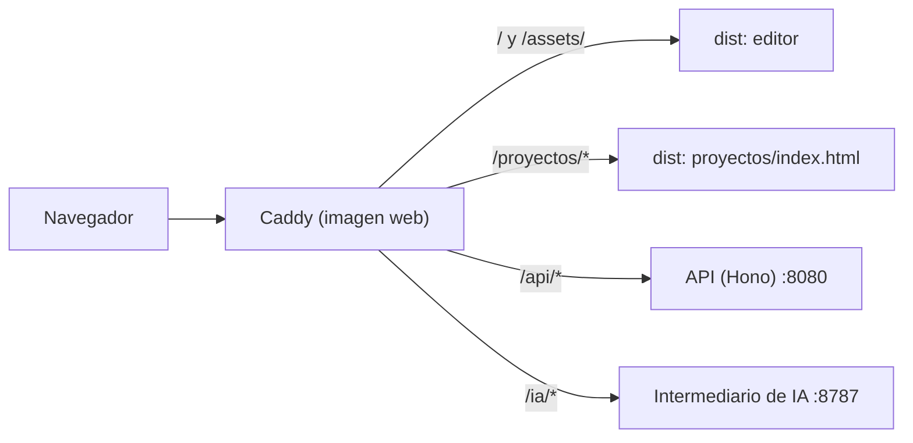
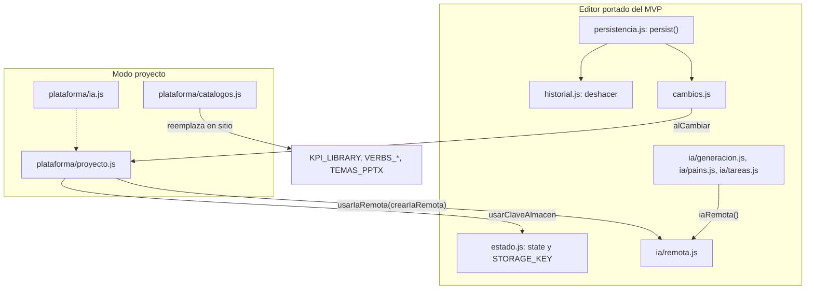

# La aplicación web

Qué hay en `apps/web`: el editor de procesos y el shell de proyectos, cómo se construyen y se sirven, y cómo trabaja el editor dentro de un proyecto.

**Actualizado:** 29-sep-2026.

---

## 1. Vista general

`apps/web` produce **dos páginas** en un solo build:

| Página | URL | Código | Tecnología | Para qué |
|---|---|---|---|---|
| Editor | `/`, `/?proceso=<id>`, `/?revision=<id>`, `/?invitado=<token>` | [index.html](../../apps/web/index.html), [src/main.js](../../apps/web/src/main.js), [src/app/](../../apps/web/src/app/) | JavaScript del MVP 3.8.9 partido en módulos ES | Diagramar, diagnosticar y exportar un proceso |
| Shell de proyectos | `/proyectos/…` | [proyectos/index.html](../../apps/web/proyectos/index.html), [src/shell/](../../apps/web/src/shell/) | React 19, TypeScript estricto, TanStack Query, wouter | Acceso, proyectos, procesos, revisiones y administración |

- **Sin parámetros**, el editor es el del MVP: guarda en el navegador y no habla con la API. Lo comprueban las pruebas de fidelidad y la última prueba E2E.
- **Con `?proceso=` o `?revision=`**, el editor entra en **modo proyecto** (sección 4): abre y guarda revisiones en la API.
- **Con `?invitado=<token>`**, el editor abre en **modo lectura** la revisión compartida con ese enlace, sin sesión ([invitado.js](../../apps/web/src/app/plataforma/invitado.js), [ADR 20](../adr/0020-rutas-publicas-con-token.md)): modo «Presentar», «Ficha del proceso» y un panel de comentarios; un clic en un elemento ancla el comentario. No lee ni escribe `processiq.v1`.
- El editor reutiliza piezas del shell: el cliente de la API ([api.ts](../../apps/web/src/shell/api.ts)), los textos ([formato.ts](../../apps/web/src/shell/formato.ts)), los permisos ([permisos.ts](../../apps/web/src/shell/permisos.ts)) y el registro de errores ([observabilidad.ts](../../apps/web/src/shell/observabilidad.ts)). El shell no importa nada del editor.

---

## 2. Build

### 2.1 Vite multipágina

Configuración en [vite.config.js](../../apps/web/vite.config.js) y scripts en [package.json](../../apps/web/package.json).

| Ajuste | Valor | Por qué |
|---|---|---|
| `build.rolldownOptions.input` | `editor` → `index.html`, `proyectos` → `proyectos/index.html` | Dos páginas en un mismo build |
| `plugins` | `react({ include: /\.tsx$/ })` y `rutasDelShell()` | React solo transforma el shell. Los `.js` del editor quedan exactamente como en la fase 1 |
| `build.cssMinify` | `false` | La app lee variables CSS (`getComputedStyle`) y las copia a los SVG y a los exports. El minificador pasaba los colores a minúsculas y los artefactos dejaban de ser idénticos al MVP (divergencia D3 en [fase1-divergencias.md](../fase1-divergencias.md)). Caddy comprime igual |
| `build.target` / `sourcemap` | `es2022` / `true` | |
| `server.port` | 5173 | `pnpm dev` |
| `server.proxy['/ia']` | `http://localhost:8787`, quitando `/ia` | Intermediario de IA local |
| `server.proxy['/api']` | `http://localhost:8790`, sin `changeOrigin` | La API valida el `Origin` de la web (`http://localhost:5173`) |
| `preview.port` | 4173 | `vite preview` |

- `rutasDelShell()` es un plugin de desarrollo: toda ruta `/proyectos/...` que no pide un archivo sirve `proyectos/index.html`. En el servidor lo hace Caddy (`try_files`).
- Los paquetes `@processiq/*` exportan su fuente TypeScript (`./src/index.ts`). Vite la compila sin build previo.
- `dev` y `build` ejecutan antes [scripts/copiar-vendor.mjs](../../apps/web/scripts/copiar-vendor.mjs) (sección 2.2).
- **Tipos:** [tsconfig.json](../../apps/web/tsconfig.json) solo incluye `src/shell`. El editor es JavaScript portado y no se comprueba con `tsc`. Comando: `pnpm --filter @processiq/web typecheck`.

### 2.2 Librerías de navegador (`/vendor`)

Las librerías que el MVP cargaba desde jsDelivr se instalan por npm con **versión exacta** y se sirven desde la propia app (divergencia D5). `copiar-vendor.mjs` copia sus bundles a `public/vendor/` en cada `dev` y `build`; esa carpeta está en `.gitignore`.

| Librería | Versión | Archivo | Cómo se carga | Para qué |
|---|---|---|---|---|
| pptxgenjs | 3.12.0 | `pptxgen.bundle.js` | `<script>` clásico en `index.html` (global `PptxGenJS`) | Export PPTX |
| JSZip | 3.10.1 | `jszip.min.js` | Bajo demanda (`lazyLoadScript`) | Post-proceso del PPTX y lectura de `.pptx` |
| mammoth | 1.13.0 (el MVP usa la 1.8.0: divergencia D6) | `mammoth.browser.min.js` | Bajo demanda | Word → texto. Antes de leer, [ingesta/flujo.js](../../apps/web/src/app/ingesta/flujo.js) quita del documento la marca de las casillas (`w14:checkbox`, con JSZip) para que su símbolo `☒`/`☐` se lea como texto, igual que con 1.8.0 |
| pdf.js | 4.7.76 | `pdf.min.mjs`, `pdf.worker.min.mjs` | `import()` dinámico (ESM) la primera vez | PDF → texto |

- Las rutas están en `CDN` de [ingesta/formatos.js](../../apps/web/src/app/ingesta/formatos.js). El nombre `CDN` es histórico: ya no apuntan a un CDN.
- Actualizar una de estas versiones obliga a pasar la fidelidad (PPTX y extracción se comparan byte a byte) y a revisar el [ADR 17](../adr/0017-excepciones-auditoria-dependencias.md) (excepciones de auditoría de pptxgenjs y mammoth).
- Lo único externo que carga la web es Montserrat desde Google Fonts (mejora pendiente M1).

### 2.3 Cómo lo sirve Caddy

[infra/web.Dockerfile](../../infra/web.Dockerfile) construye `@processiq/web` en `node:22-alpine` y copia `apps/web/dist` a `/srv` de una imagen `caddy:2-alpine` con el [Caddyfile](../../infra/Caddyfile).

| Ruta | Qué hace Caddy |
|---|---|
| `/ia/*` | `handle_path` (quita `/ia`) y reenvía al intermediario (`intermediario:8787`) con `flush_interval -1`, para que el streaming SSE de Claude no se acumule |
| `/api/*` | Reenvía a la API (`api:8080`) |
| `/proyectos*` | `try_files {path} /proyectos/index.html`, `Cache-Control: no-cache`. Los JS y CSS del shell están en `/assets/` |
| `/` y `/index.html` | Se sirven como **plantilla** (`templates`) para resolver `{{.Host}}` en las etiquetas Open Graph; `no-cache` |
| `/assets/*` | `Cache-Control: public, max-age=31536000, immutable` (nombres con hash) |
| Error 404 | `/404.html` |

- En todo el sitio: HSTS, `nosniff`, `Referrer-Policy`, `X-Frame-Options: DENY`, sin cabecera `Server`, compresión zstd/gzip.
- El dominio (`DOMINIO`) y el modo del certificado (`TLS_MODO`: `acme`, `interno` o `ninguno`) salen de `.env`. El certificado se obtiene por TLS-ALPN porque IIS ocupa el puerto 80.
- Staging tiene su propio Caddy detrás del de producción ([ADR 16](../adr/0016-staging-mismo-servidor.md)). Operación: [runbooks/servidor-local.md](../runbooks/servidor-local.md) y [runbooks/despliegue.md](../runbooks/despliegue.md).

---

## 3. El editor (`/`)

### 3.1 Arranque

1. [main.js](../../apps/web/src/main.js) importa, en este orden:
   - [catalogos-globales.js](../../apps/web/src/app/catalogos-globales.js): publica en `window.*` los catálogos de `@processiq/dominio`;
   - [inicio.js](../../apps/web/src/app/inicio.js): registra `init()` en `DOMContentLoaded`;
   - [plataforma/proyecto.js](../../apps/web/src/app/plataforma/proyecto.js): solo actúa con `?proceso=` o `?revision=`. Como se importa después, su `DOMContentLoaded` corre **después** de `init()`.
2. `init()`:
   - rellena los selectores (industrias, macroprocesos, categorías de dolores, tipos de ejecución) y la biblioteca de KPIs;
   - engancha los oyentes de cada área (cabecera, lienzo, paneles, copiloto, simulador, teclado, zoom…);
   - restaura el cajón derecho (`processiq.ui`) y carga el proceso del almacén (`loadFromStorage`);
   - pinta, o hace auto-layout si hay nodos sin carriles (datos de una versión vieja);
   - fija la línea base del historial y publica `window.ProcessIQ`.
3. Después se engancha la ingesta (`attachIngestListeners`).

### 3.2 Módulos ES sobre un `state` compartido

- [estado.js](../../apps/web/src/app/estado.js) exporta **un único objeto `state`**: `meta`, `ficha`, `nodes`, `edges`, `activeView` y `_views` (As-Is / To-Be), selección, modo, `nextId`, y cachés con prefijo `_` (`_lanes`, `_raci`, `_sipoc`, `_kpiValues`, `_modeloCompleto`, `_history`…).
- Los ~60 módulos de [src/app/](../../apps/web/src/app/) lo importan y lo mutan directamente. No hay store ni bus de eventos: es el código del MVP movido tal cual («portar sin reescribir»).
- El **cálculo puro** vive en los paquetes (`motor`, `dominio`, `bpmn`, `exportar`, `documentos`, `mining`, `analitica`, `ia`). La app les pasa `state` o partes de él y guarda las **cachés** (por ejemplo, las rutas memorizadas por arista en [lienzo/ruteo.js](../../apps/web/src/app/lienzo/ruteo.js)).
- `STORAGE_KEY` es un `let` exportado. `usarClaveAlmacen(clave)` lo cambia y, como los imports ES son enlaces vivos, `persistencia.js` escribe en la clave nueva sin tocar su código. Así el modo proyecto cambia dónde se guarda el trabajo.

### 3.3 `persist()` y el historial de deshacer

Toda mutación termina en `persist()` ([persistencia.js](../../apps/web/src/app/persistencia.js)):

1. Guarda la vista activa en `_views`.
2. Escribe en `localStorage[STORAGE_KEY]`: `meta`, `ficha`, `nodes`, `edges`, `activeView`, `views`, `nextId`, `raci`, `sipoc`, `simResults`, `kpiValues`, `lanes` y `savedAt`.
3. Muestra «Guardando → Guardado», o «Error al guardar» si el navegador rechaza la escritura (cuota llena).
4. Llama a `recordHistory()` ([historial.js](../../apps/web/src/app/historial.js)): guarda una foto JSON del estado, sin duplicar la anterior, descarta la rama de rehacer y conserva **60** como máximo.
5. Llama a `avisarCambio()` ([cambios.js](../../apps/web/src/app/cambios.js)). Sin oyentes (editor libre) no hace nada; en modo proyecto lo escucha la detección de cambios sin guardar.

Deshacer y rehacer:

- Botones de la barra, `Ctrl+Z`, y `Ctrl+Shift+Z` o `Ctrl+Y`. No actúan mientras escribes en un campo.
- Restaurar una foto vuelve a llamar a `persist()` con la bandera `_restoringHistory`, para no grabar la restauración como paso nuevo.
- `resetState()` (Nuevo, ejemplos, generación con IA) pausa el historial y toma **una** línea base en una microtarea.

Claves del navegador (todas reservadas en [iniciativas/README.md](../iniciativas/README.md)):

| Clave | Quién la usa | Contenido |
|---|---|---|
| `processiq.v1` | Editor libre | El proceso (forma de `persist()`) |
| `processiq.proceso.<id>` | Modo proyecto | Borrador local del proceso. Se borra (con su `….base`) al guardar una revisión que lo contiene; al abrir un proceso se purgan los de otros procesos con más de 30 días (sección 4.2) |
| `processiq.proceso.<id>.base` | Modo proyecto | `{ revisionId, huella }` de la versión de partida del borrador |
| `processiq.abriendo` | Modo proyecto | Clave temporal mientras llega la revisión |
| `processiq.ui` | Editor | Cajón derecho abierto a mano y pestaña activa |
| `processiq.ai` | Editor | Modo de IA, código de equipo o clave propia, URL del intermediario, modelo |
| `processiq.ia.costes` | Editor | Últimas 20 ejecuciones de IA, para calibrar la estimación de coste |
| `processiq.importacion.descartado` | Shell | Fecha del guardado cuya importación se rechazó |
| `processiq.invitados.vista` | Vista del invitado (`?invitado=`) | Copia de la revisión compartida mientras está abierta; se borra al salir |

### 3.4 `window.ProcessIQ`: el gancho de pruebas

Se define al final de `init()` ([inicio.js](../../apps/web/src/app/inicio.js)). Lo usan las pruebas de fidelidad, las E2E y el banco de calidad. **No lo rompas:** cambiar un nombre o una firma rompe `pnpm fidelidad`.

| Grupo | Métodos |
|---|---|
| Ejemplos (14) | `loadDemo`, `loadComplex`, `loadComplex2` … `loadComplex12`, `loadFichaVentaLotes` |
| Ficha y BPMN | `exportFicha()`, `openFichaPreview()`, `deriveFicha()`, `importBpmnXml(xml)`, `generateBpmnXml()` |
| Diagnóstico | `snapshot()` (nodos, aristas, tareas, decisiones, nombre), `quality()`, `autoFit(opciones)`, `svg()` |
| Niveles | `nivel(n)` con n = 1, 2 o 3; `niveles()`; `modeloCompleto()` (nodos del modelo completo) |
| Ruteo | `astar(bool)`: activa el ruteo A* (apagado por defecto, ver [HANDOFF](../mvp/HANDOFF.md)) |
| IA | `aiReady()`, `openAiSettings()`, `buildProcessFromAiSpec(spec)`, `runAiTask(clave)`, `aiTasks()`, `aiAnalyzePains()`, `askProfundidad()` |
| Ingesta | `addSource(tipo, nombre, texto)`, `sources()`, `detectParticipants(texto)`, `runIngest(fuente)`, `cancelIngest()` |
| PPTX | `sinDescarga(bool)` (genera sin descargar), `ultimoPptx()` (blob y conectores), `nombresPptx()` |

### 3.5 Niveles de detalle

El proceso se genera **una vez** al máximo detalle y se colapsa en el navegador. Cambiar de nivel es instantáneo y nunca vuelve a llamar a la IA.

| Nivel | Nombre | Qué muestra |
|---|---|---|
| 1 | Ejecutivo | Un paso por actor entre decisiones; como mucho 10 cajas |
| 2 | Actividad | Agrupa tareas consecutivas del mismo actor |
| 3 | Detalle | Todas las tareas, como se levantaron |

- Proyección: `proyectarNivel` de `@processiq/motor`. En la app, [layout/niveles.js](../../apps/web/src/app/layout/niveles.js) guarda el modelo completo (`state._modeloCompleto`), aplica el nivel (`aplicarNivel`), rehace el auto-layout y actualiza el selector.
- Si la IA etiquetó los nodos con `nivel` y `padre`, manda esa jerarquía. Si no (proceso importado o dibujado a mano), se deduce.
- Cada modelo completo lleva un sello (`_sello`) que heredan sus proyecciones. Si aparece un nodo sin sello, el proceso se reemplazó por otra vía y se vuelve a capturar el modelo. Los nodos de dibujo que crea el editor (`_autoGen`) quedan fuera de esa comprobación.
- El nivel visible se guarda en `meta.nivelVista`.

### 3.6 Catálogos

- [catalogos-globales.js](../../apps/web/src/app/catalogos-globales.js) publica en `window` los catálogos de `@processiq/dominio`: `KPI_LIBRARY`, `PAIN_CATEGORIES`, `INDUSTRIES`, `EXECUTION_TYPES`, `VERBS_ALLOWED`, `VERBS_FORBIDDEN` y `MACROPROCESSES`. Los temas PPTX (`TEMAS_PPTX`, `mbc` y `bbva`) vienen de `@processiq/exportar`.
- En el editor libre se usan siempre estos, los «de fábrica».
- En modo proyecto se reemplazan **en sitio** por los de la organización (sección 4.6 y [ADR 14](../adr/0014-catalogos-en-sitio.md)).

### 3.7 Exportar e importar

Menú Exportar ([ui/cabecera.js](../../apps/web/src/app/ui/cabecera.js)). La app valida y descarga; el contenido lo arman los paquetes.

| Formato | Módulo | Paquete | Notas |
|---|---|---|---|
| JSON | [exportar/archivos.js](../../apps/web/src/app/exportar/archivos.js) | — | Lo mismo que una revisión (`contenidoDe`): `meta`, `ficha`, `nodes`, `edges`, `activeView`, `views` (As-Is y To-Be), `raci`, `sipoc`, `simResults`, `kpiValues` y `lanes`, más `exportedAt`; el MVP exportaba solo `meta`, `ficha`, `nodes`, `edges` y `exportedAt` (divergencia D7). Sin `schemaVersion`: lo leen «Importar», «Nuevo proceso → JSON» y la importación asistida del shell. «Importar» restaura las dos vistas y los análisis; un JSON del MVP (sin `views`) se importa como siempre |
| SVG / PNG | [exportar/archivos.js](../../apps/web/src/app/exportar/archivos.js) | — | Serializa el lienzo (`serializeCanvasSvg`) con los colores copiados de las variables CSS |
| BPMN 2.0 | [bpmn/exportar.js](../../apps/web/src/app/bpmn/exportar.js) | `@processiq/bpmn` | Importar: [bpmn/importar.js](../../apps/web/src/app/bpmn/importar.js) o soltar un `.bpmn` en la ingesta |
| PPTX (MBC, BBVA y temas de la organización) | [exportar/pptx.js](../../apps/web/src/app/exportar/pptx.js) | `@processiq/exportar` | `construirPptx` y `posprocesarPptx` (JSZip convierte las líneas en conectores anclados). Guarda el resultado en `state._ultimoPptx` para las pruebas |
| Word (informe) | [exportar/word.js](../../apps/web/src/app/exportar/word.js) | `@processiq/exportar` | `.doc` en HTML (`application/msword`) |
| Ficha de Proceso | [exportar/ficha.js](../../apps/web/src/app/exportar/ficha.js) | `@processiq/exportar` | Vista previa en un modal y descarga como `.doc` |

Nombre de archivo: `ProcessIQ_<nombre>_<fecha>.<ext>`.

### 3.8 Módulos por área

Todos en [src/app/](../../apps/web/src/app/). «Portado» significa copiado del MVP sin cambios de lógica.

#### Arranque, estado y persistencia

| Módulo | Qué hace |
|---|---|
| [inicio.js](../../apps/web/src/app/inicio.js) | `init()`, arranque y `window.ProcessIQ` |
| [estado.js](../../apps/web/src/app/estado.js) | `state`, `STORAGE_KEY` y `usarClaveAlmacen`, formas por defecto y ficha vacía |
| [persistencia.js](../../apps/web/src/app/persistencia.js) | `persist()` y `loadFromStorage()` |
| [historial.js](../../apps/web/src/app/historial.js) | Deshacer y rehacer, `resetState()`, panel de atajos y botón Autoajustar |
| [cambios.js](../../apps/web/src/app/cambios.js) | Aviso «el proceso cambió» (`alCambiar`, `avisarCambio`) |
| [catalogos-globales.js](../../apps/web/src/app/catalogos-globales.js) | Catálogos en `window.*` |
| [dom.js](../../apps/web/src/app/dom.js) | `$`, `$$` y capas SVG del lienzo |
| [util.js](../../apps/web/src/app/util.js) | `escapeHtml` |

#### Lienzo, render y ruteo

| Módulo | Qué hace |
|---|---|
| [lienzo/render.js](../../apps/web/src/app/lienzo/render.js) | Dibuja carriles, nodos, aristas y etiquetas en las capas SVG a partir de `state` |
| [lienzo/ruteo.js](../../apps/web/src/app/lienzo/ruteo.js) | Cachés de rutas: path por arista, corredores de retorno y A* (apagado). La geometría está en `@processiq/motor` |
| [lienzo/interaccion.js](../../apps/web/src/app/lienzo/interaccion.js) | Seleccionar, arrastrar, conectar y borrar; cabeceras de carril fijas |
| [lienzo/zoom.js](../../apps/web/src/app/lienzo/zoom.js) | Zoom con atajos y rueda; encuadre al cargar |
| [lienzo/calidad.js](../../apps/web/src/app/lienzo/calidad.js) | Mide la calidad del diagrama y Autoajustar (prueba variantes de disposición) |
| [layout/auto-layout.js](../../apps/web/src/app/layout/auto-layout.js) | `autoLayout()` sobre `calcularLayout` de `@processiq/motor`; asigna códigos de actividad |
| [layout/niveles.js](../../apps/web/src/app/layout/niveles.js) | Niveles 1–3, modelo completo y selector |

#### Proceso, validación y vistas

| Módulo | Qué hace |
|---|---|
| [proceso/operaciones.js](../../apps/web/src/app/proceso/operaciones.js) | Compuertas de cierre, ramas Sí/No, códigos de actividad, responsables y orden de recorrido |
| [validacion/lint.js](../../apps/web/src/app/validacion/lint.js) | Linter del Playbook MBB (`validarProceso` de `@processiq/dominio`) |
| [vistas/comparador.js](../../apps/web/src/app/vistas/comparador.js) | Vistas As-Is / To-Be y clonar As-Is a To-Be |
| [vistas/to-be.js](../../apps/web/src/app/vistas/to-be.js) | Transformar a To-Be por nivel (operativo, táctico, estratégico) sin IA |

#### Paneles

| Módulo | Qué hace |
|---|---|
| [paneles/cajon.js](../../apps/web/src/app/paneles/cajon.js) | Pestañas y cajón derecho |
| [paneles/propiedades.js](../../apps/web/src/app/paneles/propiedades.js) | Propiedades del nodo o la arista seleccionados |
| [paneles/pains.js](../../apps/web/src/app/paneles/pains.js) | Dolores del proceso |
| [paneles/kpis.js](../../apps/web/src/app/paneles/kpis.js) | Biblioteca de KPIs; valor actual del cliente y brecha |
| [paneles/ficha.js](../../apps/web/src/app/paneles/ficha.js) | Edición de la Ficha de Proceso |

#### Copiloto

| Módulo | Qué hace |
|---|---|
| [copiloto/copiloto.js](../../apps/web/src/app/copiloto/copiloto.js) | Chat y acciones rápidas. Con IA lista, las acciones que tienen tarea de IA van a `runAiTask` |
| [copiloto/comandos.js](../../apps/web/src/app/copiloto/comandos.js) | Edición del diagrama con comandos en lenguaje natural |
| [copiloto/heuristicas.js](../../apps/web/src/app/copiloto/heuristicas.js) | Respuestas sin IA: pains, KPIs, To-Be y resumen por reglas |

#### Ingesta y minería

| Módulo | Qué hace |
|---|---|
| [ingesta/flujo.js](../../apps/web/src/app/ingesta/flujo.js) | `runIngest()`: extraer → interpretar (IA o modo básico) → dibujar, con progreso y Cancelar |
| [ingesta/formatos.js](../../apps/web/src/app/ingesta/formatos.js) | Carga diferida de `/vendor`, progreso, cancelación y `MAX_AI_CHARS` (180 000) |
| [ingesta/fuentes.js](../../apps/web/src/app/ingesta/fuentes.js) | Lista de fuentes y texto combinado (reparto justo del tope) |
| [ingesta/modal.js](../../apps/web/src/app/ingesta/modal.js) | Modal de ingesta: notas, dictado (Web Speech API) y event log |
| [ingesta/participantes.js](../../apps/web/src/app/ingesta/participantes.js) | Detecta participantes de una transcripción y pide su rol |
| [ingesta/texto.js](../../apps/web/src/app/ingesta/texto.js) | Modo básico sin IA (`@processiq/documentos`) |
| [mining/event-log.js](../../apps/web/src/app/mining/event-log.js) | Event log CSV → proceso (`@processiq/mining`) |

#### IA

Detalle en [ia.md](ia.md).

| Módulo | Qué hace |
|---|---|
| [ia/motor.js](../../apps/web/src/app/ia/motor.js) | Configuración (`processiq.ai`), historial de costes, `aiReady()` y `callClaude()` |
| [ia/remota.js](../../apps/web/src/app/ia/remota.js) | Punto de enganche de la IA del servidor (`usarIaRemota`, `iaRemota`) |
| [ia/generacion.js](../../apps/web/src/app/ia/generacion.js) | `aiBuildProcess()` y `buildProcessFromAiSpec()` |
| [ia/pains.js](../../apps/web/src/app/ia/pains.js) | Análisis de dolores con IA |
| [ia/tareas.js](../../apps/web/src/app/ia/tareas.js) | Tareas analíticas del copiloto con IA |
| [ia/ajustes.js](../../apps/web/src/app/ia/ajustes.js) | Ajustes de IA, oyentes de la ingesta y texto «qué motor se usará» |
| [ia/dialogos.js](../../apps/web/src/app/ia/dialogos.js) | Código de equipo, nivel de detalle y modelo con coste estimado |

#### Analítica

| Módulo | Qué hace |
|---|---|
| [analitica/simulador.js](../../apps/web/src/app/analitica/simulador.js) | Simulador de carga: FTE, lead time y costo |
| [analitica/avanzada.js](../../apps/web/src/app/analitica/avanzada.js) | What-If, automatización, cuello de botella, variantes, mapa de valor y backlog |
| [analitica/raci.js](../../apps/web/src/app/analitica/raci.js) | Matriz RACI |
| [analitica/sipoc.js](../../apps/web/src/app/analitica/sipoc.js) | SIPOC |
| [analitica/impacto-esfuerzo.js](../../apps/web/src/app/analitica/impacto-esfuerzo.js) | Matriz impacto-esfuerzo de los dolores |

#### Exportar, BPMN y ejemplos

| Módulo | Qué hace |
|---|---|
| [exportar/archivos.js](../../apps/web/src/app/exportar/archivos.js) | JSON, SVG, PNG, importación JSON y descarga |
| [exportar/pptx.js](../../apps/web/src/app/exportar/pptx.js) | PPTX con conectores anclados |
| [exportar/word.js](../../apps/web/src/app/exportar/word.js) | Informe Word y `deriveFicha()` |
| [exportar/ficha.js](../../apps/web/src/app/exportar/ficha.js) | Ficha de Proceso: vista previa y descarga |
| [bpmn/exportar.js](../../apps/web/src/app/bpmn/exportar.js) | BPMN XML |
| [bpmn/importar.js](../../apps/web/src/app/bpmn/importar.js) | Aplica un BPMN importado al proceso abierto |
| [ejemplos/ejemplos.js](../../apps/web/src/app/ejemplos/ejemplos.js) | 13 procesos de ejemplo |
| [ejemplos/venta-lotes.js](../../apps/web/src/app/ejemplos/venta-lotes.js) | Ejemplo de entrenamiento de la Ficha |
| [ejemplos/galeria.js](../../apps/web/src/app/ejemplos/galeria.js) | Selector de ejemplos |

#### Interfaz general

| Módulo | Qué hace |
|---|---|
| [ui/cabecera.js](../../apps/web/src/app/ui/cabecera.js) | Cabecera (nombre, industria, Nuevo, vistas, ingesta, importar, menú Exportar) y barra de formas |
| [ui/modal.js](../../apps/web/src/app/ui/modal.js) | `openModal()`, el diálogo genérico (`#modal`) |
| [ui/teclado.js](../../apps/web/src/app/ui/teclado.js) | Atajos de teclado |
| [ui/preferencias.js](../../apps/web/src/app/ui/preferencias.js) | Recuerda el cajón abierto (`processiq.ui`) |
| [ui/presentacion.js](../../apps/web/src/app/ui/presentacion.js) | Modo presentación |
| [ui/onboarding.js](../../apps/web/src/app/ui/onboarding.js) | Botones del estado vacío |
| [ui/movil.js](../../apps/web/src/app/ui/movil.js) | Aviso en pantallas estrechas |

#### Plataforma

Detalle en la sección 4.

| Módulo | Qué hace |
|---|---|
| [plataforma/proyecto.js](../../apps/web/src/app/plataforma/proyecto.js) | Abrir y guardar revisiones, borrador local, cambios sin guardar, barra y avisos |
| [plataforma/catalogos.js](../../apps/web/src/app/plataforma/catalogos.js) | Catálogos de la organización reemplazados en sitio |
| [plataforma/ia.js](../../apps/web/src/app/plataforma/ia.js) | IA del servidor: `crearIaRemota()` |
| [plataforma/barra.css](../../apps/web/src/app/plataforma/barra.css) | Estilos de la barra, los avisos y los diálogos (clases `piq-`) |
| [plataforma/colaboracion.js](../../apps/web/src/app/plataforma/colaboracion.js) | Colaboración en tiempo real (sección 4.9): latido de presencia, avatares de quién más está y aviso de revisión nueva |
| [plataforma/invitado.js](../../apps/web/src/app/plataforma/invitado.js) | Vista del invitado (`/?invitado=<token>`, iniciativa `invitados`): la revisión del enlace en modo lectura, la ficha y los comentarios. Estilos en [modulos/invitados/vista.css](../../apps/web/src/modulos/invitados/vista.css), todos bajo `html.invitados-modo` |

---

## 4. Modo proyecto (`src/app/plataforma/`)

### 4.1 Activación

| Parámetro | Qué abre |
|---|---|
| `/?proceso=<id>` | La última revisión del proceso, o el proceso vacío si aún no tiene revisiones |
| `/?revision=<id>` | Esa revisión concreta |

Al cargar el módulo, **antes** de que arranque el editor:

- borra `processiq.abriendo` y la usa como clave del almacén, para que el editor arranque vacío y no cargue el trabajo libre (`processiq.v1`);
- activa el registro de errores (`capturarErrores('editor')`);
- programa `abrir()` en `DOMContentLoaded`, que corre después de `init()`.

Sin esos parámetros, el módulo no hace nada.

### 4.2 Abrir el proceso

`abrir()` en [proyecto.js](../../apps/web/src/app/plataforma/proyecto.js):

1. Pinta la barra con «Abriendo el proceso…».
2. Pide a la API la revisión (si la hay), el proceso con sus revisiones y el rol, y el proyecto.
3. Pide los catálogos de la organización y los aplica (sección 4.6). Si fallan, avisa y sigue con los de fábrica.
4. Purga los borradores de **otros** procesos (`purgarBorradores`): los que llevan más de 30 días sin cambios (`savedAt` del borrador) y las bases que se quedaron sin borrador. Lo que no reconoce como borrador del editor no lo toca, y nunca toca `processiq.v1`.
5. Busca un **borrador local** del proceso (`processiq.proceso.<id>`) y su base (`….base`). Si la huella del borrador no coincide con la de su base, hay cambios sin guardar y pregunta:
   - borrador sobre la misma versión: «Recuperar mis cambios» o «Descartarlos»;
   - borrador sobre **otra** versión: «Seguir con mis cambios sobre la vN» (cambia la versión de partida y la URL) o «Descartarlos».

   El diálogo es obligatorio: `Esc` no lo cierra.
6. Cambia la clave del almacén a `processiq.proceso.<id>`, carga el contenido en `state`, pinta, pasa el linter y encuadra.
7. Fija la huella guardada: la de la base si se recuperó el borrador; si no, la del contenido abierto, que escribe en `….base`.
8. Reinicia el historial (la revisión abierta es la línea base de deshacer), llama a `persist()` y empieza a escuchar los cambios. Tras cada `persist()`, si falta `….base` (se borró al guardar o la purgó otra pestaña), la vuelve a escribir (`asegurarBase`): sin ella, un borrador con cambios no se ofrecería recuperar.
9. Si el rol o el proyecto no permiten guardar, avisa de que es solo lectura.
10. Registra la IA del servidor (sección 4.7) y ofrece dibujar una generación pendiente (ver [ia.md](ia.md)).

Errores al abrir:

| Respuesta | Qué hace |
|---|---|
| 401 | Lleva a `/proyectos/entrar?volver=<esta URL>` |
| `CAMBIAR_CLAVE` | Lleva a `/proyectos/clave?volver=<esta URL>` |
| 404 | Barra en rojo: «No se encontró ese proceso o no tienes acceso a él» |
| Otro | Barra en rojo con el mensaje |

### 4.3 Cambios sin guardar

- `persist()` → `avisarCambio()` → `programarRevision()` (espera 250 ms) → compara la huella actual con la guardada → muestra u oculta «Cambios sin guardar».
- **Huella:** hash **cyrb53** (53 bits, en base 36) del JSON del contenido normalizado:
  - `contenidoDe()` toma `meta`, `ficha`, `nodes`, `edges`, `activeView`, `views`, `raci`, `sipoc`, `simResults`, `kpiValues` y `lanes`;
  - quita de nodos y aristas (también en `views`) las `CLAVES_EFIMERAS` de `@processiq/dominio`: `_d`, `_dSerie`, `_band`, `_inferredOwner` y `_sello`, cachés de dibujo que cambian al repintar sin que cambie el proceso;
  - normaliza con `migrarProyecto` (esquema v1). Si no valida, usa el contenido sin normalizar.
- Con cambios sin guardar, cerrar o recargar la pestaña pide confirmación (`beforeunload`).

### 4.4 Guardar revisión

«Guardar revisión» o `Ctrl+S`. Solo se puede si el rol tiene la capacidad `escribir` (propietario o editor; el administrador cuenta como propietario) y el proyecto no está archivado.

1. Diálogo con el mensaje (opcional, 500 caracteres) y el número de la versión que se creará. Si la versión de partida no es la última, lo advierte.
2. Si hay otro guardado en curso (por ejemplo, el automático tras una generación con IA), espera.
3. Normaliza el contenido con `migrarProyecto`. Si no valida, muestra los errores y no guarda.
4. `POST /api/procesos/:id/revisiones` con `contenido`, `mensaje`, `padreId` (la revisión abierta, o `null`) y, si sale de una generación con IA, `ejecucionIaId`.
5. Actualiza la versión de partida y la última, la huella y `….base`, y cambia la URL a `/?revision=<nueva>`.
6. Si nada cambió mientras se guardaba, la revisión ya contiene el borrador: borra `processiq.proceso.<id>` y `….base`. El siguiente cambio los vuelve a crear. Si hubo cambios durante el guardado, el borrador se queda con la base nueva y se ofrecerá recuperarlo.

| Resultado | Aviso |
|---|---|
| Sin conflicto | «Guardada como vN (borrador)» (se oculta a los 6 s) |
| `conflicto: true` | Se guardó igual, pero alguien guardó antes la vM: la nueva no incluye esos cambios |
| 401 o `CAMBIAR_CLAVE` | Sesión caducada: los cambios siguen en el navegador; enlace «Entrar» |
| Otro error | El mensaje y hasta 6 detalles |

La API asigna el número con `select … for update` sobre el proceso y marca el conflicto si `padreId` no es la última revisión.

### 4.5 Barra superior, avisos y diálogos

- **Barra** (`.piq-proyecto`) sobre el lienzo:
  - enlace «←» al proceso en el shell;
  - «Proyecto › Proceso»;
  - detalle: «vN · Estado», «la última es la vM» si no es la misma, y tu rol o «solo lectura»;
  - quién más tiene abierto el proceso y quién edita (sección 4.9);
  - etiqueta «Cambios sin guardar» y botón «Guardar revisión», destacado cuando hay cambios.
- **Avisos:** `ok`, `info`, `atencion` y `error`, con detalles, enlace y botones opcionales. Los `ok` se ocultan solos.
- **Diálogos:** `<dialog>` nativo.
- Estilos en [barra.css](../../apps/web/src/app/plataforma/barra.css), con clases `piq-` para no tocar el CSS del editor. La barra usa `z-index` 60: por debajo de la cabecera (120) y de los modales.

### 4.6 Catálogos de la organización

[plataforma/catalogos.js](../../apps/web/src/app/plataforma/catalogos.js) aplica `GET /api/catalogos` **reemplazando el contenido** de las constantes, sin reasignarlas ([ADR 14](../adr/0014-catalogos-en-sitio.md)):

| Catálogo | Cómo se reemplaza |
|---|---|
| `KPI_LIBRARY`, `VERBS_ALLOWED` | Se vacía la lista y se rellena |
| `VERBS_FORBIDDEN` | Se borran sus claves y se copian las nuevas |
| `TEMAS_PPTX` | Se **añaden** los temas de la organización (MBC y BBVA siguen) |

- Por cada tema de la organización añade un botón «PPTX · cliente `nombre`» en el menú Exportar, clonado del de BBVA.
- Después repinta la biblioteca de KPIs y vuelve a pasar el linter.
- Como el editor (`window.*`), el linter (`validarProceso`) y el PPTX usan esas constantes por referencia, ninguno cambia. Una página abre un solo proceso, así que no se mezclan organizaciones.

### 4.7 IA remota

- `activarIa()` pide `GET /api/ia/estado`. Si falla, supone «no configurada».
- Registra `crearIaRemota(...)` ([plataforma/ia.js](../../apps/web/src/app/plataforma/ia.js)) con `usarIaRemota()` ([ia/remota.js](../../apps/web/src/app/ia/remota.js)). Desde ahí, generación, pains y tareas del copiloto van al servidor.
- Pasa en `soloLectura` un motivo si no se puede guardar: quien no escribe tampoco usa la IA del servidor.
- Tras dibujar una generación, `alGenerar` la guarda como revisión con `ejecucionIaId`.

El detalle está en [ia.md](ia.md).

### 4.8 Errores del editor

Solo en modo proyecto, los errores no controlados del editor se informan a `POST /api/errores` con origen `editor` y aparecen en la pantalla «Sistema» ([ADR 15](../adr/0015-observabilidad-propia.md)). El editor libre no informa de nada.

---

### 4.9 Colaboración en tiempo real

[plataforma/colaboracion.js](../../apps/web/src/app/plataforma/colaboracion.js), sobre [shell/colaboracion.ts](../../apps/web/src/shell/colaboracion.ts) ([ADR 21](../adr/0021-presencia-y-eventos-por-sse.md), [ficha](../iniciativas/colaboracion.md)).

- **Cuándo:** `abrir()` la activa al terminar de abrir el proceso (`activarPresencia()`). Sin proyecto no existe, y con `?invitado=` no hace nada: la vista del invitado no da latidos ni abre el SSE.
- **Latido:** `conectarColaboracion` genera un identificador de pestaña y hace `PUT /api/procesos/:id/presencia` al abrir, cada 20 s, al volver a la pestaña y cada vez que `pintarBarra()` ve que cambió el estado: `editando` mientras hay cambios sin guardar (`ctx.sucio`), `viendo` si no. Al cerrar la pestaña (`pagehide`), `DELETE …/presencia` con `keepalive`. Un 401, 403 o 404 en el latido lo detiene todo.
- **Eventos:** `EventSource` sobre `/api/procesos/:id/eventos?pestana=…`. Si el SSE se cierra del todo (p. ej. un 502 mientras reinicia la API), se vuelve a abrir a los 10 s.
- **Barra:** entre el nombre y «Cambios sin guardar», los avatares (iniciales, un color por persona) de quien más tiene el proceso abierto, hasta 4 y «+N». Quien edita lleva un anillo ámbar y, al lado, «Ana está editando» o, si también tienes cambios, «Ana también está editando». Es un aviso suave: no bloquea nada.
- **Revisión nueva:** si llega una revisión con número mayor que la última conocida (`ctx.ultima`), la barra pasa a decir «la última es la vN» y sale un aviso («Ana guardó la v4: «mensaje».») con dos botones:
  - **«Cargar la nueva versión»:** recarga el editor con `/?revision=<nueva>`, el mismo camino de apertura (sección 4.2). Con cambios sin guardar, antes pregunta; si se aceptan perder, borra el borrador local (`processiq.proceso.<id>` y `….base`) para que no se ofrezca recuperarlo, y no pide confirmar al salir.
  - **«Seguir con la mía»:** cierra el aviso. Al guardar, el diálogo recuerda que la última es otra y la API marca el conflicto (sección 4.4).
  - El aviso de la revisión que guarda esta misma pestaña puede llegar antes que la respuesta de la API: mientras `ctx.guardando`, no se decide nada, y al terminar ya es la última conocida. Si la guardaste desde otra pestaña, dice «Guardaste la vN desde otra pestaña».
- **Avisos con botones:** `avisar(tipo, texto, detalles, enlace, acciones)` acepta `acciones: [{ texto, alPulsar, principal }]` y devuelve una función que cierra el aviso solo si sigue siendo el que está a la vista.

## 5. El shell de proyectos (`/proyectos/`)

### 5.1 Piezas

| Archivo | Qué hace |
|---|---|
| [main.tsx](../../apps/web/src/shell/main.tsx) | Monta React: `LimiteDeErrores`, `QueryClientProvider`, `Router` con base `/proyectos` y las rutas |
| [sesion.tsx](../../apps/web/src/shell/sesion.tsx) | `useSesion`, `useUsuario`, la guardia `ConSesion` y el marco: cabecera y menú, con los módulos de iniciativa y el desplegable «Administración» (`MenuAdministracion`, un `
` que se cierra al elegir, al pulsar fuera o con Escape) |
| [api.ts](../../apps/web/src/shell/api.ts) | Cliente tipado de la API, `pedir()` y `ErrorApi` |
| [ui.tsx](../../apps/web/src/shell/ui.tsx) | Componentes de interfaz |
| [permisos.ts](../../apps/web/src/shell/permisos.ts) | Capacidades por rol de proyecto, solo para mostrar u ocultar botones |
| [formato.ts](../../apps/web/src/shell/formato.ts) | Textos de estados y roles, fechas (`es-PE`), enlaces al editor y `destinoSeguro()` |
| [navegacion.ts](../../apps/web/src/shell/navegacion.ts) | `useIrA()` y `useVolver()` |
| [observabilidad.ts](../../apps/web/src/shell/observabilidad.ts) | `reportarError()` y `capturarErrores()` |
| [importacion.ts](../../apps/web/src/shell/importacion.ts) | Lectura del editor libre y de JSON exportados |
| [colaboracion.ts](../../apps/web/src/shell/colaboracion.ts) | Latido de presencia y SSE de un proceso (`conectarColaboracion`), iniciales y textos; lo usan la página del proceso y el editor ([ADR 21](../adr/0021-presencia-y-eventos-por-sse.md)) |
| [estilos.css](../../apps/web/src/shell/estilos.css) | Estilos del shell (importa `tokens.css`) |
| [paginas/](../../apps/web/src/shell/paginas/) | Una pantalla por archivo |

### 5.2 Rutas

`/proyectos` sin barra final se reescribe a `/proyectos/`. Todas las rutas salvo «Entrar» pasan por `ConSesion`.

| Ruta | Página | Quién puede |
|---|---|---|
| `/proyectos/entrar` | `Entrar` ([Acceso.tsx](../../apps/web/src/shell/paginas/Acceso.tsx)) | Cualquiera. Con sesión abierta, sigue a `volver` |
| `/proyectos/clave` | `CambiarClave` ([Acceso.tsx](../../apps/web/src/shell/paginas/Acceso.tsx)) | Con sesión, también con contraseña temporal |
| `/proyectos/` | `Proyectos` ([Proyectos.tsx](../../apps/web/src/shell/paginas/Proyectos.tsx)) | Con sesión. El administrador ve todos los de la organización; el resto, los suyos. «Nuevo proyecto»: todos menos el rol de organización `lector` |
| `/proyectos/importar` | `Importar` ([Importar.tsx](../../apps/web/src/shell/paginas/Importar.tsx)) | Con sesión. Solo ofrece proyectos donde puedes escribir y no archivados |
| `/proyectos/p/:id` | `Proyecto` ([Proyecto.tsx](../../apps/web/src/shell/paginas/Proyecto.tsx)) | Miembros del proyecto y administradores (si no, la API responde 404). «Nuevo proceso» (vacío, desde una plantilla o desde un JSON): `escribir`; ajustes y miembros: `administrar` |
| `/proyectos/proceso/:id` | `Proceso` ([Proceso.tsx](../../apps/web/src/shell/paginas/Proceso.tsx)) | Igual. Renombrar y «Enviar a revisión»: `escribir`; «Aprobar» y «Devolver»: `aprobar`; «Guardar como plantilla»: administradores. Muestra quién más lo tiene abierto («Ahora lo tiene abierto: AT · Ana Torres, editando») y la lista de revisiones se actualiza sola (sección 5.5) |
| `/proyectos/admin/usuarios` | `Usuarios` ([Admin.tsx](../../apps/web/src/shell/paginas/Admin.tsx)) | Administradores |
| `/proyectos/admin/catalogos` | `Catalogos` ([Catalogos.tsx](../../apps/web/src/shell/paginas/Catalogos.tsx)): KPIs, verbos, temas PPTX y plantillas de proceso | Administradores |
| `/proyectos/admin/auditoria` | `Auditoria` ([Admin.tsx](../../apps/web/src/shell/paginas/Admin.tsx)) | Administradores |
| `/proyectos/admin/ia` | `ConsumoIa` ([Ia.tsx](../../apps/web/src/shell/paginas/Ia.tsx)) | Administradores |
| `/proyectos/admin/sistema` | `Sistema` ([Sistema.tsx](../../apps/web/src/shell/paginas/Sistema.tsx)) | Administradores |
| Cualquier otra | `NoEncontrada` ([Admin.tsx](../../apps/web/src/shell/paginas/Admin.tsx)) | Con sesión |

Capacidades por rol de proyecto (copia de las de la API; quien decide es la API):

| Capacidad | Propietario | Editor | Revisor | Lector |
|---|---|---|---|---|
| `leer` | ✓ | ✓ | ✓ | ✓ |
| `escribir` | ✓ | ✓ | | |
| `aprobar` | ✓ | | ✓ | |
| `administrar` | ✓ | | | |

Un proyecto archivado es de solo lectura: el shell oculta las acciones de `escribir` y `aprobar`.

### 5.3 Sesión y redirecciones

- `useSesion()` consulta `GET /api/sesion` (clave `['sesion']`, válida 60 s). Un 401 se traduce en `null`, no en error.
- `ConSesion`:
  - mientras carga, «Cargando…»;
  - sin sesión, redirige a `/entrar?volver=<ruta actual>`;
  - con contraseña temporal, redirige a `/clave?volver=…`, salvo en la propia pantalla de cambio;
  - con `soloAdmin` y un usuario que no es administrador, muestra un aviso en lugar de la página.
- Si **cualquier** consulta o mutación falla con 401 o `CAMBIAR_CLAVE`, se invalida la sesión y la guardia lleva a «Entrar» o a «Cambiar contraseña».
- `destinoSeguro()` solo acepta rutas del mismo sitio (`/algo`), nunca `//otro-sitio` ni URLs absolutas: evita redirecciones abiertas. Por defecto, `/proyectos/`.
- `useIrA()` navega con el router dentro de `/proyectos`. Fuera (por ejemplo, volver al editor con `/?proceso=…`) hace una carga completa.
- «Salir» llama a `DELETE /api/sesion` y recarga en `/proyectos/entrar`, para no dejar en memoria datos del usuario anterior.
- Menú del marco: Proyectos, y para administradores Usuarios, Catálogos, Auditoría, IA y Sistema (con un punto rojo si `GET /api/sistema` trae avisos de nivel `error`; se consulta cada 60 s). Siempre hay un enlace «Editor libre» a `/`.

### 5.4 Cliente de la API y `ErrorApi`

- `pedir<T>(metodo, ruta, cuerpo?)` llama a `/api` + ruta en el mismo origen, con la cookie de sesión (`credentials: 'same-origin'`) y JSON.
- Un 204 devuelve `undefined`. Una respuesta que no es JSON (por ejemplo, un 502 del proxy) se tolera.
- Los fallos se lanzan como **`ErrorApi`**:

| Campo | Qué lleva |
|---|---|
| `estado` | Código HTTP; `0` si no hubo conexión |
| `message` | `error.mensaje` de la API o un texto genérico |
| `codigo` | `error.codigo` de la API (`SIN_SESION`, `CAMBIAR_CLAVE`, `ARCHIVADO`…) o `RED` |
| `detalles` | `error.detalles` (por ejemplo, errores de validación) |

- El objeto `api` agrupa las llamadas: sesión, proyectos y miembros, procesos y revisiones, IA, catálogos, sistema y administración. `api.eventosIa(id)` devuelve la URL del SSE de una ejecución.
- `pedir` está exportado para que los módulos de iniciativa usen el mismo tratamiento de errores y sesión.

### 5.5 TanStack Query

Un solo `QueryClient` en [main.tsx](../../apps/web/src/shell/main.tsx):

- `refetchOnWindowFocus: false`;
- **reintentos:** los 4xx no se reintentan (permiso, no encontrado…); el resto (red, 5xx), hasta 2 reintentos;
- `QueryCache` y `MutationCache` con `onError` que revisa la sesión (sección 5.3).

Refrescos periódicos: «Sistema» cada 15 s (y cada 60 s para el punto rojo del menú), «Consumo de IA» cada 15 s.

En vivo: la página del proceso da su latido de presencia (como `viendo`, lugar `shell`) y escucha el SSE del proceso (`usePresencia`). Cuando la última revisión que llega no es la que muestra la tabla (otra versión o su estado), invalida `['proceso', id]` y la lista se actualiza sola. Al salir de la página, la presencia se borra.

### 5.6 Componentes (`ui.tsx`)

Sin librería de componentes:

| Componente | Para qué |
|---|---|
| `useTitulo(titulo)` | Título de la pestaña: `«título» · ProcessIQ` |
| `Boton` | Variantes `primario`, `secundario`, `peligro` y `sutil`; `cargando` lo deshabilita y muestra «Un momento…» |
| `Campo`, `AreaTexto`, `Selector` | Entradas con etiqueta asociada (`useId`) |
| `Aviso` | `info`, `ok`, `atencion` o `error` (con `role="alert"` o `status`) |
| `ErrorDe` | Muestra un error, con hasta 8 detalles si es un `ErrorApi` |
| `Insignia` | Estado de una revisión |
| `Etiqueta` | Marca `neutro` o `aviso` |
| `Cargando`, `Vacio` | Estados de carga y lista vacía |
| `Dialogo` | `<dialog>` nativo controlado por `abierto`; `Esc` lo cierra |
| `ClaveTemporal` | Muestra una contraseña temporal una sola vez, con botón «Copiar» |

### 5.7 Errores de la web

- `capturarErrores('web')` se activa al cargar el shell: escucha `error` (ignora recursos que no cargan) y `unhandledrejection`.
- `reportarError()` envía `POST /api/errores` con `origen`, `mensaje` (2 000 caracteres), `pila` (8 000), `url` y `detalle`. Usa `keepalive`, para que llegue aunque la página se cierre. Informa de cada error una sola vez por página y de 10 como máximo. Nunca lanza.
- `POST /api/errores` es pública (hay errores también en «Entrar») y tiene límite por IP.
- **`LimiteDeErrores`**: si una pantalla falla al pintarse, informa del error (con la pila de componentes, 1 500 caracteres) y muestra «Algo salió mal» con un botón «Recargar», en vez de dejar la página en blanco.

### 5.8 Importación asistida

Lleva a un proyecto el trabajo del editor libre ([importacion.ts](../../apps/web/src/shell/importacion.ts), [Importar.tsx](../../apps/web/src/shell/paginas/Importar.tsx)).

- **Qué lee:**
  - `localStorage['processiq.v1']` del mismo navegador (mismo origen que el shell), si tiene al menos un nodo: nombre (`meta.name`), número de nodos, industria y fecha (`savedAt`);
  - archivos JSON exportados desde el editor («Exportar → JSON»), en lote. Deben tener una lista `nodes`; si no traen nombre, se usa el del archivo. Los de ahora llevan también las dos vistas y los análisis (divergencia D7) y llegan enteros a la revisión; los del MVP, solo la vista activa.
- **Aviso en «Proyectos»:** si el navegador tiene trabajo sin llevar, lo ofrece. «No, gracias» guarda la fecha del guardado en `processiq.importacion.descartado` y no vuelve a ofrecerlo hasta que haya un guardado nuevo.
- **Cómo crea los procesos:** por cada pendiente, `POST /api/proyectos/:id/procesos` con `nombre` (editable en la tabla), `contenido` (el JSON tal cual) y un mensaje («Importado del editor libre de un navegador» o «Importado de `archivo`»). La API valida el contenido con `migrarProyecto` y crea la primera revisión.
- Cada resultado se muestra aparte (enlaces a «Abrir en el editor» y a sus revisiones, o el error). Los que fallan siguen en la lista.
- **Nada se borra del navegador** salvo que pulses «Vaciar el editor libre» tras importar su proceso.

La pantalla «Proyecto» también permite crear un proceso a partir de un JSON exportado.

### 5.9 Otras pantallas

| Pantalla | Qué hace |
|---|---|
| Usuarios | Alta con contraseña temporal, cambio de rol, activar o desactivar, restablecer contraseña |
| Auditoría | Últimos 200 eventos, filtrables por entidad |
| Catálogos | KPIs, verbos del Playbook y temas PPTX de cliente (se crean duplicando MBC o BBVA) |
| Consumo de IA | Ver [ia.md](ia.md) |
| Sistema | API, base de datos, worker y cola de IA, copias de seguridad, disco y errores agrupados, con avisos |

---

## 6. Estilos y tokens compartidos

- [src/tokens.css](../../apps/web/src/tokens.css) define en `:root` los tokens del sistema de diseño MBC:
  - colores de marca y escala de grises;
  - colores semánticos y **colores por tipo de nodo** (los que el lienzo copia a los SVG exportados);
  - tipografía (Montserrat y escala de tamaños);
  - espacios en rejilla de 4 px (`--space-1` … `--space-10`), radios, sombras y movimiento (duraciones y curvas).
- Lo importan el editor ([src/estilos.css](../../apps/web/src/estilos.css), cargado desde `index.html`) y el shell ([shell/estilos.css](../../apps/web/src/shell/estilos.css), importado desde `main.tsx`).
- [plataforma/barra.css](../../apps/web/src/app/plataforma/barra.css) (lo importa `proyecto.js`) usa los mismos tokens con clases `piq-`.
- Hay nombres heredados (`--indra-*`, alias del acento). No los renombres: los usa el CSS portado y los SVG exportados se comparan byte a byte.
- Regla de capas del editor: `.app-header` está en `z-index` 120 y toda capa nueva dentro de `.app-main` va por debajo. `#modal` (1100) va por encima del modal de ingesta (1000).

---

## 7. Cómo se prueba

| Prueba | Qué protege | Comando |
|---|---|---|
| Fidelidad | Editor libre idéntico al MVP: 14 ejemplos (JSON, SVG, BPMN, Word, Ficha, PPTX, 3 niveles), interacciones e IA simulada | `pnpm fidelidad` |
| E2E | Shell y editor en modo proyecto con la API real y Postgres; la última comprueba que el editor sin parámetros no cambia | `pnpm e2e` |
| Tipos | Shell en TypeScript estricto | `pnpm --filter @processiq/web typecheck` |

Cambios en `src/app/`: `pnpm fidelidad` y `pnpm e2e` en verde. Pantalla nueva o cambiada: revisar una captura antes de darla por buena.

---

## 8. Puntos por confirmar

- **El modelo completo no se guarda.** `state._modeloCompleto` no está ni en `processiq.v1` ni en la revisión. Al recargar, o al abrir una revisión guardada en nivel 1 o 2, lo visible pasa a ser el «modelo completo» y el detalle de nivel 3 se pierde. En modo proyecto, la generación con IA se guarda **después** de aplicar el nivel elegido. Es el comportamiento del MVP. Por confirmar si se acepta así.
- **Borradores sin cambios.** Abrir un proceso solo para verlo deja su borrador (igual a la revisión) hasta el siguiente guardado o hasta que la purga lo borre a los 30 días. No se borra al cerrar la pestaña: otra pestaña con el mismo proceso usa la misma clave.
- **Registro de claves.** [iniciativas/README.md](../iniciativas/README.md) reserva `processiq.proceso.<id>`, pero no nombra la variante `….base`.
